<!-- github.com/ranakun -->

<p align="center">
  
</p>

<h2 align="center">Rana Singh Shashwat</h2>
<p align="center"><strong>Applied cryptography &amp; MPC</strong> · threshold signing &amp; HSM-backed custody infrastructure</p>

<p align="center">I build the signing layer for institutional digital-asset custody:<br>
threshold signature schemes, secure multiparty computation, and air-gapped HSM key management.</p>

---

#### The primitive I build around

$$
f(0) = \sum_{i \in Q} \lambda_i f(i) \qquad \lambda_i = \prod_{j \in Q, j \neq i} \frac{j}{j - i}
$$

<sub>Lagrange interpolation at 0 reconstructs one secret from any <i>t</i> of <i>n</i> shares (|Q| = t): the common core of every threshold scheme, independent of the underlying group (threshold ECDSA, EdDSA, BLS). No single party ever holds the key. (Shamir, <a href="https://web.mit.edu/6.857/OldStuff/Fall03/ref/Shamir-HowToShareASecret.pdf"><i>How to Share a Secret</i></a>, 1979.)</sub>

---

#### Reconstruct the secret · find the angle

<sub>A cloud of shards. Exactly one camera angle resolves it. Drag, or hit the viewer's auto-rotation and watch it pass through.</sub>

```stl
solid shards
  facet normal 4.107278e-01 5.663367e-01 7.145386e-01
    outer loop
      vertex 3.904007e-01 -1.128741e+00 4.068885e-01
      vertex 3.777003e-01 -1.049718e+00 3.515560e-01
      vertex 3.059602e-01 -1.080775e+00 4.174087e-01
    endloop
  endfacet
  facet normal -1.676593e-01 9.495175e-01 2.651543e-01
    outer loop
      vertex 3.777003e-01 -1.049718e+00 3.515560e-01
      vertex 1.610102e-01 -1.097280e+00 3.848590e-01
      vertex 3.059602e-01 -1.080775e+00 4.174087e-01
    endloop
  endfacet
  facet normal -2.397767e-01 2.624998e-01 9.346663e-01
    outer loop
      vertex 1.610102e-01 -1.097280e+00 3.848590e-01
      vertex 2.232089e-01 -1.135329e+00 4.115013e-01
      vertex 3.059602e-01 -1.080775e+00 4.174087e-01
    endloop
  endfacet
  facet normal 0.000000e+00 -1.076557e-01 9.941882e-01
    outer loop
      vertex 2.232089e-01 -1.135329e+00 4.115013e-01
      vertex 3.904007e-01 -1.135329e+00 4.115013e-01
      vertex 3.059602e-01 -1.080775e+00 4.174087e-01
    endloop
  endfacet
  facet normal 3.933774e-01 5.273330e-01 7.531096e-01
    outer loop
      vertex 3.904007e-01 -1.135329e+00 4.115013e-01
      vertex 3.904007e-01 -1.128741e+00 4.068885e-01
      vertex 3.059602e-01 -1.080775e+00 4.174087e-01
    endloop
  endfacet
  facet normal -2.144283e-16 -5.735764e-01 -8.191520e-01
    outer loop
      vertex 3.958303e-01 -1.176348e+00 3.669769e-01
      vertex 1.632496e-01 -1.144449e+00 3.446410e-01
      vertex 3.829533e-01 -1.096226e+00 3.108749e-01
    endloop
  endfacet
  facet normal 2.456057e-16 -5.735764e-01 -8.191520e-01
    outer loop
      vertex 3.958303e-01 -1.176348e+00 3.669769e-01
      vertex 2.263133e-01 -1.183028e+00 3.716539e-01
      vertex 1.632496e-01 -1.144449e+00 3.446410e-01
    endloop
  endfacet
  facet normal 0.000000e+00 -5.735764e-01 -8.191520e-01
    outer loop
      vertex 3.958303e-01 -1.176348e+00 3.669769e-01
      vertex 3.958303e-01 -1.183028e+00 3.716539e-01
      vertex 2.263133e-01 -1.183028e+00 3.716539e-01
    endloop
  endfacet
  facet normal -9.899658e-01 -1.380799e-01 3.002750e-02
    outer loop
      vertex 3.904007e-01 -1.128741e+00 4.068885e-01
      vertex 3.777003e-01 -1.049718e+00 3.515560e-01
      vertex 3.829533e-01 -1.096226e+00 3.108749e-01
    endloop
  endfacet
  facet normal -9.899658e-01 -1.380799e-01 3.002750e-02
    outer loop
      vertex 3.904007e-01 -1.128741e+00 4.068885e-01
      vertex 3.829533e-01 -1.096226e+00 3.108749e-01
      vertex 3.958303e-01 -1.176348e+00 3.669769e-01
    endloop
  endfacet
  facet normal 2.504705e-01 -6.212132e-01 7.425353e-01
    outer loop
      vertex 3.777003e-01 -1.049718e+00 3.515560e-01
      vertex 1.610102e-01 -1.097280e+00 3.848590e-01
      vertex 1.632496e-01 -1.144449e+00 3.446410e-01
    endloop
  endfacet
  facet normal 2.504705e-01 -6.212132e-01 7.425353e-01
    outer loop
      vertex 3.777003e-01 -1.049718e+00 3.515560e-01
      vertex 1.632496e-01 -1.144449e+00 3.446410e-01
      vertex 3.829533e-01 -1.096226e+00 3.108749e-01
    endloop
  endfacet
  facet normal 5.883069e-01 5.406410e-01 -6.013338e-01
    outer loop
      vertex 1.610102e-01 -1.097280e+00 3.848590e-01
      vertex 2.232089e-01 -1.135329e+00 4.115013e-01
      vertex 2.263133e-01 -1.183028e+00 3.716539e-01
    endloop
  endfacet
  facet normal 5.883069e-01 5.406410e-01 -6.013338e-01
    outer loop
      vertex 1.610102e-01 -1.097280e+00 3.848590e-01
      vertex 2.263133e-01 -1.183028e+00 3.716539e-01
      vertex 1.632496e-01 -1.144449e+00 3.446410e-01
    endloop
  endfacet
  facet normal 0.000000e+00 6.411187e-01 -7.674418e-01
    outer loop
      vertex 2.232089e-01 -1.135329e+00 4.115013e-01
      vertex 3.904007e-01 -1.135329e+00 4.115013e-01
      vertex 3.958303e-01 -1.183028e+00 3.716539e-01
    endloop
  endfacet
  facet normal 0.000000e+00 6.411187e-01 -7.674418e-01
    outer loop
      vertex 2.232089e-01 -1.135329e+00 4.115013e-01
      vertex 3.958303e-01 -1.183028e+00 3.716539e-01
      vertex 2.263133e-01 -1.183028e+00 3.716539e-01
    endloop
  endfacet
  facet normal -9.959304e-01 -5.169387e-02 -7.382650e-02
    outer loop
      vertex 3.904007e-01 -1.135329e+00 4.115013e-01
      vertex 3.904007e-01 -1.128741e+00 4.068885e-01
      vertex 3.958303e-01 -1.176348e+00 3.669769e-01
    endloop
  endfacet
  facet normal -9.959304e-01 -5.169387e-02 -7.382650e-02
    outer loop
      vertex 3.904007e-01 -1.135329e+00 4.115013e-01
      vertex 3.958303e-01 -1.176348e+00 3.669769e-01
      vertex 3.958303e-01 -1.183028e+00 3.716539e-01
    endloop
  endfacet
  facet normal 3.363833e-01 6.483425e-01 6.830068e-01
    outer loop
      vertex 3.778337e-01 -1.039479e+00 3.647563e-01
      vertex 3.376499e-01 -9.600106e-01 3.091122e-01
      vertex 2.651663e-01 -9.998530e-01 3.826309e-01
    endloop
  endfacet
  facet normal -3.973614e-01 9.119267e-01 1.024389e-01
    outer loop
      vertex 3.376499e-01 -9.600106e-01 3.091122e-01
      vertex 1.925042e-01 -1.028655e+00 3.571778e-01
      vertex 2.651663e-01 -9.998530e-01 3.826309e-01
    endloop
  endfacet
  facet normal -4.675873e-01 6.582906e-01 5.899285e-01
    outer loop
      vertex 1.925042e-01 -1.028655e+00 3.571778e-01
      vertex 1.619818e-01 -1.086856e+00 3.979304e-01
      vertex 2.651663e-01 -9.998530e-01 3.826309e-01
    endloop
  endfacet
  facet normal 1.537397e-01 -8.580026e-03 9.880741e-01
    outer loop
      vertex 1.619818e-01 -1.086856e+00 3.979304e-01
      vertex 3.778337e-01 -1.039479e+00 3.647563e-01
      vertex 2.651663e-01 -9.998530e-01 3.826309e-01
    endloop
  endfacet
  facet normal 3.142796e-16 -5.735764e-01 -8.191520e-01
    outer loop
      vertex 3.831090e-01 -1.086024e+00 3.241015e-01
      vertex 1.951919e-01 -1.075050e+00 3.164172e-01
      vertex 3.423641e-01 -1.005447e+00 2.676805e-01
    endloop
  endfacet
  facet normal 2.214635e-16 -5.735764e-01 -8.191520e-01
    outer loop
      vertex 3.831090e-01 -1.086024e+00 3.241015e-01
      vertex 1.642434e-01 -1.134063e+00 3.577388e-01
      vertex 1.951919e-01 -1.075050e+00 3.164172e-01
    endloop
  endfacet
  facet normal -9.237987e-01 -3.058625e-01 2.303130e-01
    outer loop
      vertex 3.778337e-01 -1.039479e+00 3.647563e-01
      vertex 3.376499e-01 -9.600106e-01 3.091122e-01
      vertex 3.423641e-01 -1.005447e+00 2.676805e-01
    endloop
  endfacet
  facet normal -9.237987e-01 -3.058625e-01 2.303130e-01
    outer loop
      vertex 3.778337e-01 -1.039479e+00 3.647563e-01
      vertex 3.423641e-01 -1.005447e+00 2.676805e-01
      vertex 3.831090e-01 -1.086024e+00 3.241015e-01
    endloop
  endfacet
  facet normal 4.869037e-01 -5.604085e-01 6.699755e-01
    outer loop
      vertex 3.376499e-01 -9.600106e-01 3.091122e-01
      vertex 1.925042e-01 -1.028655e+00 3.571778e-01
      vertex 1.951919e-01 -1.075050e+00 3.164172e-01
    endloop
  endfacet
  facet normal 4.869037e-01 -5.604085e-01 6.699755e-01
    outer loop
      vertex 3.376499e-01 -9.600106e-01 3.091122e-01
      vertex 1.951919e-01 -1.075050e+00 3.164172e-01
      vertex 3.423641e-01 -1.005447e+00 2.676805e-01
    endloop
  endfacet
  facet normal 9.102576e-01 -2.422613e-01 3.357687e-01
    outer loop
      vertex 1.925042e-01 -1.028655e+00 3.571778e-01
      vertex 1.619818e-01 -1.086856e+00 3.979304e-01
      vertex 1.642434e-01 -1.134063e+00 3.577388e-01
    endloop
  endfacet
  facet normal 9.102576e-01 -2.422613e-01 3.357687e-01
    outer loop
      vertex 1.925042e-01 -1.028655e+00 3.571778e-01
      vertex 1.642434e-01 -1.134063e+00 3.577388e-01
      vertex 1.951919e-01 -1.075050e+00 3.164172e-01
    endloop
  endfacet
  facet normal -2.504195e-01 6.206229e-01 -7.430460e-01
    outer loop
      vertex 1.619818e-01 -1.086856e+00 3.979304e-01
      vertex 3.778337e-01 -1.039479e+00 3.647563e-01
      vertex 3.831090e-01 -1.086024e+00 3.241015e-01
    endloop
  endfacet
  facet normal -2.504195e-01 6.206229e-01 -7.430460e-01
    outer loop
      vertex 1.619818e-01 -1.086856e+00 3.979304e-01
      vertex 3.831090e-01 -1.086024e+00 3.241015e-01
      vertex 1.642434e-01 -1.134063e+00 3.577388e-01
    endloop
  endfacet
  facet normal 3.122417e-01 7.235471e-01 6.156173e-01
    outer loop
      vertex 3.180242e-01 -7.597094e-01 4.948615e-01
      vertex 2.580731e-01 -6.957092e-01 4.500480e-01
      vertex 2.149564e-01 -7.457016e-01 5.306738e-01
    endloop
  endfacet
  facet normal -5.430205e-01 8.121998e-01 2.132141e-01
    outer loop
      vertex 2.580731e-01 -6.957092e-01 4.500480e-01
      vertex 1.098776e-01 -8.171038e-01 5.350495e-01
      vertex 2.149564e-01 -7.457016e-01 5.306738e-01
    endloop
  endfacet
  facet normal -5.361691e-02 1.394986e-01 9.887696e-01
    outer loop
      vertex 1.098776e-01 -8.171038e-01 5.350495e-01
      vertex 1.818980e-01 -8.240886e-01 5.399403e-01
      vertex 2.149564e-01 -7.457016e-01 5.306738e-01
    endloop
  endfacet
  facet normal 3.250377e-01 -2.532435e-02 9.453619e-01
    outer loop
      vertex 1.818980e-01 -8.240886e-01 5.399403e-01
      vertex 3.180242e-01 -7.597094e-01 4.948615e-01
      vertex 2.149564e-01 -7.457016e-01 5.306738e-01
    endloop
  endfacet
  facet normal 6.172879e-17 -5.735764e-01 -8.191520e-01
    outer loop
      vertex 3.227586e-01 -8.051743e-01 4.534498e-01
      vertex 1.115134e-01 -8.634231e-01 4.942361e-01
      vertex 2.619150e-01 -7.402213e-01 4.079693e-01
    endloop
  endfacet
  facet normal 6.172879e-17 -5.735764e-01 -8.191520e-01
    outer loop
      vertex 3.227586e-01 -8.051743e-01 4.534498e-01
      vertex 1.846059e-01 -8.705119e-01 4.991997e-01
      vertex 1.115134e-01 -8.634231e-01 4.942361e-01
    endloop
  endfacet
  facet normal -7.911744e-01 -4.548172e-01 4.088819e-01
    outer loop
      vertex 3.180242e-01 -7.597094e-01 4.948615e-01
      vertex 2.580731e-01 -6.957092e-01 4.500480e-01
      vertex 2.619150e-01 -7.402213e-01 4.079693e-01
    endloop
  endfacet
  facet normal -7.911744e-01 -4.548172e-01 4.088819e-01
    outer loop
      vertex 3.180242e-01 -7.597094e-01 4.948615e-01
      vertex 2.619150e-01 -7.402213e-01 4.079693e-01
      vertex 3.227586e-01 -8.051743e-01 4.534498e-01
    endloop
  endfacet
  facet normal 6.946088e-01 -4.616270e-01 5.517418e-01
    outer loop
      vertex 2.580731e-01 -6.957092e-01 4.500480e-01
      vertex 1.098776e-01 -8.171038e-01 5.350495e-01
      vertex 1.115134e-01 -8.634231e-01 4.942361e-01
    endloop
  endfacet
  facet normal 6.946088e-01 -4.616270e-01 5.517418e-01
    outer loop
      vertex 2.580731e-01 -6.957092e-01 4.500480e-01
      vertex 1.115134e-01 -8.634231e-01 4.942361e-01
      vertex 2.619150e-01 -7.402213e-01 4.079693e-01
    endloop
  endfacet
  facet normal 1.143963e-01 6.590370e-01 -7.433598e-01
    outer loop
      vertex 1.098776e-01 -8.171038e-01 5.350495e-01
      vertex 1.818980e-01 -8.240886e-01 5.399403e-01
      vertex 1.846059e-01 -8.705119e-01 4.991997e-01
    endloop
  endfacet
  facet normal 1.143963e-01 6.590370e-01 -7.433598e-01
    outer loop
      vertex 1.098776e-01 -8.171038e-01 5.350495e-01
      vertex 1.846059e-01 -8.705119e-01 4.991997e-01
      vertex 1.115134e-01 -8.634231e-01 4.942361e-01
    endloop
  endfacet
  facet normal -4.868310e-01 5.599491e-01 -6.704122e-01
    outer loop
      vertex 1.818980e-01 -8.240886e-01 5.399403e-01
      vertex 3.180242e-01 -7.597094e-01 4.948615e-01
      vertex 3.227586e-01 -8.051743e-01 4.534498e-01
    endloop
  endfacet
  facet normal -4.868310e-01 5.599491e-01 -6.704122e-01
    outer loop
      vertex 1.818980e-01 -8.240886e-01 5.399403e-01
      vertex 3.227586e-01 -8.051743e-01 4.534498e-01
      vertex 1.846059e-01 -8.705119e-01 4.991997e-01
    endloop
  endfacet
  facet normal 2.625764e-01 7.977884e-01 5.427590e-01
    outer loop
      vertex 2.393977e-01 -4.585113e-01 6.768865e-01
      vertex 1.675073e-01 -4.133240e-01 6.452461e-01
      vertex 1.497589e-01 -4.614414e-01 7.245589e-01
    endloop
  endfacet
  facet normal -7.012360e-01 6.682269e-01 2.484772e-01
    outer loop
      vertex 1.675073e-01 -4.133240e-01 6.452461e-01
      vertex 9.519122e-02 -5.159271e-01 7.170895e-01
      vertex 1.497589e-01 -4.614414e-01 7.245589e-01
    endloop
  endfacet
  facet normal -5.318091e-01 4.328203e-01 7.279050e-01
    outer loop
      vertex 9.519122e-02 -5.159271e-01 7.170895e-01
      vertex 1.030371e-01 -5.702113e-01 7.550997e-01
      vertex 1.497589e-01 -4.614414e-01 7.245589e-01
    endloop
  endfacet
  facet normal 4.678435e-01 4.684983e-02 8.825687e-01
    outer loop
      vertex 1.030371e-01 -5.702113e-01 7.550997e-01
      vertex 2.393977e-01 -4.585113e-01 6.768865e-01
      vertex 1.497589e-01 -4.614414e-01 7.245589e-01
    endloop
  endfacet
  facet normal -4.040195e-16 -5.735764e-01 -8.191520e-01
    outer loop
      vertex 2.432709e-01 -5.030490e-01 6.348257e-01
      vertex 9.673131e-02 -5.613937e-01 6.756791e-01
      vertex 1.702174e-01 -4.571307e-01 6.026733e-01
    endloop
  endfacet
  facet normal -9.973510e-16 -5.735764e-01 -8.191520e-01
    outer loop
      vertex 2.432709e-01 -5.030490e-01 6.348257e-01
      vertex 1.047041e-01 -6.165562e-01 7.143043e-01
      vertex 9.673131e-02 -5.613937e-01 6.756791e-01
    endloop
  endfacet
  facet normal -6.041266e-01 -5.742858e-01 5.524734e-01
    outer loop
      vertex 2.393977e-01 -4.585113e-01 6.768865e-01
      vertex 1.675073e-01 -4.133240e-01 6.452461e-01
      vertex 1.702174e-01 -4.571307e-01 6.026733e-01
    endloop
  endfacet
  facet normal -6.041266e-01 -5.742858e-01 5.524734e-01
    outer loop
      vertex 2.393977e-01 -4.585113e-01 6.768865e-01
      vertex 1.702174e-01 -4.571307e-01 6.026733e-01
      vertex 2.432709e-01 -5.030490e-01 6.348257e-01
    endloop
  endfacet
  facet normal 8.582782e-01 -3.293632e-01 3.935458e-01
    outer loop
      vertex 1.675073e-01 -4.133240e-01 6.452461e-01
      vertex 9.519122e-02 -5.159271e-01 7.170895e-01
      vertex 9.673131e-02 -5.613937e-01 6.756791e-01
    endloop
  endfacet
  facet normal 8.582782e-01 -3.293632e-01 3.935458e-01
    outer loop
      vertex 1.675073e-01 -4.133240e-01 6.452461e-01
      vertex 9.673131e-02 -5.613937e-01 6.756791e-01
      vertex 1.702174e-01 -4.571307e-01 6.026733e-01
    endloop
  endfacet
  facet normal 9.930637e-01 9.576686e-02 -6.821447e-02
    outer loop
      vertex 9.519122e-02 -5.159271e-01 7.170895e-01
      vertex 1.030371e-01 -5.702113e-01 7.550997e-01
      vertex 1.047041e-01 -6.165562e-01 7.143043e-01
    endloop
  endfacet
  facet normal 9.930637e-01 9.576686e-02 -6.821447e-02
    outer loop
      vertex 9.519122e-02 -5.159271e-01 7.170895e-01
      vertex 1.047041e-01 -6.165562e-01 7.143043e-01
      vertex 9.673131e-02 -5.613937e-01 6.756791e-01
    endloop
  endfacet
  facet normal -6.945145e-01 4.611487e-01 -5.522604e-01
    outer loop
      vertex 1.030371e-01 -5.702113e-01 7.550997e-01
      vertex 2.393977e-01 -4.585113e-01 6.768865e-01
      vertex 2.432709e-01 -5.030490e-01 6.348257e-01
    endloop
  endfacet
  facet normal -6.945145e-01 4.611487e-01 -5.522604e-01
    outer loop
      vertex 1.030371e-01 -5.702113e-01 7.550997e-01
      vertex 2.432709e-01 -5.030490e-01 6.348257e-01
      vertex 1.047041e-01 -6.165562e-01 7.143043e-01
    endloop
  endfacet
  facet normal 1.527780e-01 8.280194e-01 5.394837e-01
    outer loop
      vertex 1.948486e-01 -8.253380e-01 2.471287e-01
      vertex 1.938197e-01 -8.249889e-01 2.468843e-01
      vertex 1.247932e-01 -8.518858e-01 3.077145e-01
    endloop
  endfacet
  facet normal 0.000000e+00 9.145839e-01 4.043962e-01
    outer loop
      vertex 1.938197e-01 -8.249889e-01 2.468843e-01
      vertex 8.784695e-02 -8.249889e-01 2.468843e-01
      vertex 1.247932e-01 -8.518858e-01 3.077145e-01
    endloop
  endfacet
  facet normal -5.444046e-01 5.932900e-01 5.929845e-01
    outer loop
      vertex 8.784695e-02 -8.249889e-01 2.468843e-01
      vertex 4.095260e-02 -9.683504e-01 3.472671e-01
      vertex 1.247932e-01 -8.518858e-01 3.077145e-01
    endloop
  endfacet
  facet normal 1.638275e-01 2.094473e-01 9.639981e-01
    outer loop
      vertex 4.095260e-02 -9.683504e-01 3.472671e-01
      vertex 1.115649e-01 -9.435019e-01 3.298680e-01
      vertex 1.247932e-01 -8.518858e-01 3.077145e-01
    endloop
  endfacet
  facet normal 6.302471e-01 9.531750e-02 7.705213e-01
    outer loop
      vertex 1.115649e-01 -9.435019e-01 3.298680e-01
      vertex 1.948486e-01 -8.253380e-01 2.471287e-01
      vertex 1.247932e-01 -8.518858e-01 3.077145e-01
    endloop
  endfacet
  facet normal 0.000000e+00 -5.735764e-01 -8.191520e-01
    outer loop
      vertex 1.975859e-01 -8.691639e-01 2.045694e-01
      vertex 8.908106e-02 -8.688099e-01 2.043216e-01
      vertex 1.965426e-01 -8.688099e-01 2.043216e-01
    endloop
  endfacet
  facet normal 5.483727e-17 -5.735764e-01 -8.191520e-01
    outer loop
      vertex 1.975859e-01 -8.691639e-01 2.045694e-01
      vertex 4.152792e-02 -1.014185e+00 3.061146e-01
      vertex 8.908106e-02 -8.688099e-01 2.043216e-01
    endloop
  endfacet
  facet normal 1.101230e-15 -5.735764e-01 -8.191520e-01
    outer loop
      vertex 1.975859e-01 -8.691639e-01 2.045694e-01
      vertex 1.131322e-01 -9.889879e-01 2.884711e-01
      vertex 4.152792e-02 -1.014185e+00 3.061146e-01
    endloop
  endfacet
  facet normal -3.779095e-01 -6.570408e-01 6.522896e-01
    outer loop
      vertex 1.948486e-01 -8.253380e-01 2.471287e-01
      vertex 1.938197e-01 -8.249889e-01 2.468843e-01
      vertex 1.965426e-01 -8.688099e-01 2.043216e-01
    endloop
  endfacet
  facet normal -3.779095e-01 -6.570408e-01 6.522896e-01
    outer loop
      vertex 1.948486e-01 -8.253380e-01 2.471287e-01
      vertex 1.965426e-01 -8.688099e-01 2.043216e-01
      vertex 1.975859e-01 -8.691639e-01 2.045694e-01
    endloop
  endfacet
  facet normal 0.000000e+00 -6.967327e-01 7.173309e-01
    outer loop
      vertex 1.938197e-01 -8.249889e-01 2.468843e-01
      vertex 8.784695e-02 -8.249889e-01 2.468843e-01
      vertex 8.908106e-02 -8.688099e-01 2.043216e-01
    endloop
  endfacet
  facet normal 0.000000e+00 -6.967327e-01 7.173309e-01
    outer loop
      vertex 1.938197e-01 -8.249889e-01 2.468843e-01
      vertex 8.908106e-02 -8.688099e-01 2.043216e-01
      vertex 1.965426e-01 -8.688099e-01 2.043216e-01
    endloop
  endfacet
  facet normal 9.636080e-01 -1.717917e-01 2.048104e-01
    outer loop
      vertex 8.784695e-02 -8.249889e-01 2.468843e-01
      vertex 4.095260e-02 -9.683504e-01 3.472671e-01
      vertex 4.152792e-02 -1.014185e+00 3.061146e-01
    endloop
  endfacet
  facet normal 9.636080e-01 -1.717917e-01 2.048104e-01
    outer loop
      vertex 8.784695e-02 -8.249889e-01 2.468843e-01
      vertex 4.152792e-02 -1.014185e+00 3.061146e-01
      vertex 8.908106e-02 -8.688099e-01 2.043216e-01
    endloop
  endfacet
  facet normal -3.857102e-01 6.136950e-01 -6.889166e-01
    outer loop
      vertex 4.095260e-02 -9.683504e-01 3.472671e-01
      vertex 1.115649e-01 -9.435019e-01 3.298680e-01
      vertex 1.131322e-01 -9.889879e-01 2.884711e-01
    endloop
  endfacet
  facet normal -3.857102e-01 6.136950e-01 -6.889166e-01
    outer loop
      vertex 4.095260e-02 -9.683504e-01 3.472671e-01
      vertex 1.131322e-01 -9.889879e-01 2.884711e-01
      vertex 4.152792e-02 -1.014185e+00 3.061146e-01
    endloop
  endfacet
  facet normal -8.582113e-01 3.290030e-01 -3.939929e-01
    outer loop
      vertex 1.115649e-01 -9.435019e-01 3.298680e-01
      vertex 1.948486e-01 -8.253380e-01 2.471287e-01
      vertex 1.975859e-01 -8.691639e-01 2.045694e-01
    endloop
  endfacet
  facet normal -8.582113e-01 3.290030e-01 -3.939929e-01
    outer loop
      vertex 1.115649e-01 -9.435019e-01 3.298680e-01
      vertex 1.975859e-01 -8.691639e-01 2.045694e-01
      vertex 1.131322e-01 -9.889879e-01 2.884711e-01
    endloop
  endfacet
  facet normal -8.647527e-01 2.880489e-01 4.113765e-01
    outer loop
      vertex 2.973956e-02 -7.663058e-01 3.029061e-01
      vertex 2.973956e-02 -8.922224e-01 3.910738e-01
      vertex 4.762702e-02 -8.099767e-01 3.710859e-01
    endloop
  endfacet
  facet normal -3.587787e-01 2.933806e-01 8.861183e-01
    outer loop
      vertex 2.973956e-02 -8.922224e-01 3.910738e-01
      vertex 4.320918e-02 -9.069971e-01 4.014192e-01
      vertex 4.762702e-02 -8.099767e-01 3.710859e-01
    endloop
  endfacet
  facet normal 8.004310e-01 1.453671e-01 5.815313e-01
    outer loop
      vertex 4.320918e-02 -9.069971e-01 4.014192e-01
      vertex 8.923009e-02 -7.663058e-01 3.029061e-01
      vertex 4.762702e-02 -8.099767e-01 3.710859e-01
    endloop
  endfacet
  facet normal 0.000000e+00 8.420704e-01 5.393676e-01
    outer loop
      vertex 8.923009e-02 -7.663058e-01 3.029061e-01
      vertex 2.973956e-02 -7.663058e-01 3.029061e-01
      vertex 4.762702e-02 -8.099767e-01 3.710859e-01
    endloop
  endfacet
  facet normal -3.257399e-15 -5.735764e-01 -8.191520e-01
    outer loop
      vertex 3.016528e-02 -8.101185e-01 2.603375e-01
      vertex 4.382772e-02 -9.528238e-01 3.602609e-01
      vertex 3.016528e-02 -9.378375e-01 3.497674e-01
    endloop
  endfacet
  facet normal 0.000000e+00 -5.735764e-01 -8.191520e-01
    outer loop
      vertex 3.016528e-02 -8.101185e-01 2.603375e-01
      vertex 9.050742e-02 -8.101185e-01 2.603375e-01
      vertex 4.382772e-02 -9.528238e-01 3.602609e-01
    endloop
  endfacet
  facet normal 9.999748e-01 4.069630e-03 5.812034e-03
    outer loop
      vertex 2.973956e-02 -7.663058e-01 3.029061e-01
      vertex 2.973956e-02 -8.922224e-01 3.910738e-01
      vertex 3.016528e-02 -9.378375e-01 3.497674e-01
    endloop
  endfacet
  facet normal 9.999748e-01 4.069630e-03 5.812034e-03
    outer loop
      vertex 2.973956e-02 -7.663058e-01 3.029061e-01
      vertex 3.016528e-02 -9.378375e-01 3.497674e-01
      vertex 3.016528e-02 -8.101185e-01 2.603375e-01
    endloop
  endfacet
  facet normal 7.944775e-01 4.116917e-01 -4.464476e-01
    outer loop
      vertex 2.973956e-02 -8.922224e-01 3.910738e-01
      vertex 4.320918e-02 -9.069971e-01 4.014192e-01
      vertex 4.382772e-02 -9.528238e-01 3.602609e-01
    endloop
  endfacet
  facet normal 7.944775e-01 4.116917e-01 -4.464476e-01
    outer loop
      vertex 2.973956e-02 -8.922224e-01 3.910738e-01
      vertex 4.382772e-02 -9.528238e-01 3.602609e-01
      vertex 3.016528e-02 -9.378375e-01 3.497674e-01
    endloop
  endfacet
  facet normal -9.635644e-01 1.714110e-01 -2.053338e-01
    outer loop
      vertex 4.320918e-02 -9.069971e-01 4.014192e-01
      vertex 8.923009e-02 -7.663058e-01 3.029061e-01
      vertex 9.050742e-02 -8.101185e-01 2.603375e-01
    endloop
  endfacet
  facet normal -9.635644e-01 1.714110e-01 -2.053338e-01
    outer loop
      vertex 4.320918e-02 -9.069971e-01 4.014192e-01
      vertex 9.050742e-02 -8.101185e-01 2.603375e-01
      vertex 4.382772e-02 -9.528238e-01 3.602609e-01
    endloop
  endfacet
  facet normal 0.000000e+00 -6.968504e-01 7.172165e-01
    outer loop
      vertex 8.923009e-02 -7.663058e-01 3.029061e-01
      vertex 2.973956e-02 -7.663058e-01 3.029061e-01
      vertex 3.016528e-02 -8.101185e-01 2.603375e-01
    endloop
  endfacet
  facet normal 0.000000e+00 -6.968504e-01 7.172165e-01
    outer loop
      vertex 8.923009e-02 -7.663058e-01 3.029061e-01
      vertex 3.016528e-02 -8.101185e-01 2.603375e-01
      vertex 9.050742e-02 -8.101185e-01 2.603375e-01
    endloop
  endfacet
  facet normal -6.128954e-01 3.087977e-01 7.273261e-01
    outer loop
      vertex -8.290810e-02 -5.304964e-01 5.325346e-01
      vertex -4.043757e-02 -6.603338e-01 6.234477e-01
      vertex -3.000219e-02 -5.621354e-01 5.905496e-01
    endloop
  endfacet
  facet normal 3.995525e-01 2.527496e-01 8.811785e-01
    outer loop
      vertex -4.043757e-02 -6.603338e-01 6.234477e-01
      vertex 1.209271e-03 -6.146516e-01 5.914607e-01
      vertex -3.000219e-02 -5.621354e-01 5.905496e-01
    endloop
  endfacet
  facet normal 6.853676e-01 4.176768e-01 5.965043e-01
    outer loop
      vertex 1.209271e-03 -6.146516e-01 5.914607e-01
      vertex 1.209271e-03 -5.304964e-01 5.325346e-01
      vertex -3.000219e-02 -5.621354e-01 5.905496e-01
    endloop
  endfacet
  facet normal 0.000000e+00 8.779307e-01 4.787878e-01
    outer loop
      vertex 1.209271e-03 -5.304964e-01 5.325346e-01
      vertex -8.290810e-02 -5.304964e-01 5.325346e-01
      vertex -3.000219e-02 -5.621354e-01 5.905496e-01
    endloop
  endfacet
  facet normal -1.875373e-16 -5.735764e-01 -8.191520e-01
    outer loop
      vertex -8.419414e-02 -5.743138e-01 4.899694e-01
      vertex 1.228029e-03 -6.597744e-01 5.498096e-01
      vertex -4.106482e-02 -7.061652e-01 5.822927e-01
    endloop
  endfacet
  facet normal 0.000000e+00 -5.735764e-01 -8.191520e-01
    outer loop
      vertex -8.419414e-02 -5.743138e-01 4.899694e-01
      vertex 1.228029e-03 -5.743138e-01 4.899694e-01
      vertex 1.228029e-03 -6.597744e-01 5.498096e-01
    endloop
  endfacet
  facet normal 9.635532e-01 1.713144e-01 -2.054666e-01
    outer loop
      vertex -8.290810e-02 -5.304964e-01 5.325346e-01
      vertex -4.043757e-02 -6.603338e-01 6.234477e-01
      vertex -4.106482e-02 -7.061652e-01 5.822927e-01
    endloop
  endfacet
  facet normal 9.635532e-01 1.713144e-01 -2.054666e-01
    outer loop
      vertex -8.290810e-02 -5.304964e-01 5.325346e-01
      vertex -4.106482e-02 -7.061652e-01 5.822927e-01
      vertex -8.419414e-02 -5.743138e-01 4.899694e-01
    endloop
  endfacet
  facet normal -7.944834e-01 4.117279e-01 -4.464037e-01
    outer loop
      vertex -4.043757e-02 -6.603338e-01 6.234477e-01
      vertex 1.209271e-03 -6.146516e-01 5.914607e-01
      vertex 1.228029e-03 -6.597744e-01 5.498096e-01
    endloop
  endfacet
  facet normal -7.944834e-01 4.117279e-01 -4.464037e-01
    outer loop
      vertex -4.043757e-02 -6.603338e-01 6.234477e-01
      vertex 1.228029e-03 -6.597744e-01 5.498096e-01
      vertex -4.106482e-02 -7.061652e-01 5.822927e-01
    endloop
  endfacet
  facet normal -1.000000e+00 -1.793174e-04 -2.560918e-04
    outer loop
      vertex 1.209271e-03 -6.146516e-01 5.914607e-01
      vertex 1.209271e-03 -5.304964e-01 5.325346e-01
      vertex 1.228029e-03 -5.743138e-01 4.899694e-01
    endloop
  endfacet
  facet normal -1.000000e+00 -1.793174e-04 -2.560918e-04
    outer loop
      vertex 1.209271e-03 -6.146516e-01 5.914607e-01
      vertex 1.228029e-03 -5.743138e-01 4.899694e-01
      vertex 1.228029e-03 -6.597744e-01 5.498096e-01
    endloop
  endfacet
  facet normal 0.000000e+00 -6.967831e-01 7.172819e-01
    outer loop
      vertex 1.209271e-03 -5.304964e-01 5.325346e-01
      vertex -8.290810e-02 -5.304964e-01 5.325346e-01
      vertex -8.419414e-02 -5.743138e-01 4.899694e-01
    endloop
  endfacet
  facet normal 0.000000e+00 -6.967831e-01 7.172819e-01
    outer loop
      vertex 1.209271e-03 -5.304964e-01 5.325346e-01
      vertex -8.419414e-02 -5.743138e-01 4.899694e-01
      vertex 1.228029e-03 -5.743138e-01 4.899694e-01
    endloop
  endfacet
  facet normal -1.771771e-01 8.587853e-01 4.807245e-01
    outer loop
      vertex -1.639081e-01 -3.435965e-01 7.144534e-01
      vertex -1.647781e-01 -3.438917e-01 7.146602e-01
      vertex -1.053778e-01 -3.623998e-01 7.696165e-01
    endloop
  endfacet
  facet normal -6.707063e-01 4.565188e-02 7.403168e-01
    outer loop
      vertex -1.647781e-01 -3.438917e-01 7.146602e-01
      vertex -9.434739e-02 -4.438197e-01 7.846305e-01
      vertex -1.053778e-01 -3.623998e-01 7.696165e-01
    endloop
  endfacet
  facet normal -1.849967e-01 1.539205e-01 9.706105e-01
    outer loop
      vertex -9.434739e-02 -4.438197e-01 7.846305e-01
      vertex -3.463250e-02 -4.648334e-01 7.993445e-01
      vertex -1.053778e-01 -3.623998e-01 7.696165e-01
    endloop
  endfacet
  facet normal 6.102881e-01 5.785421e-01 5.411445e-01
    outer loop
      vertex -3.463250e-02 -4.648334e-01 7.993445e-01
      vertex -7.428977e-02 -3.435965e-01 7.144534e-01
      vertex -1.053778e-01 -3.623998e-01 7.696165e-01
    endloop
  endfacet
  facet normal 0.000000e+00 9.465221e-01 3.226390e-01
    outer loop
      vertex -7.428977e-02 -3.435965e-01 7.144534e-01
      vertex -1.639081e-01 -3.435965e-01 7.144534e-01
      vertex -1.053778e-01 -3.623998e-01 7.696165e-01
    endloop
  endfacet
  facet normal 4.853075e-14 -5.735764e-01 -8.191520e-01
    outer loop
      vertex -1.666309e-01 -3.874175e-01 6.718908e-01
      vertex -9.591469e-02 -4.893057e-01 7.432336e-01
      vertex -1.675154e-01 -3.877176e-01 6.721009e-01
    endloop
  endfacet
  facet normal 9.119470e-16 -5.735764e-01 -8.191520e-01
    outer loop
      vertex -1.666309e-01 -3.874175e-01 6.718908e-01
      vertex -3.520781e-02 -5.106684e-01 7.581920e-01
      vertex -9.591469e-02 -4.893057e-01 7.432336e-01
    endloop
  endfacet
  facet normal 0.000000e+00 -5.735764e-01 -8.191520e-01
    outer loop
      vertex -1.666309e-01 -3.874175e-01 6.718908e-01
      vertex -7.552388e-02 -3.874175e-01 6.718908e-01
      vertex -3.520781e-02 -5.106684e-01 7.581920e-01
    endloop
  endfacet
  facet normal 3.779095e-01 -6.570408e-01 6.522896e-01
    outer loop
      vertex -1.639081e-01 -3.435965e-01 7.144534e-01
      vertex -1.647781e-01 -3.438917e-01 7.146602e-01
      vertex -1.675154e-01 -3.877176e-01 6.721009e-01
    endloop
  endfacet
  facet normal 3.779095e-01 -6.570408e-01 6.522896e-01
    outer loop
      vertex -1.639081e-01 -3.435965e-01 7.144534e-01
      vertex -1.675154e-01 -3.877176e-01 6.721009e-01
      vertex -1.666309e-01 -3.874175e-01 6.718908e-01
    endloop
  endfacet
  facet normal 8.582113e-01 3.290030e-01 -3.939929e-01
    outer loop
      vertex -1.647781e-01 -3.438917e-01 7.146602e-01
      vertex -9.434739e-02 -4.438197e-01 7.846305e-01
      vertex -9.591469e-02 -4.893057e-01 7.432336e-01
    endloop
  endfacet
  facet normal 8.582113e-01 3.290030e-01 -3.939929e-01
    outer loop
      vertex -1.647781e-01 -3.438917e-01 7.146602e-01
      vertex -9.591469e-02 -4.893057e-01 7.432336e-01
      vertex -1.675154e-01 -3.877176e-01 6.721009e-01
    endloop
  endfacet
  facet normal 3.857102e-01 6.136950e-01 -6.889166e-01
    outer loop
      vertex -9.434739e-02 -4.438197e-01 7.846305e-01
      vertex -3.463250e-02 -4.648334e-01 7.993445e-01
      vertex -3.520781e-02 -5.106684e-01 7.581920e-01
    endloop
  endfacet
  facet normal 3.857102e-01 6.136950e-01 -6.889166e-01
    outer loop
      vertex -9.434739e-02 -4.438197e-01 7.846305e-01
      vertex -3.520781e-02 -5.106684e-01 7.581920e-01
      vertex -9.591469e-02 -4.893057e-01 7.432336e-01
    endloop
  endfacet
  facet normal -9.636080e-01 -1.717917e-01 2.048104e-01
    outer loop
      vertex -3.463250e-02 -4.648334e-01 7.993445e-01
      vertex -7.428977e-02 -3.435965e-01 7.144534e-01
      vertex -7.552388e-02 -3.874175e-01 6.718908e-01
    endloop
  endfacet
  facet normal -9.636080e-01 -1.717917e-01 2.048104e-01
    outer loop
      vertex -3.463250e-02 -4.648334e-01 7.993445e-01
      vertex -7.552388e-02 -3.874175e-01 6.718908e-01
      vertex -3.520781e-02 -5.106684e-01 7.581920e-01
    endloop
  endfacet
  facet normal 0.000000e+00 -6.967327e-01 7.173309e-01
    outer loop
      vertex -7.428977e-02 -3.435965e-01 7.144534e-01
      vertex -1.639081e-01 -3.435965e-01 7.144534e-01
      vertex -1.666309e-01 -3.874175e-01 6.718908e-01
    endloop
  endfacet
  facet normal 0.000000e+00 -6.967327e-01 7.173309e-01
    outer loop
      vertex -7.428977e-02 -3.435965e-01 7.144534e-01
      vertex -1.666309e-01 -3.874175e-01 6.718908e-01
      vertex -7.552388e-02 -3.874175e-01 6.718908e-01
    endloop
  endfacet
  facet normal -2.507491e-01 7.903440e-01 5.590001e-01
    outer loop
      vertex -1.765319e-01 -5.591997e-01 5.034794e-01
      vertex -2.522954e-01 -6.068214e-01 5.368244e-01
      vertex -1.579094e-01 -6.114207e-01 5.856657e-01
    endloop
  endfacet
  facet normal -4.561299e-01 6.464591e-02 8.875621e-01
    outer loop
      vertex -2.522954e-01 -6.068214e-01 5.368244e-01
      vertex -1.085883e-01 -7.245394e-01 6.192514e-01
      vertex -1.579094e-01 -6.114207e-01 5.856657e-01
    endloop
  endfacet
  facet normal 5.118056e-01 4.418963e-01 7.367379e-01
    outer loop
      vertex -1.085883e-01 -7.245394e-01 6.192514e-01
      vertex -1.003197e-01 -6.673306e-01 5.791934e-01
      vertex -1.579094e-01 -6.114207e-01 5.856657e-01
    endloop
  endfacet
  facet normal 6.856822e-01 6.746457e-01 2.733003e-01
    outer loop
      vertex -1.003197e-01 -6.673306e-01 5.791934e-01
      vertex -1.765319e-01 -5.591997e-01 5.034794e-01
      vertex -1.579094e-01 -6.114207e-01 5.856657e-01
    endloop
  endfacet
  facet normal 8.744641e-17 -5.735764e-01 -8.191520e-01
    outer loop
      vertex -1.792420e-01 -6.030064e-01 4.609066e-01
      vertex -1.102554e-01 -7.708843e-01 5.784560e-01
      vertex -2.561686e-01 -6.513592e-01 4.947636e-01
    endloop
  endfacet
  facet normal -2.623392e-16 -5.735764e-01 -8.191520e-01
    outer loop
      vertex -1.792420e-01 -6.030064e-01 4.609066e-01
      vertex -1.018598e-01 -7.127972e-01 5.377830e-01
      vertex -1.102554e-01 -7.708843e-01 5.784560e-01
    endloop
  endfacet
  facet normal 6.041266e-01 -5.742858e-01 5.524734e-01
    outer loop
      vertex -1.765319e-01 -5.591997e-01 5.034794e-01
      vertex -2.522954e-01 -6.068214e-01 5.368244e-01
      vertex -2.561686e-01 -6.513592e-01 4.947636e-01
    endloop
  endfacet
  facet normal 6.041266e-01 -5.742858e-01 5.524734e-01
    outer loop
      vertex -1.765319e-01 -5.591997e-01 5.034794e-01
      vertex -2.561686e-01 -6.513592e-01 4.947636e-01
      vertex -1.792420e-01 -6.030064e-01 4.609066e-01
    endloop
  endfacet
  facet normal 6.945145e-01 4.611487e-01 -5.522604e-01
    outer loop
      vertex -2.522954e-01 -6.068214e-01 5.368244e-01
      vertex -1.085883e-01 -7.245394e-01 6.192514e-01
      vertex -1.102554e-01 -7.708843e-01 5.784560e-01
    endloop
  endfacet
  facet normal 6.945145e-01 4.611487e-01 -5.522604e-01
    outer loop
      vertex -2.522954e-01 -6.068214e-01 5.368244e-01
      vertex -1.102554e-01 -7.708843e-01 5.784560e-01
      vertex -2.561686e-01 -6.513592e-01 4.947636e-01
    endloop
  endfacet
  facet normal -9.930637e-01 9.576686e-02 -6.821447e-02
    outer loop
      vertex -1.085883e-01 -7.245394e-01 6.192514e-01
      vertex -1.003197e-01 -6.673306e-01 5.791934e-01
      vertex -1.018598e-01 -7.127972e-01 5.377830e-01
    endloop
  endfacet
  facet normal -9.930637e-01 9.576686e-02 -6.821447e-02
    outer loop
      vertex -1.085883e-01 -7.245394e-01 6.192514e-01
      vertex -1.018598e-01 -7.127972e-01 5.377830e-01
      vertex -1.102554e-01 -7.708843e-01 5.784560e-01
    endloop
  endfacet
  facet normal -8.582782e-01 -3.293632e-01 3.935458e-01
    outer loop
      vertex -1.003197e-01 -6.673306e-01 5.791934e-01
      vertex -1.765319e-01 -5.591997e-01 5.034794e-01
      vertex -1.792420e-01 -6.030064e-01 4.609066e-01
    endloop
  endfacet
  facet normal -8.582782e-01 -3.293632e-01 3.935458e-01
    outer loop
      vertex -1.003197e-01 -6.673306e-01 5.791934e-01
      vertex -1.792420e-01 -6.030064e-01 4.609066e-01
      vertex -1.018598e-01 -7.127972e-01 5.377830e-01
    endloop
  endfacet
  facet normal -2.983596e-01 7.190061e-01 6.277036e-01
    outer loop
      vertex -2.595474e-01 -7.125898e-01 4.346801e-01
      vertex -2.658818e-01 -7.193520e-01 4.394151e-01
      vertex -2.151710e-01 -7.567921e-01 5.064047e-01
    endloop
  endfacet
  facet normal -5.500494e-01 4.790121e-01 6.841002e-01
    outer loop
      vertex -2.658818e-01 -7.193520e-01 4.394151e-01
      vertex -2.658818e-01 -8.024577e-01 4.976063e-01
      vertex -2.151710e-01 -7.567921e-01 5.064047e-01
    endloop
  endfacet
  facet normal -2.652121e-01 1.099529e-01 9.579003e-01
    outer loop
      vertex -2.658818e-01 -8.024577e-01 4.976063e-01
      vertex -1.829514e-01 -8.416786e-01 5.250691e-01
      vertex -2.151710e-01 -7.567921e-01 5.064047e-01
    endloop
  endfacet
  facet normal 4.367845e-02 2.303251e-01 9.721330e-01
    outer loop
      vertex -1.829514e-01 -8.416786e-01 5.250691e-01
      vertex -1.105331e-01 -8.346552e-01 5.201512e-01
      vertex -2.151710e-01 -7.567921e-01 5.064047e-01
    endloop
  endfacet
  facet normal 5.798193e-01 8.032640e-01 1.362958e-01
    outer loop
      vertex -1.105331e-01 -8.346552e-01 5.201512e-01
      vertex -2.595474e-01 -7.125898e-01 4.346801e-01
      vertex -2.151710e-01 -7.567921e-01 5.064047e-01
    endloop
  endfacet
  facet normal 1.474411e-15 -5.735764e-01 -8.191520e-01
    outer loop
      vertex -2.633901e-01 -7.571072e-01 3.926051e-01
      vertex -2.698182e-01 -8.483056e-01 4.564629e-01
      vertex -2.698182e-01 -7.639695e-01 3.974101e-01
    endloop
  endfacet
  facet normal 3.583440e-16 -5.735764e-01 -8.191520e-01
    outer loop
      vertex -2.633901e-01 -7.571072e-01 3.926051e-01
      vertex -1.856600e-01 -8.881072e-01 4.843322e-01
      vertex -2.698182e-01 -8.483056e-01 4.564629e-01
    endloop
  endfacet
  facet normal -5.582816e-16 -5.735764e-01 -8.191520e-01
    outer loop
      vertex -2.633901e-01 -7.571072e-01 3.926051e-01
      vertex -1.121696e-01 -8.809798e-01 4.793416e-01
      vertex -1.856600e-01 -8.881072e-01 4.843322e-01
    endloop
  endfacet
  facet normal 7.911711e-01 -4.547831e-01 4.089262e-01
    outer loop
      vertex -2.595474e-01 -7.125898e-01 4.346801e-01
      vertex -2.658818e-01 -7.193520e-01 4.394151e-01
      vertex -2.698182e-01 -7.639695e-01 3.974101e-01
    endloop
  endfacet
  facet normal 7.911711e-01 -4.547831e-01 4.089262e-01
    outer loop
      vertex -2.595474e-01 -7.125898e-01 4.346801e-01
      vertex -2.698182e-01 -7.639695e-01 3.974101e-01
      vertex -2.633901e-01 -7.571072e-01 3.926051e-01
    endloop
  endfacet
  facet normal 9.978548e-01 -3.754979e-02 -5.362666e-02
    outer loop
      vertex -2.658818e-01 -7.193520e-01 4.394151e-01
      vertex -2.658818e-01 -8.024577e-01 4.976063e-01
      vertex -2.698182e-01 -8.483056e-01 4.564629e-01
    endloop
  endfacet
  facet normal 9.978548e-01 -3.754979e-02 -5.362666e-02
    outer loop
      vertex -2.658818e-01 -7.193520e-01 4.394151e-01
      vertex -2.698182e-01 -8.483056e-01 4.564629e-01
      vertex -2.698182e-01 -7.639695e-01 3.974101e-01
    endloop
  endfacet
  facet normal 4.868203e-01 5.598812e-01 -6.704768e-01
    outer loop
      vertex -2.658818e-01 -8.024577e-01 4.976063e-01
      vertex -1.829514e-01 -8.416786e-01 5.250691e-01
      vertex -1.856600e-01 -8.881072e-01 4.843322e-01
    endloop
  endfacet
  facet normal 4.868203e-01 5.598812e-01 -6.704768e-01
    outer loop
      vertex -2.658818e-01 -8.024577e-01 4.976063e-01
      vertex -1.856600e-01 -8.881072e-01 4.843322e-01
      vertex -2.698182e-01 -8.483056e-01 4.564629e-01
    endloop
  endfacet
  facet normal -1.143936e-01 6.589623e-01 -7.434264e-01
    outer loop
      vertex -1.829514e-01 -8.416786e-01 5.250691e-01
      vertex -1.105331e-01 -8.346552e-01 5.201512e-01
      vertex -1.121696e-01 -8.809798e-01 4.793416e-01
    endloop
  endfacet
  facet normal -1.143936e-01 6.589623e-01 -7.434264e-01
    outer loop
      vertex -1.829514e-01 -8.416786e-01 5.250691e-01
      vertex -1.121696e-01 -8.809798e-01 4.793416e-01
      vertex -1.856600e-01 -8.881072e-01 4.843322e-01
    endloop
  endfacet
  facet normal -6.945980e-01 -4.615720e-01 5.518015e-01
    outer loop
      vertex -1.105331e-01 -8.346552e-01 5.201512e-01
      vertex -2.595474e-01 -7.125898e-01 4.346801e-01
      vertex -2.633901e-01 -7.571072e-01 3.926051e-01
    endloop
  endfacet
  facet normal -6.945980e-01 -4.615720e-01 5.518015e-01
    outer loop
      vertex -1.105331e-01 -8.346552e-01 5.201512e-01
      vertex -2.633901e-01 -7.571072e-01 3.926051e-01
      vertex -1.121696e-01 -8.809798e-01 4.793416e-01
    endloop
  endfacet
  facet normal -5.090022e-01 6.513817e-01 5.626887e-01
    outer loop
      vertex -2.803306e-01 -4.240775e-01 7.986856e-01
      vertex -3.138902e-01 -4.904452e-01 8.451567e-01
      vertex -2.631753e-01 -4.500912e-01 8.443182e-01
    endloop
  endfacet
  facet normal -1.145182e-01 1.642800e-01 9.797437e-01
    outer loop
      vertex -3.138902e-01 -4.904452e-01 8.451567e-01
      vertex -2.325547e-01 -5.082976e-01 8.576571e-01
      vertex -2.631753e-01 -4.500912e-01 8.443182e-01
    endloop
  endfacet
  facet normal 5.914338e-01 4.625054e-01 6.605262e-01
    outer loop
      vertex -2.325547e-01 -5.082976e-01 8.576571e-01
      vertex -2.325547e-01 -4.466725e-01 8.145068e-01
      vertex -2.631753e-01 -4.500912e-01 8.443182e-01
    endloop
  endfacet
  facet normal 2.839968e-01 8.750107e-01 3.920487e-01
    outer loop
      vertex -2.325547e-01 -4.466725e-01 8.145068e-01
      vertex -2.803306e-01 -4.240775e-01 7.986856e-01
      vertex -2.631753e-01 -4.500912e-01 8.443182e-01
    endloop
  endfacet
  facet normal -9.168713e-16 -5.735764e-01 -8.191520e-01
    outer loop
      vertex -2.850171e-01 -4.695228e-01 7.572603e-01
      vertex -2.364425e-01 -5.551508e-01 8.172177e-01
      vertex -3.191377e-01 -5.370000e-01 8.045083e-01
    endloop
  endfacet
  facet normal 5.836307e-16 -5.735764e-01 -8.191520e-01
    outer loop
      vertex -2.850171e-01 -4.695228e-01 7.572603e-01
      vertex -2.364425e-01 -4.924956e-01 7.733460e-01
      vertex -2.364425e-01 -5.551508e-01 8.172177e-01
    endloop
  endfacet
  facet normal 9.237925e-01 -3.055752e-01 2.307188e-01
    outer loop
      vertex -2.803306e-01 -4.240775e-01 7.986856e-01
      vertex -3.138902e-01 -4.904452e-01 8.451567e-01
      vertex -3.191377e-01 -5.370000e-01 8.045083e-01
    endloop
  endfacet
  facet normal 9.237925e-01 -3.055752e-01 2.307188e-01
    outer loop
      vertex -2.803306e-01 -4.240775e-01 7.986856e-01
      vertex -3.191377e-01 -5.370000e-01 8.045083e-01
      vertex -2.850171e-01 -4.695228e-01 7.572603e-01
    endloop
  endfacet
  facet normal 2.504159e-01 6.205813e-01 -7.430819e-01
    outer loop
      vertex -3.138902e-01 -4.904452e-01 8.451567e-01
      vertex -2.325547e-01 -5.082976e-01 8.576571e-01
      vertex -2.364425e-01 -5.551508e-01 8.172177e-01
    endloop
  endfacet
  facet normal 2.504159e-01 6.205813e-01 -7.430819e-01
    outer loop
      vertex -3.138902e-01 -4.904452e-01 8.451567e-01
      vertex -2.364425e-01 -5.551508e-01 8.172177e-01
      vertex -3.191377e-01 -5.370000e-01 8.045083e-01
    endloop
  endfacet
  facet normal -9.979073e-01 3.708803e-02 5.296719e-02
    outer loop
      vertex -2.325547e-01 -5.082976e-01 8.576571e-01
      vertex -2.325547e-01 -4.466725e-01 8.145068e-01
      vertex -2.364425e-01 -4.924956e-01 7.733460e-01
    endloop
  endfacet
  facet normal -9.979073e-01 3.708803e-02 5.296719e-02
    outer loop
      vertex -2.325547e-01 -5.082976e-01 8.576571e-01
      vertex -2.364425e-01 -4.924956e-01 7.733460e-01
      vertex -2.364425e-01 -5.551508e-01 8.172177e-01
    endloop
  endfacet
  facet normal -4.869113e-01 -5.604570e-01 6.699293e-01
    outer loop
      vertex -2.325547e-01 -4.466725e-01 8.145068e-01
      vertex -2.803306e-01 -4.240775e-01 7.986856e-01
      vertex -2.850171e-01 -4.695228e-01 7.572603e-01
    endloop
  endfacet
  facet normal -4.869113e-01 -5.604570e-01 6.699293e-01
    outer loop
      vertex -2.325547e-01 -4.466725e-01 8.145068e-01
      vertex -2.850171e-01 -4.695228e-01 7.572603e-01
      vertex -2.364425e-01 -4.924956e-01 7.733460e-01
    endloop
  endfacet
  facet normal -1.241779e-01 1.236211e-01 9.845292e-01
    outer loop
      vertex -2.842461e-01 -1.087949e+00 3.555969e-01
      vertex -1.648113e-01 -1.114164e+00 3.739527e-01
      vertex -2.309557e-01 -1.049454e+00 3.574849e-01
    endloop
  endfacet
  facet normal 5.029182e-01 6.570011e-01 5.616252e-01
    outer loop
      vertex -1.648113e-01 -1.114164e+00 3.739527e-01
      vertex -1.955844e-01 -1.055485e+00 3.328654e-01
      vertex -2.309557e-01 -1.049454e+00 3.574849e-01
    endloop
  endfacet
  facet normal 3.388384e-01 9.025334e-01 2.657479e-01
    outer loop
      vertex -1.955844e-01 -1.055485e+00 3.328654e-01
      vertex -2.842461e-01 -1.013553e+00 3.035046e-01
      vertex -2.309557e-01 -1.049454e+00 3.574849e-01
    endloop
  endfacet
  facet normal -4.052980e-01 5.243548e-01 7.488562e-01
    outer loop
      vertex -2.842461e-01 -1.013553e+00 3.035046e-01
      vertex -2.842461e-01 -1.087949e+00 3.555969e-01
      vertex -2.309557e-01 -1.049454e+00 3.574849e-01
    endloop
  endfacet
  facet normal -9.752692e-17 -5.735764e-01 -8.191520e-01
    outer loop
      vertex -2.881823e-01 -1.134786e+00 3.151465e-01
      vertex -1.982929e-01 -1.101873e+00 2.921002e-01
      vertex -1.670936e-01 -1.161364e+00 3.337565e-01
    endloop
  endfacet
  facet normal -1.047941e-16 -5.735764e-01 -8.191520e-01
    outer loop
      vertex -2.881823e-01 -1.134786e+00 3.151465e-01
      vertex -2.881823e-01 -1.059361e+00 2.623329e-01
      vertex -1.982929e-01 -1.101873e+00 2.921002e-01
    endloop
  endfacet
  facet normal 2.504218e-01 6.206499e-01 -7.430226e-01
    outer loop
      vertex -2.842461e-01 -1.087949e+00 3.555969e-01
      vertex -1.648113e-01 -1.114164e+00 3.739527e-01
      vertex -1.670936e-01 -1.161364e+00 3.337565e-01
    endloop
  endfacet
  facet normal 2.504218e-01 6.206499e-01 -7.430226e-01
    outer loop
      vertex -2.842461e-01 -1.087949e+00 3.555969e-01
      vertex -1.670936e-01 -1.161364e+00 3.337565e-01
      vertex -2.881823e-01 -1.134786e+00 3.151465e-01
    endloop
  endfacet
  facet normal -9.102249e-01 -2.421017e-01 3.359722e-01
    outer loop
      vertex -1.648113e-01 -1.114164e+00 3.739527e-01
      vertex -1.955844e-01 -1.055485e+00 3.328654e-01
      vertex -1.982929e-01 -1.101873e+00 2.921002e-01
    endloop
  endfacet
  facet normal -9.102249e-01 -2.421017e-01 3.359722e-01
    outer loop
      vertex -1.648113e-01 -1.114164e+00 3.739527e-01
      vertex -1.982929e-01 -1.101873e+00 2.921002e-01
      vertex -1.670936e-01 -1.161364e+00 3.337565e-01
    endloop
  endfacet
  facet normal -4.868974e-01 -5.603686e-01 6.700134e-01
    outer loop
      vertex -1.955844e-01 -1.055485e+00 3.328654e-01
      vertex -2.842461e-01 -1.013553e+00 3.035046e-01
      vertex -2.881823e-01 -1.059361e+00 2.623329e-01
    endloop
  endfacet
  facet normal -4.868974e-01 -5.603686e-01 6.700134e-01
    outer loop
      vertex -1.955844e-01 -1.055485e+00 3.328654e-01
      vertex -2.881823e-01 -1.059361e+00 2.623329e-01
      vertex -1.982929e-01 -1.101873e+00 2.921002e-01
    endloop
  endfacet
  facet normal 9.978550e-01 -3.754838e-02 -5.362464e-02
    outer loop
      vertex -2.842461e-01 -1.013553e+00 3.035046e-01
      vertex -2.842461e-01 -1.087949e+00 3.555969e-01
      vertex -2.881823e-01 -1.134786e+00 3.151465e-01
    endloop
  endfacet
  facet normal 9.978550e-01 -3.754838e-02 -5.362464e-02
    outer loop
      vertex -2.842461e-01 -1.013553e+00 3.035046e-01
      vertex -2.881823e-01 -1.134786e+00 3.151465e-01
      vertex -2.881823e-01 -1.059361e+00 2.623329e-01
    endloop
  endfacet
  facet normal -4.683018e-01 5.560621e-01 6.866501e-01
    outer loop
      vertex -3.216873e-01 -5.610665e-01 7.795736e-01
      vertex -3.334343e-01 -6.341577e-01 8.307526e-01
      vertex -2.809927e-01 -5.827805e-01 8.249120e-01
    endloop
  endfacet
  facet normal -0.000000e+00 1.129524e-01 9.936004e-01
    outer loop
      vertex -3.334343e-01 -6.341577e-01 8.307526e-01
      vertex -2.382164e-01 -6.341577e-01 8.307526e-01
      vertex -2.809927e-01 -5.827805e-01 8.249120e-01
    endloop
  endfacet
  facet normal 4.998106e-01 4.967945e-01 7.094960e-01
    outer loop
      vertex -2.382164e-01 -6.341577e-01 8.307526e-01
      vertex -2.382164e-01 -5.793877e-01 7.924022e-01
      vertex -2.809927e-01 -5.827805e-01 8.249120e-01
    endloop
  endfacet
  facet normal 1.588054e-01 9.384026e-01 3.068898e-01
    outer loop
      vertex -2.382164e-01 -5.793877e-01 7.924022e-01
      vertex -3.216873e-01 -5.610665e-01 7.795736e-01
      vertex -2.809927e-01 -5.827805e-01 8.249120e-01
    endloop
  endfacet
  facet normal 0.000000e+00 -5.735764e-01 -8.191520e-01
    outer loop
      vertex -3.269276e-01 -6.075807e-01 7.388967e-01
      vertex -2.420969e-01 -6.818626e-01 7.909094e-01
      vertex -3.388660e-01 -6.818626e-01 7.909094e-01
    endloop
  endfacet
  facet normal 6.959259e-16 -5.735764e-01 -8.191520e-01
    outer loop
      vertex -3.269276e-01 -6.075807e-01 7.388967e-01
      vertex -2.420969e-01 -6.262003e-01 7.519343e-01
      vertex -2.420969e-01 -6.818626e-01 7.909094e-01
    endloop
  endfacet
  facet normal 9.899780e-01 -1.379523e-01 3.021253e-02
    outer loop
      vertex -3.216873e-01 -5.610665e-01 7.795736e-01
      vertex -3.334343e-01 -6.341577e-01 8.307526e-01
      vertex -3.388660e-01 -6.818626e-01 7.909094e-01
    endloop
  endfacet
  facet normal 9.899780e-01 -1.379523e-01 3.021253e-02
    outer loop
      vertex -3.216873e-01 -5.610665e-01 7.795736e-01
      vertex -3.388660e-01 -6.818626e-01 7.909094e-01
      vertex -3.269276e-01 -6.075807e-01 7.388967e-01
    endloop
  endfacet
  facet normal 0.000000e+00 6.410300e-01 -7.675158e-01
    outer loop
      vertex -3.334343e-01 -6.341577e-01 8.307526e-01
      vertex -2.382164e-01 -6.341577e-01 8.307526e-01
      vertex -2.420969e-01 -6.818626e-01 7.909094e-01
    endloop
  endfacet
  facet normal 0.000000e+00 6.410300e-01 -7.675158e-01
    outer loop
      vertex -3.334343e-01 -6.341577e-01 8.307526e-01
      vertex -2.420969e-01 -6.818626e-01 7.909094e-01
      vertex -3.388660e-01 -6.818626e-01 7.909094e-01
    endloop
  endfacet
  facet normal -9.979150e-01 3.701930e-02 5.286904e-02
    outer loop
      vertex -2.382164e-01 -6.341577e-01 8.307526e-01
      vertex -2.382164e-01 -5.793877e-01 7.924022e-01
      vertex -2.420969e-01 -6.262003e-01 7.519343e-01
    endloop
  endfacet
  facet normal -9.979150e-01 3.701930e-02 5.286904e-02
    outer loop
      vertex -2.382164e-01 -6.341577e-01 8.307526e-01
      vertex -2.420969e-01 -6.262003e-01 7.519343e-01
      vertex -2.420969e-01 -6.818626e-01 7.909094e-01
    endloop
  endfacet
  facet normal -2.504666e-01 -6.211672e-01 7.425751e-01
    outer loop
      vertex -2.382164e-01 -5.793877e-01 7.924022e-01
      vertex -3.216873e-01 -5.610665e-01 7.795736e-01
      vertex -3.269276e-01 -6.075807e-01 7.388967e-01
    endloop
  endfacet
  facet normal -2.504666e-01 -6.211672e-01 7.425751e-01
    outer loop
      vertex -2.382164e-01 -5.793877e-01 7.924022e-01
      vertex -3.269276e-01 -6.075807e-01 7.388967e-01
      vertex -2.420969e-01 -6.262003e-01 7.519343e-01
    endloop
  endfacet
  facet normal -0.000000e+00 9.143231e-02 9.958113e-01
    outer loop
      vertex -2.712001e-01 -9.955504e-01 5.282434e-01
      vertex -2.167887e-01 -9.955504e-01 5.282434e-01
      vertex -2.279641e-01 -9.551575e-01 5.245347e-01
    endloop
  endfacet
  facet normal 2.989488e-01 1.689430e-01 9.391953e-01
    outer loop
      vertex -2.167887e-01 -9.955504e-01 5.282434e-01
      vertex -1.571247e-01 -9.590517e-01 5.026868e-01
      vertex -2.279641e-01 -9.551575e-01 5.245347e-01
    endloop
  endfacet
  facet normal 1.533932e-01 9.309272e-01 3.314289e-01
    outer loop
      vertex -1.571247e-01 -9.590517e-01 5.026868e-01
      vertex -2.712001e-01 -9.340132e-01 4.851546e-01
      vertex -2.279641e-01 -9.551575e-01 5.245347e-01
    endloop
  endfacet
  facet normal -4.220861e-01 5.199790e-01 7.426070e-01
    outer loop
      vertex -2.712001e-01 -9.340132e-01 4.851546e-01
      vertex -2.712001e-01 -9.955504e-01 5.282434e-01
      vertex -2.279641e-01 -9.551575e-01 5.245347e-01
    endloop
  endfacet
  facet normal 0.000000e+00 -5.735764e-01 -8.191520e-01
    outer loop
      vertex -2.751322e-01 -1.043249e+00 4.883958e-01
      vertex -1.594028e-01 -1.006221e+00 4.624686e-01
      vertex -2.199319e-01 -1.043249e+00 4.883958e-01
    endloop
  endfacet
  facet normal -4.425313e-16 -5.735764e-01 -8.191520e-01
    outer loop
      vertex -2.751322e-01 -1.043249e+00 4.883958e-01
      vertex -2.751322e-01 -9.808195e-01 4.446823e-01
      vertex -1.594028e-01 -1.006221e+00 4.624686e-01
    endloop
  endfacet
  facet normal 0.000000e+00 6.411225e-01 -7.674385e-01
    outer loop
      vertex -2.712001e-01 -9.955504e-01 5.282434e-01
      vertex -2.167887e-01 -9.955504e-01 5.282434e-01
      vertex -2.199319e-01 -1.043249e+00 4.883958e-01
    endloop
  endfacet
  facet normal 0.000000e+00 6.411225e-01 -7.674385e-01
    outer loop
      vertex -2.712001e-01 -9.955504e-01 5.282434e-01
      vertex -2.199319e-01 -1.043249e+00 4.883958e-01
      vertex -2.751322e-01 -1.043249e+00 4.883958e-01
    endloop
  endfacet
  facet normal -5.883481e-01 5.408995e-01 -6.010609e-01
    outer loop
      vertex -2.167887e-01 -9.955504e-01 5.282434e-01
      vertex -1.571247e-01 -9.590517e-01 5.026868e-01
      vertex -1.594028e-01 -1.006221e+00 4.624686e-01
    endloop
  endfacet
  facet normal -5.883481e-01 5.408995e-01 -6.010609e-01
    outer loop
      vertex -2.167887e-01 -9.955504e-01 5.282434e-01
      vertex -1.594028e-01 -1.006221e+00 4.624686e-01
      vertex -2.199319e-01 -1.043249e+00 4.883958e-01
    endloop
  endfacet
  facet normal -2.504606e-01 -6.210987e-01 7.426344e-01
    outer loop
      vertex -1.571247e-01 -9.590517e-01 5.026868e-01
      vertex -2.712001e-01 -9.340132e-01 4.851546e-01
      vertex -2.751322e-01 -9.808195e-01 4.446823e-01
    endloop
  endfacet
  facet normal -2.504606e-01 -6.210987e-01 7.426344e-01
    outer loop
      vertex -1.571247e-01 -9.590517e-01 5.026868e-01
      vertex -2.751322e-01 -9.808195e-01 4.446823e-01
      vertex -1.594028e-01 -1.006221e+00 4.624686e-01
    endloop
  endfacet
  facet normal 9.978595e-01 -3.750829e-02 -5.356740e-02
    outer loop
      vertex -2.712001e-01 -9.340132e-01 4.851546e-01
      vertex -2.712001e-01 -9.955504e-01 5.282434e-01
      vertex -2.751322e-01 -1.043249e+00 4.883958e-01
    endloop
  endfacet
  facet normal 9.978595e-01 -3.750829e-02 -5.356740e-02
    outer loop
      vertex -2.712001e-01 -9.340132e-01 4.851546e-01
      vertex -2.751322e-01 -1.043249e+00 4.883958e-01
      vertex -2.751322e-01 -9.808195e-01 4.446823e-01
    endloop
  endfacet
  facet normal -3.667807e-01 4.933283e-01 7.887326e-01
    outer loop
      vertex -3.851067e-01 -1.086054e+00 4.496589e-01
      vertex -3.770017e-01 -1.136484e+00 4.849705e-01
      vertex -3.263978e-01 -1.093745e+00 4.817705e-01
    endloop
  endfacet
  facet normal -0.000000e+00 7.466356e-02 9.972088e-01
    outer loop
      vertex -3.770017e-01 -1.136484e+00 4.849705e-01
      vertex -2.751178e-01 -1.136484e+00 4.849705e-01
      vertex -3.263978e-01 -1.093745e+00 4.817705e-01
    endloop
  endfacet
  facet normal 3.926434e-01 5.275130e-01 7.533666e-01
    outer loop
      vertex -2.751178e-01 -1.136484e+00 4.849705e-01
      vertex -2.751178e-01 -1.086054e+00 4.496589e-01
      vertex -3.263978e-01 -1.093745e+00 4.817705e-01
    endloop
  endfacet
  facet normal 0.000000e+00 9.724957e-01 2.329208e-01
    outer loop
      vertex -2.751178e-01 -1.086054e+00 4.496589e-01
      vertex -3.851067e-01 -1.086054e+00 4.496589e-01
      vertex -3.263978e-01 -1.093745e+00 4.817705e-01
    endloop
  endfacet
  facet normal 0.000000e+00 -5.735764e-01 -8.191520e-01
    outer loop
      vertex -3.905377e-01 -1.133725e+00 4.097921e-01
      vertex -2.789976e-01 -1.184866e+00 4.456017e-01
      vertex -3.823183e-01 -1.184866e+00 4.456017e-01
    endloop
  endfacet
  facet normal 0.000000e+00 -5.735764e-01 -8.191520e-01
    outer loop
      vertex -3.905377e-01 -1.133725e+00 4.097921e-01
      vertex -2.789976e-01 -1.133725e+00 4.097921e-01
      vertex -2.789976e-01 -1.184866e+00 4.456017e-01
    endloop
  endfacet
  facet normal 9.837952e-01 3.498222e-02 -1.758499e-01
    outer loop
      vertex -3.851067e-01 -1.086054e+00 4.496589e-01
      vertex -3.770017e-01 -1.136484e+00 4.849705e-01
      vertex -3.823183e-01 -1.184866e+00 4.456017e-01
    endloop
  endfacet
  facet normal 9.837952e-01 3.498222e-02 -1.758499e-01
    outer loop
      vertex -3.851067e-01 -1.086054e+00 4.496589e-01
      vertex -3.823183e-01 -1.184866e+00 4.456017e-01
      vertex -3.905377e-01 -1.133725e+00 4.097921e-01
    endloop
  endfacet
  facet normal 0.000000e+00 6.311537e-01 -7.756578e-01
    outer loop
      vertex -3.770017e-01 -1.136484e+00 4.849705e-01
      vertex -2.751178e-01 -1.136484e+00 4.849705e-01
      vertex -2.789976e-01 -1.184866e+00 4.456017e-01
    endloop
  endfacet
  facet normal 0.000000e+00 6.311537e-01 -7.756578e-01
    outer loop
      vertex -3.770017e-01 -1.136484e+00 4.849705e-01
      vertex -2.789976e-01 -1.184866e+00 4.456017e-01
      vertex -3.823183e-01 -1.184866e+00 4.456017e-01
    endloop
  endfacet
  facet normal -9.979158e-01 3.701226e-02 5.285899e-02
    outer loop
      vertex -2.751178e-01 -1.136484e+00 4.849705e-01
      vertex -2.751178e-01 -1.086054e+00 4.496589e-01
      vertex -2.789976e-01 -1.133725e+00 4.097921e-01
    endloop
  endfacet
  facet normal -9.979158e-01 3.701226e-02 5.285899e-02
    outer loop
      vertex -2.751178e-01 -1.136484e+00 4.849705e-01
      vertex -2.789976e-01 -1.133725e+00 4.097921e-01
      vertex -2.789976e-01 -1.184866e+00 4.456017e-01
    endloop
  endfacet
  facet normal 0.000000e+00 -6.415204e-01 7.671060e-01
    outer loop
      vertex -2.751178e-01 -1.086054e+00 4.496589e-01
      vertex -3.851067e-01 -1.086054e+00 4.496589e-01
      vertex -3.905377e-01 -1.133725e+00 4.097921e-01
    endloop
  endfacet
  facet normal 0.000000e+00 -6.415204e-01 7.671060e-01
    outer loop
      vertex -2.751178e-01 -1.086054e+00 4.496589e-01
      vertex -3.905377e-01 -1.133725e+00 4.097921e-01
      vertex -2.789976e-01 -1.133725e+00 4.097921e-01
    endloop
  endfacet
  facet normal 1.181692e-01 1.490466e-01 9.817439e-01
    outer loop
      vertex -2.215530e-01 -1.153460e+00 4.710131e-01
      vertex -1.624609e-01 -1.140490e+00 4.619313e-01
      vertex -2.327825e-01 -1.116356e+00 4.667316e-01
    endloop
  endfacet
  facet normal 3.171005e-01 8.342332e-01 4.511123e-01
    outer loop
      vertex -1.624609e-01 -1.140490e+00 4.619313e-01
      vertex -2.241067e-01 -1.102779e+00 4.355257e-01
      vertex -2.327825e-01 -1.116356e+00 4.667316e-01
    endloop
  endfacet
  facet normal 0.000000e+00 9.169726e-01 3.989502e-01
    outer loop
      vertex -2.241067e-01 -1.102779e+00 4.355257e-01
      vertex -2.803253e-01 -1.102779e+00 4.355257e-01
      vertex -2.327825e-01 -1.116356e+00 4.667316e-01
    endloop
  endfacet
  facet normal -3.501982e-01 5.372551e-01 7.672797e-01
    outer loop
      vertex -2.803253e-01 -1.102779e+00 4.355257e-01
      vertex -2.803253e-01 -1.153460e+00 4.710131e-01
      vertex -2.327825e-01 -1.116356e+00 4.667316e-01
    endloop
  endfacet
  facet normal -0.000000e+00 1.146290e-01 9.934084e-01
    outer loop
      vertex -2.803253e-01 -1.153460e+00 4.710131e-01
      vertex -2.215530e-01 -1.153460e+00 4.710131e-01
      vertex -2.327825e-01 -1.116356e+00 4.667316e-01
    endloop
  endfacet
  facet normal 2.424582e-16 -5.735764e-01 -8.191520e-01
    outer loop
      vertex -2.246619e-01 -1.201841e+00 4.316434e-01
      vertex -2.272515e-01 -1.150449e+00 3.956580e-01
      vertex -1.647406e-01 -1.188689e+00 4.224341e-01
    endloop
  endfacet
  facet normal 0.000000e+00 -5.735764e-01 -8.191520e-01
    outer loop
      vertex -2.246619e-01 -1.201841e+00 4.316434e-01
      vertex -2.842590e-01 -1.150449e+00 3.956580e-01
      vertex -2.272515e-01 -1.150449e+00 3.956580e-01
    endloop
  endfacet
  facet normal -0.000000e+00 -5.735764e-01 -8.191520e-01
    outer loop
      vertex -2.246619e-01 -1.201841e+00 4.316434e-01
      vertex -2.842590e-01 -1.201841e+00 4.316434e-01
      vertex -2.842590e-01 -1.150449e+00 3.956580e-01
    endloop
  endfacet
  facet normal -2.504255e-01 6.206921e-01 -7.429862e-01
    outer loop
      vertex -2.215530e-01 -1.153460e+00 4.710131e-01
      vertex -1.624609e-01 -1.140490e+00 4.619313e-01
      vertex -1.647406e-01 -1.188689e+00 4.224341e-01
    endloop
  endfacet
  facet normal -2.504255e-01 6.206921e-01 -7.429862e-01
    outer loop
      vertex -2.215530e-01 -1.153460e+00 4.710131e-01
      vertex -1.647406e-01 -1.188689e+00 4.224341e-01
      vertex -2.246619e-01 -1.201841e+00 4.316434e-01
    endloop
  endfacet
  facet normal -5.808356e-01 -4.993390e-01 6.428768e-01
    outer loop
      vertex -1.624609e-01 -1.140490e+00 4.619313e-01
      vertex -2.241067e-01 -1.102779e+00 4.355257e-01
      vertex -2.272515e-01 -1.150449e+00 3.956580e-01
    endloop
  endfacet
  facet normal -5.808356e-01 -4.993390e-01 6.428768e-01
    outer loop
      vertex -1.624609e-01 -1.140490e+00 4.619313e-01
      vertex -2.272515e-01 -1.150449e+00 3.956580e-01
      vertex -1.647406e-01 -1.188689e+00 4.224341e-01
    endloop
  endfacet
  facet normal 0.000000e+00 -6.415398e-01 7.670897e-01
    outer loop
      vertex -2.241067e-01 -1.102779e+00 4.355257e-01
      vertex -2.803253e-01 -1.102779e+00 4.355257e-01
      vertex -2.842590e-01 -1.150449e+00 3.956580e-01
    endloop
  endfacet
  facet normal 0.000000e+00 -6.415398e-01 7.670897e-01
    outer loop
      vertex -2.241067e-01 -1.102779e+00 4.355257e-01
      vertex -2.842590e-01 -1.150449e+00 3.956580e-01
      vertex -2.272515e-01 -1.150449e+00 3.956580e-01
    endloop
  endfacet
  facet normal 9.978578e-01 -3.752393e-02 -5.358973e-02
    outer loop
      vertex -2.803253e-01 -1.102779e+00 4.355257e-01
      vertex -2.803253e-01 -1.153460e+00 4.710131e-01
      vertex -2.842590e-01 -1.201841e+00 4.316434e-01
    endloop
  endfacet
  facet normal 9.978578e-01 -3.752393e-02 -5.358973e-02
    outer loop
      vertex -2.803253e-01 -1.102779e+00 4.355257e-01
      vertex -2.842590e-01 -1.201841e+00 4.316434e-01
      vertex -2.842590e-01 -1.150449e+00 3.956580e-01
    endloop
  endfacet
  facet normal 0.000000e+00 6.311732e-01 -7.756420e-01
    outer loop
      vertex -2.803253e-01 -1.153460e+00 4.710131e-01
      vertex -2.215530e-01 -1.153460e+00 4.710131e-01
      vertex -2.246619e-01 -1.201841e+00 4.316434e-01
    endloop
  endfacet
  facet normal 0.000000e+00 6.311732e-01 -7.756420e-01
    outer loop
      vertex -2.803253e-01 -1.153460e+00 4.710131e-01
      vertex -2.246619e-01 -1.201841e+00 4.316434e-01
      vertex -2.842590e-01 -1.201841e+00 4.316434e-01
    endloop
  endfacet
  facet normal -4.215198e-01 3.673747e-01 8.290699e-01
    outer loop
      vertex -3.606124e-01 -1.060265e+00 5.919881e-01
      vertex -3.220576e-01 -1.136511e+00 6.453764e-01
      vertex -3.025954e-01 -1.068354e+00 6.250700e-01
    endloop
  endfacet
  facet normal 2.093688e-01 2.238137e-01 9.518782e-01
    outer loop
      vertex -3.220576e-01 -1.136511e+00 6.453764e-01
      vertex -2.671703e-01 -1.110553e+00 6.272002e-01
      vertex -3.025954e-01 -1.068354e+00 6.250700e-01
    endloop
  endfacet
  facet normal 5.354482e-01 4.844243e-01 6.918297e-01
    outer loop
      vertex -2.671703e-01 -1.110553e+00 6.272002e-01
      vertex -2.671703e-01 -1.039755e+00 5.776270e-01
      vertex -3.025954e-01 -1.068354e+00 6.250700e-01
    endloop
  endfacet
  facet normal -1.273305e-01 8.886277e-01 4.405993e-01
    outer loop
      vertex -2.671703e-01 -1.039755e+00 5.776270e-01
      vertex -3.606124e-01 -1.060265e+00 5.919881e-01
      vertex -3.025954e-01 -1.068354e+00 6.250700e-01
    endloop
  endfacet
  facet normal -1.996614e-16 -5.735764e-01 -8.191520e-01
    outer loop
      vertex -3.658600e-01 -1.109080e+00 5.529222e-01
      vertex -2.710581e-01 -1.160099e+00 5.886467e-01
      vertex -3.267441e-01 -1.186435e+00 6.070874e-01
    endloop
  endfacet
  facet normal -2.999794e-16 -5.735764e-01 -8.191520e-01
    outer loop
      vertex -3.658600e-01 -1.109080e+00 5.529222e-01
      vertex -2.710581e-01 -1.088271e+00 5.383521e-01
      vertex -2.710581e-01 -1.160099e+00 5.886467e-01
    endloop
  endfacet
  facet normal 9.071517e-01 1.991466e-01 -3.706973e-01
    outer loop
      vertex -3.606124e-01 -1.060265e+00 5.919881e-01
      vertex -3.220576e-01 -1.136511e+00 6.453764e-01
      vertex -3.267441e-01 -1.186435e+00 6.070874e-01
    endloop
  endfacet
  facet normal 9.071517e-01 1.991466e-01 -3.706973e-01
    outer loop
      vertex -3.606124e-01 -1.060265e+00 5.919881e-01
      vertex -3.267441e-01 -1.186435e+00 6.070874e-01
      vertex -3.658600e-01 -1.109080e+00 5.529222e-01
    endloop
  endfacet
  facet normal -4.868234e-01 5.599006e-01 -6.704583e-01
    outer loop
      vertex -3.220576e-01 -1.136511e+00 6.453764e-01
      vertex -2.671703e-01 -1.110553e+00 6.272002e-01
      vertex -2.710581e-01 -1.160099e+00 5.886467e-01
    endloop
  endfacet
  facet normal -4.868234e-01 5.599006e-01 -6.704583e-01
    outer loop
      vertex -3.220576e-01 -1.136511e+00 6.453764e-01
      vertex -2.710581e-01 -1.160099e+00 5.886467e-01
      vertex -3.267441e-01 -1.186435e+00 6.070874e-01
    endloop
  endfacet
  facet normal -9.979073e-01 3.708803e-02 5.296719e-02
    outer loop
      vertex -2.671703e-01 -1.110553e+00 6.272002e-01
      vertex -2.671703e-01 -1.039755e+00 5.776270e-01
      vertex -2.710581e-01 -1.088271e+00 5.383521e-01
    endloop
  endfacet
  facet normal -9.979073e-01 3.708803e-02 5.296719e-02
    outer loop
      vertex -2.671703e-01 -1.110553e+00 6.272002e-01
      vertex -2.710581e-01 -1.088271e+00 5.383521e-01
      vertex -2.710581e-01 -1.160099e+00 5.886467e-01
    endloop
  endfacet
  facet normal 2.504682e-01 -6.211857e-01 7.425591e-01
    outer loop
      vertex -2.671703e-01 -1.039755e+00 5.776270e-01
      vertex -3.606124e-01 -1.060265e+00 5.919881e-01
      vertex -3.658600e-01 -1.109080e+00 5.529222e-01
    endloop
  endfacet
  facet normal 2.504682e-01 -6.211857e-01 7.425591e-01
    outer loop
      vertex -2.671703e-01 -1.039755e+00 5.776270e-01
      vertex -3.658600e-01 -1.109080e+00 5.529222e-01
      vertex -2.710581e-01 -1.088271e+00 5.383521e-01
    endloop
  endfacet
  facet normal 2.521395e-01 1.375679e-01 9.578626e-01
    outer loop
      vertex -2.438620e-01 -7.762891e-01 8.889219e-01
      vertex -1.677982e-01 -7.403156e-01 8.637330e-01
      vertex -1.980225e-01 -7.096597e-01 8.672862e-01
    endloop
  endfacet
  facet normal 4.463194e-01 3.442989e-01 8.259887e-01
    outer loop
      vertex -1.677982e-01 -7.403156e-01 8.637330e-01
      vertex -1.473108e-01 -7.012499e-01 8.363790e-01
      vertex -1.980225e-01 -7.096597e-01 8.672862e-01
    endloop
  endfacet
  facet normal 0.000000e+00 9.649182e-01 2.625506e-01
    outer loop
      vertex -1.473108e-01 -7.012499e-01 8.363790e-01
      vertex -1.927688e-01 -7.012499e-01 8.363790e-01
      vertex -1.980225e-01 -7.096597e-01 8.672862e-01
    endloop
  endfacet
  facet normal -1.746323e-01 9.572092e-01 2.307683e-01
    outer loop
      vertex -1.927688e-01 -7.012499e-01 8.363790e-01
      vertex -2.438620e-01 -7.124644e-01 8.442314e-01
      vertex -1.980225e-01 -7.096597e-01 8.672862e-01
    endloop
  endfacet
  facet normal -4.081502e-01 5.236264e-01 7.478160e-01
    outer loop
      vertex -2.438620e-01 -7.124644e-01 8.442314e-01
      vertex -2.438620e-01 -7.762891e-01 8.889219e-01
      vertex -1.980225e-01 -7.096597e-01 8.672862e-01
    endloop
  endfacet
  facet normal -2.309617e-16 -5.735764e-01 -8.191520e-01
    outer loop
      vertex -2.477983e-01 -8.258534e-01 8.503808e-01
      vertex -1.496887e-01 -7.496031e-01 7.969897e-01
      vertex -1.705067e-01 -7.892993e-01 8.247853e-01
    endloop
  endfacet
  facet normal 0.000000e+00 -5.735764e-01 -8.191520e-01
    outer loop
      vertex -2.477983e-01 -8.258534e-01 8.503808e-01
      vertex -1.958804e-01 -7.496031e-01 7.969897e-01
      vertex -1.496887e-01 -7.496031e-01 7.969897e-01
    endloop
  endfacet
  facet normal -8.440433e-16 -5.735764e-01 -8.191520e-01
    outer loop
      vertex -2.477983e-01 -8.258534e-01 8.503808e-01
      vertex -2.477983e-01 -7.609986e-01 8.049689e-01
      vertex -1.958804e-01 -7.496031e-01 7.969897e-01
    endloop
  endfacet
  facet normal -4.868333e-01 5.599636e-01 -6.703984e-01
    outer loop
      vertex -2.438620e-01 -7.762891e-01 8.889219e-01
      vertex -1.677982e-01 -7.403156e-01 8.637330e-01
      vertex -1.705067e-01 -7.892993e-01 8.247853e-01
    endloop
  endfacet
  facet normal -4.868333e-01 5.599636e-01 -6.703984e-01
    outer loop
      vertex -2.438620e-01 -7.762891e-01 8.889219e-01
      vertex -1.705067e-01 -7.892993e-01 8.247853e-01
      vertex -2.477983e-01 -8.258534e-01 8.503808e-01
    endloop
  endfacet
  facet normal -9.161964e-01 2.792126e-01 -2.874448e-01
    outer loop
      vertex -1.677982e-01 -7.403156e-01 8.637330e-01
      vertex -1.473108e-01 -7.012499e-01 8.363790e-01
      vertex -1.496887e-01 -7.496031e-01 7.969897e-01
    endloop
  endfacet
  facet normal -9.161964e-01 2.792126e-01 -2.874448e-01
    outer loop
      vertex -1.677982e-01 -7.403156e-01 8.637330e-01
      vertex -1.496887e-01 -7.496031e-01 7.969897e-01
      vertex -1.705067e-01 -7.892993e-01 8.247853e-01
    endloop
  endfacet
  facet normal 0.000000e+00 -6.315806e-01 7.753103e-01
    outer loop
      vertex -1.473108e-01 -7.012499e-01 8.363790e-01
      vertex -1.927688e-01 -7.012499e-01 8.363790e-01
      vertex -1.958804e-01 -7.496031e-01 7.969897e-01
    endloop
  endfacet
  facet normal 0.000000e+00 -6.315806e-01 7.753103e-01
    outer loop
      vertex -1.473108e-01 -7.012499e-01 8.363790e-01
      vertex -1.958804e-01 -7.496031e-01 7.969897e-01
      vertex -1.496887e-01 -7.496031e-01 7.969897e-01
    endloop
  endfacet
  facet normal 2.504597e-01 -6.210876e-01 7.426440e-01
    outer loop
      vertex -1.927688e-01 -7.012499e-01 8.363790e-01
      vertex -2.438620e-01 -7.124644e-01 8.442314e-01
      vertex -2.477983e-01 -7.609986e-01 8.049689e-01
    endloop
  endfacet
  facet normal 2.504597e-01 -6.210876e-01 7.426440e-01
    outer loop
      vertex -1.927688e-01 -7.012499e-01 8.363790e-01
      vertex -2.477983e-01 -7.609986e-01 8.049689e-01
      vertex -1.958804e-01 -7.496031e-01 7.969897e-01
    endloop
  endfacet
  facet normal 9.978549e-01 -3.754903e-02 -5.362557e-02
    outer loop
      vertex -2.438620e-01 -7.124644e-01 8.442314e-01
      vertex -2.438620e-01 -7.762891e-01 8.889219e-01
      vertex -2.477983e-01 -8.258534e-01 8.503808e-01
    endloop
  endfacet
  facet normal 9.978549e-01 -3.754903e-02 -5.362557e-02
    outer loop
      vertex -2.438620e-01 -7.124644e-01 8.442314e-01
      vertex -2.477983e-01 -8.258534e-01 8.503808e-01
      vertex -2.477983e-01 -7.609986e-01 8.049689e-01
    endloop
  endfacet
  facet normal -2.584919e-01 3.798000e-01 8.882195e-01
    outer loop
      vertex -2.772162e-01 -1.279847e+00 6.209732e-01
      vertex -2.706119e-01 -1.286898e+00 6.259099e-01
      vertex -2.244199e-01 -1.186641e+00 5.964834e-01
    endloop
  endfacet
  facet normal 4.713959e-01 4.138001e-02 8.809504e-01
    outer loop
      vertex -2.706119e-01 -1.286898e+00 6.259099e-01
      vertex -1.152451e-01 -1.159629e+00 5.367952e-01
      vertex -2.244199e-01 -1.186641e+00 5.964834e-01
    endloop
  endfacet
  facet normal 5.134221e-02 8.712256e-01 4.881905e-01
    outer loop
      vertex -1.152451e-01 -1.159629e+00 5.367952e-01
      vertex -1.907506e-01 -1.152306e+00 5.316678e-01
      vertex -2.244199e-01 -1.186641e+00 5.964834e-01
    endloop
  endfacet
  facet normal -3.217998e-01 8.955676e-01 3.072517e-01
    outer loop
      vertex -1.907506e-01 -1.152306e+00 5.316678e-01
      vertex -2.772162e-01 -1.193199e+00 5.603013e-01
      vertex -2.244199e-01 -1.186641e+00 5.964834e-01
    endloop
  endfacet
  facet normal -5.346218e-01 4.847245e-01 6.922584e-01
    outer loop
      vertex -2.772162e-01 -1.193199e+00 5.603013e-01
      vertex -2.772162e-01 -1.279847e+00 6.209732e-01
      vertex -2.244199e-01 -1.186641e+00 5.964834e-01
    endloop
  endfacet
  facet normal -2.408406e-15 -5.735764e-01 -8.191520e-01
    outer loop
      vertex -2.811527e-01 -1.330600e+00 5.832637e-01
      vertex -1.168815e-01 -1.208674e+00 4.978905e-01
      vertex -2.744545e-01 -1.337750e+00 5.882706e-01
    endloop
  endfacet
  facet normal -1.076845e-15 -5.735764e-01 -8.191520e-01
    outer loop
      vertex -2.811527e-01 -1.330600e+00 5.832637e-01
      vertex -1.934592e-01 -1.201247e+00 4.926902e-01
      vertex -1.168815e-01 -1.208674e+00 4.978905e-01
    endloop
  endfacet
  facet normal 1.475140e-15 -5.735764e-01 -8.191520e-01
    outer loop
      vertex -2.811527e-01 -1.330600e+00 5.832637e-01
      vertex -2.811527e-01 -1.242721e+00 5.217303e-01
      vertex -1.934592e-01 -1.201247e+00 4.926902e-01
    endloop
  endfacet
  facet normal 7.688619e-01 3.418569e-01 -5.403565e-01
    outer loop
      vertex -2.772162e-01 -1.279847e+00 6.209732e-01
      vertex -2.706119e-01 -1.286898e+00 6.259099e-01
      vertex -2.744545e-01 -1.337750e+00 5.882706e-01
    endloop
  endfacet
  facet normal 7.688619e-01 3.418569e-01 -5.403565e-01
    outer loop
      vertex -2.772162e-01 -1.279847e+00 6.209732e-01
      vertex -2.744545e-01 -1.337750e+00 5.882706e-01
      vertex -2.811527e-01 -1.330600e+00 5.832637e-01
    endloop
  endfacet
  facet normal -6.945253e-01 4.612037e-01 -5.522008e-01
    outer loop
      vertex -2.706119e-01 -1.286898e+00 6.259099e-01
      vertex -1.152451e-01 -1.159629e+00 5.367952e-01
      vertex -1.168815e-01 -1.208674e+00 4.978905e-01
    endloop
  endfacet
  facet normal -6.945253e-01 4.612037e-01 -5.522008e-01
    outer loop
      vertex -2.706119e-01 -1.286898e+00 6.259099e-01
      vertex -1.168815e-01 -1.208674e+00 4.978905e-01
      vertex -2.744545e-01 -1.337750e+00 5.882706e-01
    endloop
  endfacet
  facet normal -1.126519e-01 -6.151966e-01 7.802837e-01
    outer loop
      vertex -1.152451e-01 -1.159629e+00 5.367952e-01
      vertex -1.907506e-01 -1.152306e+00 5.316678e-01
      vertex -1.934592e-01 -1.201247e+00 4.926902e-01
    endloop
  endfacet
  facet normal -1.126519e-01 -6.151966e-01 7.802837e-01
    outer loop
      vertex -1.152451e-01 -1.159629e+00 5.367952e-01
      vertex -1.934592e-01 -1.201247e+00 4.926902e-01
      vertex -1.168815e-01 -1.208674e+00 4.978905e-01
    endloop
  endfacet
  facet normal 4.869144e-01 -5.604764e-01 6.699109e-01
    outer loop
      vertex -1.907506e-01 -1.152306e+00 5.316678e-01
      vertex -2.772162e-01 -1.193199e+00 5.603013e-01
      vertex -2.811527e-01 -1.242721e+00 5.217303e-01
    endloop
  endfacet
  facet normal 4.869144e-01 -5.604764e-01 6.699109e-01
    outer loop
      vertex -1.907506e-01 -1.152306e+00 5.316678e-01
      vertex -2.811527e-01 -1.242721e+00 5.217303e-01
      vertex -1.934592e-01 -1.201247e+00 4.926902e-01
    endloop
  endfacet
  facet normal 9.978548e-01 -3.754979e-02 -5.362666e-02
    outer loop
      vertex -2.772162e-01 -1.193199e+00 5.603013e-01
      vertex -2.772162e-01 -1.279847e+00 6.209732e-01
      vertex -2.811527e-01 -1.330600e+00 5.832637e-01
    endloop
  endfacet
  facet normal 9.978548e-01 -3.754979e-02 -5.362666e-02
    outer loop
      vertex -2.772162e-01 -1.193199e+00 5.603013e-01
      vertex -2.811527e-01 -1.330600e+00 5.832637e-01
      vertex -2.811527e-01 -1.242721e+00 5.217303e-01
    endloop
  endfacet
  facet normal -2.157474e-01 3.060281e-01 9.272539e-01
    outer loop
      vertex -2.520632e-01 -1.013770e+00 8.261652e-01
      vertex -1.763694e-01 -1.061348e+00 8.594796e-01
      vertex -1.577626e-01 -9.498011e-01 8.269942e-01
    endloop
  endfacet
  facet normal 6.000546e-01 1.297887e-01 7.893601e-01
    outer loop
      vertex -1.763694e-01 -1.061348e+00 8.594796e-01
      vertex -1.002274e-01 -9.533169e-01 7.838352e-01
      vertex -1.577626e-01 -9.498011e-01 8.269942e-01
    endloop
  endfacet
  facet normal 5.268577e-01 5.372952e-01 6.585855e-01
    outer loop
      vertex -1.002274e-01 -9.533169e-01 7.838352e-01
      vertex -1.084884e-01 -8.961607e-01 7.438140e-01
      vertex -1.577626e-01 -9.498011e-01 8.269942e-01
    endloop
  endfacet
  facet normal -5.516692e-01 8.107060e-01 1.960022e-01
    outer loop
      vertex -1.084884e-01 -8.961607e-01 7.438140e-01
      vertex -2.520632e-01 -1.013770e+00 8.261652e-01
      vertex -1.577626e-01 -9.498011e-01 8.269942e-01
    endloop
  endfacet
  facet normal 8.176484e-16 -5.735764e-01 -8.191520e-01
    outer loop
      vertex -2.559364e-01 -1.064602e+00 7.885116e-01
      vertex -1.017675e-01 -1.003220e+00 7.455312e-01
      vertex -1.790795e-01 -1.112911e+00 8.223379e-01
    endloop
  endfacet
  facet normal 1.727074e-15 -5.735764e-01 -8.191520e-01
    outer loop
      vertex -2.559364e-01 -1.064602e+00 7.885116e-01
      vertex -1.101554e-01 -9.451855e-01 7.048951e-01
      vertex -1.017675e-01 -1.003220e+00 7.455312e-01
    endloop
  endfacet
  facet normal 5.823934e-01 4.547472e-01 -6.738122e-01
    outer loop
      vertex -2.520632e-01 -1.013770e+00 8.261652e-01
      vertex -1.763694e-01 -1.061348e+00 8.594796e-01
      vertex -1.790795e-01 -1.112911e+00 8.223379e-01
    endloop
  endfacet
  facet normal 5.823934e-01 4.547472e-01 -6.738122e-01
    outer loop
      vertex -2.520632e-01 -1.013770e+00 8.261652e-01
      vertex -1.790795e-01 -1.112911e+00 8.223379e-01
      vertex -2.559364e-01 -1.064602e+00 7.885116e-01
    endloop
  endfacet
  facet normal -8.582017e-01 3.289514e-01 -3.940570e-01
    outer loop
      vertex -1.763694e-01 -1.061348e+00 8.594796e-01
      vertex -1.002274e-01 -9.533169e-01 7.838352e-01
      vertex -1.017675e-01 -1.003220e+00 7.455312e-01
    endloop
  endfacet
  facet normal -8.582017e-01 3.289514e-01 -3.940570e-01
    outer loop
      vertex -1.763694e-01 -1.061348e+00 8.594796e-01
      vertex -1.017675e-01 -1.003220e+00 7.455312e-01
      vertex -1.790795e-01 -1.112911e+00 8.223379e-01
    endloop
  endfacet
  facet normal -9.911277e-01 -6.032071e-02 1.184372e-01
    outer loop
      vertex -1.002274e-01 -9.533169e-01 7.838352e-01
      vertex -1.084884e-01 -8.961607e-01 7.438140e-01
      vertex -1.101554e-01 -9.451855e-01 7.048951e-01
    endloop
  endfacet
  facet normal -9.911277e-01 -6.032071e-02 1.184372e-01
    outer loop
      vertex -1.002274e-01 -9.533169e-01 7.838352e-01
      vertex -1.101554e-01 -9.451855e-01 7.048951e-01
      vertex -1.017675e-01 -1.003220e+00 7.455312e-01
    endloop
  endfacet
  facet normal 6.946088e-01 -4.616270e-01 5.517418e-01
    outer loop
      vertex -1.084884e-01 -8.961607e-01 7.438140e-01
      vertex -2.520632e-01 -1.013770e+00 8.261652e-01
      vertex -2.559364e-01 -1.064602e+00 7.885116e-01
    endloop
  endfacet
  facet normal 6.946088e-01 -4.616270e-01 5.517418e-01
    outer loop
      vertex -1.084884e-01 -8.961607e-01 7.438140e-01
      vertex -2.559364e-01 -1.064602e+00 7.885116e-01
      vertex -1.101554e-01 -9.451855e-01 7.048951e-01
    endloop
  endfacet
  facet normal -1.352851e-01 2.689986e-01 9.535920e-01
    outer loop
      vertex -1.765473e-01 -1.020881e+00 8.871176e-01
      vertex -8.943507e-02 -1.050439e+00 9.078140e-01
      vertex -1.002154e-01 -9.376711e-01 8.744740e-01
    endloop
  endfacet
  facet normal 6.658736e-01 2.693546e-01 6.957446e-01
    outer loop
      vertex -8.943507e-02 -1.050439e+00 9.078140e-01
      vertex -3.750013e-02 -8.916676e-01 7.966412e-01
      vertex -1.002154e-01 -9.376711e-01 8.744740e-01
    endloop
  endfacet
  facet normal -2.336302e-01 9.077988e-01 3.483078e-01
    outer loop
      vertex -3.750013e-02 -8.916676e-01 7.966412e-01
      vertex -1.012993e-01 -9.141185e-01 8.123615e-01
      vertex -1.002154e-01 -9.376711e-01 8.744740e-01
    endloop
  endfacet
  facet normal -6.895241e-01 6.731395e-01 2.672821e-01
    outer loop
      vertex -1.012993e-01 -9.141185e-01 8.123615e-01
      vertex -1.765473e-01 -1.020881e+00 8.871176e-01
      vertex -1.002154e-01 -9.376711e-01 8.744740e-01
    endloop
  endfacet
  facet normal -1.053589e-15 -5.735764e-01 -8.191520e-01
    outer loop
      vertex -1.792923e-01 -1.072428e+00 8.499644e-01
      vertex -3.808321e-02 -9.412050e-01 7.580812e-01
      vertex -9.082566e-02 -1.102445e+00 8.709826e-01
    endloop
  endfacet
  facet normal 3.228017e-15 -5.735764e-01 -8.191520e-01
    outer loop
      vertex -1.792923e-01 -1.072428e+00 8.499644e-01
      vertex -1.028744e-01 -9.640050e-01 7.740460e-01
      vertex -3.808321e-02 -9.412050e-01 7.580812e-01
    endloop
  endfacet
  facet normal 3.623645e-01 5.322005e-01 -7.651500e-01
    outer loop
      vertex -1.765473e-01 -1.020881e+00 8.871176e-01
      vertex -8.943507e-02 -1.050439e+00 9.078140e-01
      vertex -9.082566e-02 -1.102445e+00 8.709826e-01
    endloop
  endfacet
  facet normal 3.623645e-01 5.322005e-01 -7.651500e-01
    outer loop
      vertex -1.765473e-01 -1.020881e+00 8.871176e-01
      vertex -9.082566e-02 -1.102445e+00 8.709826e-01
      vertex -1.792923e-01 -1.072428e+00 8.499644e-01
    endloop
  endfacet
  facet normal -9.635512e-01 1.712963e-01 -2.054915e-01
    outer loop
      vertex -8.943507e-02 -1.050439e+00 9.078140e-01
      vertex -3.750013e-02 -8.916676e-01 7.966412e-01
      vertex -3.808321e-02 -9.412050e-01 7.580812e-01
    endloop
  endfacet
  facet normal -9.635512e-01 1.712963e-01 -2.054915e-01
    outer loop
      vertex -8.943507e-02 -1.050439e+00 9.078140e-01
      vertex -3.808321e-02 -9.412050e-01 7.580812e-01
      vertex -9.082566e-02 -1.102445e+00 8.709826e-01
    endloop
  endfacet
  facet normal 3.802026e-01 -5.709019e-01 7.276792e-01
    outer loop
      vertex -3.750013e-02 -8.916676e-01 7.966412e-01
      vertex -1.012993e-01 -9.141185e-01 8.123615e-01
      vertex -1.028744e-01 -9.640050e-01 7.740460e-01
    endloop
  endfacet
  facet normal 3.802026e-01 -5.709019e-01 7.276792e-01
    outer loop
      vertex -3.750013e-02 -8.916676e-01 7.966412e-01
      vertex -1.028744e-01 -9.640050e-01 7.740460e-01
      vertex -3.808321e-02 -9.412050e-01 7.580812e-01
    endloop
  endfacet
  facet normal 8.582782e-01 -3.293632e-01 3.935458e-01
    outer loop
      vertex -1.012993e-01 -9.141185e-01 8.123615e-01
      vertex -1.765473e-01 -1.020881e+00 8.871176e-01
      vertex -1.792923e-01 -1.072428e+00 8.499644e-01
    endloop
  endfacet
  facet normal 8.582782e-01 -3.293632e-01 3.935458e-01
    outer loop
      vertex -1.012993e-01 -9.141185e-01 8.123615e-01
      vertex -1.792923e-01 -1.072428e+00 8.499644e-01
      vertex -1.028744e-01 -9.640050e-01 7.740460e-01
    endloop
  endfacet
  facet normal -4.399835e-02 2.662464e-01 9.629003e-01
    outer loop
      vertex -9.727796e-02 -1.234608e+00 7.764860e-01
      vertex 1.370112e-03 -1.245247e+00 7.839352e-01
      vertex -3.393846e-02 -1.133767e+00 7.514972e-01
    endloop
  endfacet
  facet normal 7.268737e-01 3.939158e-01 5.625700e-01
    outer loop
      vertex 1.370112e-03 -1.245247e+00 7.839352e-01
      vertex 1.370112e-03 -1.115156e+00 6.928448e-01
      vertex -3.393846e-02 -1.133767e+00 7.514972e-01
    endloop
  endfacet
  facet normal 4.363990e-01 7.479951e-01 5.000592e-01
    outer loop
      vertex 1.370112e-03 -1.115156e+00 6.928448e-01
      vertex -4.247347e-02 -1.067064e+00 6.591706e-01
      vertex -3.393846e-02 -1.133767e+00 7.514972e-01
    endloop
  endfacet
  facet normal -6.947914e-01 5.509633e-01 4.622817e-01
    outer loop
      vertex -4.247347e-02 -1.067064e+00 6.591706e-01
      vertex -9.727796e-02 -1.234608e+00 7.764860e-01
      vertex -3.393846e-02 -1.133767e+00 7.514972e-01
    endloop
  endfacet
  facet normal -4.032617e-16 -5.735764e-01 -8.191520e-01
    outer loop
      vertex -9.871130e-02 -1.286605e+00 7.396480e-01
      vertex 1.390300e-03 -1.165393e+00 6.547744e-01
      vertex 1.390300e-03 -1.297400e+00 7.472069e-01
    endloop
  endfacet
  facet normal 6.913058e-16 -5.735764e-01 -8.191520e-01
    outer loop
      vertex -9.871130e-02 -1.286605e+00 7.396480e-01
      vertex -4.309930e-02 -1.116592e+00 6.206040e-01
      vertex 1.390300e-03 -1.165393e+00 6.547744e-01
    endloop
  endfacet
  facet normal 1.228969e-01 5.714504e-01 -8.113820e-01
    outer loop
      vertex -9.727796e-02 -1.234608e+00 7.764860e-01
      vertex 1.370112e-03 -1.245247e+00 7.839352e-01
      vertex 1.390300e-03 -1.297400e+00 7.472069e-01
    endloop
  endfacet
  facet normal 1.228969e-01 5.714504e-01 -8.113820e-01
    outer loop
      vertex -9.727796e-02 -1.234608e+00 7.764860e-01
      vertex 1.390300e-03 -1.297400e+00 7.472069e-01
      vertex -9.871130e-02 -1.286605e+00 7.396480e-01
    endloop
  endfacet
  facet normal -9.999999e-01 -1.929882e-04 -2.756158e-04
    outer loop
      vertex 1.370112e-03 -1.245247e+00 7.839352e-01
      vertex 1.370112e-03 -1.115156e+00 6.928448e-01
      vertex 1.390300e-03 -1.165393e+00 6.547744e-01
    endloop
  endfacet
  facet normal -9.999999e-01 -1.929882e-04 -2.756158e-04
    outer loop
      vertex 1.370112e-03 -1.245247e+00 7.839352e-01
      vertex 1.390300e-03 -1.165393e+00 6.547744e-01
      vertex 1.390300e-03 -1.297400e+00 7.472069e-01
    endloop
  endfacet
  facet normal -7.868083e-01 -3.729770e-01 4.917528e-01
    outer loop
      vertex 1.370112e-03 -1.115156e+00 6.928448e-01
      vertex -4.247347e-02 -1.067064e+00 6.591706e-01
      vertex -4.309930e-02 -1.116592e+00 6.206040e-01
    endloop
  endfacet
  facet normal -7.868083e-01 -3.729770e-01 4.917528e-01
    outer loop
      vertex 1.370112e-03 -1.115156e+00 6.928448e-01
      vertex -4.309930e-02 -1.116592e+00 6.206040e-01
      vertex 1.390300e-03 -1.165393e+00 6.547744e-01
    endloop
  endfacet
  facet normal 9.636006e-01 -1.717271e-01 2.048992e-01
    outer loop
      vertex -4.247347e-02 -1.067064e+00 6.591706e-01
      vertex -9.727796e-02 -1.234608e+00 7.764860e-01
      vertex -9.871130e-02 -1.286605e+00 7.396480e-01
    endloop
  endfacet
  facet normal 9.636006e-01 -1.717271e-01 2.048992e-01
    outer loop
      vertex -4.247347e-02 -1.067064e+00 6.591706e-01
      vertex -9.871130e-02 -1.286605e+00 7.396480e-01
      vertex -4.309930e-02 -1.116592e+00 6.206040e-01
    endloop
  endfacet
  facet normal 4.305405e-02 2.735896e-01 9.608824e-01
    outer loop
      vertex -5.711133e-04 -1.123113e+00 8.696634e-01
      vertex 2.912678e-02 -1.119910e+00 8.674208e-01
      vertex 1.415577e-02 -1.022761e+00 8.404307e-01
    endloop
  endfacet
  facet normal 9.134904e-01 2.333655e-01 3.332804e-01
    outer loop
      vertex 2.912678e-02 -1.119910e+00 8.674208e-01
      vertex 2.912678e-02 -9.649281e-01 7.589014e-01
      vertex 1.415577e-02 -1.022761e+00 8.404307e-01
    endloop
  endfacet
  facet normal -4.840874e-01 7.531877e-01 4.453849e-01
    outer loop
      vertex 2.912678e-02 -9.649281e-01 7.589014e-01
      vertex -5.711133e-04 -9.975036e-01 7.817109e-01
      vertex 1.415577e-02 -1.022761e+00 8.404307e-01
    endloop
  endfacet
  facet normal -9.159459e-01 2.301772e-01 3.287271e-01
    outer loop
      vertex -5.711133e-04 -9.975036e-01 7.817109e-01
      vertex -5.711133e-04 -1.123113e+00 8.696634e-01
      vertex 1.415577e-02 -1.022761e+00 8.404307e-01
    endloop
  endfacet
  facet normal 8.798562e-16 -5.735764e-01 -8.191520e-01
    outer loop
      vertex -5.798286e-04 -1.175263e+00 8.329330e-01
      vertex 2.957126e-02 -1.014665e+00 7.204807e-01
      vertex 2.957126e-02 -1.172011e+00 8.306562e-01
    endloop
  endfacet
  facet normal 1.847836e-15 -5.735764e-01 -8.191520e-01
    outer loop
      vertex -5.798286e-04 -1.175263e+00 8.329330e-01
      vertex -5.798286e-04 -1.047737e+00 7.436384e-01
      vertex 2.957126e-02 -1.014665e+00 7.204807e-01
    endloop
  endfacet
  facet normal -1.228983e-01 5.714771e-01 -8.113630e-01
    outer loop
      vertex -5.711133e-04 -1.123113e+00 8.696634e-01
      vertex 2.912678e-02 -1.119910e+00 8.674208e-01
      vertex 2.957126e-02 -1.172011e+00 8.306562e-01
    endloop
  endfacet
  facet normal -1.228983e-01 5.714771e-01 -8.113630e-01
    outer loop
      vertex -5.711133e-04 -1.123113e+00 8.696634e-01
      vertex 2.957126e-02 -1.172011e+00 8.306562e-01
      vertex -5.798286e-04 -1.175263e+00 8.329330e-01
    endloop
  endfacet
  facet normal -9.999726e-01 -4.248933e-03 -6.068106e-03
    outer loop
      vertex 2.912678e-02 -1.119910e+00 8.674208e-01
      vertex 2.912678e-02 -9.649281e-01 7.589014e-01
      vertex 2.957126e-02 -1.014665e+00 7.204807e-01
    endloop
  endfacet
  facet normal -9.999726e-01 -4.248933e-03 -6.068106e-03
    outer loop
      vertex 2.912678e-02 -1.119910e+00 8.674208e-01
      vertex 2.957126e-02 -1.014665e+00 7.204807e-01
      vertex 2.957126e-02 -1.172011e+00 8.306562e-01
    endloop
  endfacet
  facet normal 7.867914e-01 -3.729038e-01 4.918354e-01
    outer loop
      vertex 2.912678e-02 -9.649281e-01 7.589014e-01
      vertex -5.711133e-04 -9.975036e-01 7.817109e-01
      vertex -5.798286e-04 -1.047737e+00 7.436384e-01
    endloop
  endfacet
  facet normal 7.867914e-01 -3.729038e-01 4.918354e-01
    outer loop
      vertex 2.912678e-02 -9.649281e-01 7.589014e-01
      vertex -5.798286e-04 -1.047737e+00 7.436384e-01
      vertex 2.957126e-02 -1.014665e+00 7.204807e-01
    endloop
  endfacet
  facet normal 1.000000e+00 -8.331470e-05 -1.189857e-04
    outer loop
      vertex -5.711133e-04 -9.975036e-01 7.817109e-01
      vertex -5.711133e-04 -1.123113e+00 8.696634e-01
      vertex -5.798286e-04 -1.175263e+00 8.329330e-01
    endloop
  endfacet
  facet normal 1.000000e+00 -8.331470e-05 -1.189857e-04
    outer loop
      vertex -5.711133e-04 -9.975036e-01 7.817109e-01
      vertex -5.798286e-04 -1.175263e+00 8.329330e-01
      vertex -5.798286e-04 -1.047737e+00 7.436384e-01
    endloop
  endfacet
  facet normal 4.014342e-02 2.960007e-01 9.543438e-01
    outer loop
      vertex 3.054736e-02 -1.457401e+00 6.301176e-01
      vertex 1.025675e-01 -1.449634e+00 6.246792e-01
      vertex 5.155532e-02 -1.333610e+00 5.908387e-01
    endloop
  endfacet
  facet normal 8.618301e-01 4.481779e-01 2.374560e-01
    outer loop
      vertex 1.025675e-01 -1.449634e+00 6.246792e-01
      vertex 4.442948e-02 -1.271900e+00 5.002280e-01
      vertex 5.155532e-02 -1.333610e+00 5.908387e-01
    endloop
  endfacet
  facet normal -4.015033e-01 7.419788e-01 5.369010e-01
    outer loop
      vertex 4.442948e-02 -1.271900e+00 5.002280e-01
      vertex 3.054736e-02 -1.287127e+00 5.108902e-01
      vertex 5.155532e-02 -1.333610e+00 5.908387e-01
    endloop
  endfacet
  facet normal -8.795196e-01 2.729436e-01 3.898039e-01
    outer loop
      vertex 3.054736e-02 -1.287127e+00 5.108902e-01
      vertex 3.054736e-02 -1.457401e+00 6.301176e-01
      vertex 5.155532e-02 -1.333610e+00 5.908387e-01
    endloop
  endfacet
  facet normal -1.329969e-15 -5.735764e-01 -8.191520e-01
    outer loop
      vertex 3.097166e-02 -1.509511e+00 5.933588e-01
      vertex 4.504659e-02 -1.321433e+00 4.616651e-01
      vertex 1.039921e-01 -1.501636e+00 5.878449e-01
    endloop
  endfacet
  facet normal 5.848014e-15 -5.735764e-01 -8.191520e-01
    outer loop
      vertex 3.097166e-02 -1.509511e+00 5.933588e-01
      vertex 3.097166e-02 -1.336872e+00 4.724754e-01
      vertex 4.504659e-02 -1.321433e+00 4.616651e-01
    endloop
  endfacet
  facet normal -1.228935e-01 5.713877e-01 -8.114267e-01
    outer loop
      vertex 3.054736e-02 -1.457401e+00 6.301176e-01
      vertex 1.025675e-01 -1.449634e+00 6.246792e-01
      vertex 1.039921e-01 -1.501636e+00 5.878449e-01
    endloop
  endfacet
  facet normal -1.228935e-01 5.713877e-01 -8.114267e-01
    outer loop
      vertex 3.054736e-02 -1.457401e+00 6.301176e-01
      vertex 1.039921e-01 -1.501636e+00 5.878449e-01
      vertex 3.097166e-02 -1.509511e+00 5.933588e-01
    endloop
  endfacet
  facet normal -9.635894e-01 -1.716290e-01 2.050341e-01
    outer loop
      vertex 1.025675e-01 -1.449634e+00 6.246792e-01
      vertex 4.442948e-02 -1.271900e+00 5.002280e-01
      vertex 4.504659e-02 -1.321433e+00 4.616651e-01
    endloop
  endfacet
  facet normal -9.635894e-01 -1.716290e-01 2.050341e-01
    outer loop
      vertex 1.025675e-01 -1.449634e+00 6.246792e-01
      vertex 4.504659e-02 -1.321433e+00 4.616651e-01
      vertex 1.039921e-01 -1.501636e+00 5.878449e-01
    endloop
  endfacet
  facet normal 7.868160e-01 -3.730102e-01 4.917154e-01
    outer loop
      vertex 4.442948e-02 -1.271900e+00 5.002280e-01
      vertex 3.054736e-02 -1.287127e+00 5.108902e-01
      vertex 3.097166e-02 -1.336872e+00 4.724754e-01
    endloop
  endfacet
  facet normal 7.868160e-01 -3.730102e-01 4.917154e-01
    outer loop
      vertex 4.442948e-02 -1.271900e+00 5.002280e-01
      vertex 3.097166e-02 -1.336872e+00 4.724754e-01
      vertex 4.504659e-02 -1.321433e+00 4.616651e-01
    endloop
  endfacet
  facet normal 9.999750e-01 4.055960e-03 5.792511e-03
    outer loop
      vertex 3.054736e-02 -1.287127e+00 5.108902e-01
      vertex 3.054736e-02 -1.457401e+00 6.301176e-01
      vertex 3.097166e-02 -1.509511e+00 5.933588e-01
    endloop
  endfacet
  facet normal 9.999750e-01 4.055960e-03 5.792511e-03
    outer loop
      vertex 3.054736e-02 -1.287127e+00 5.108902e-01
      vertex 3.097166e-02 -1.509511e+00 5.933588e-01
      vertex 3.097166e-02 -1.336872e+00 4.724754e-01
    endloop
  endfacet
  facet normal 1.237673e-01 2.979868e-01 9.465123e-01
    outer loop
      vertex 1.001762e-01 -1.452142e+00 6.233221e-01
      vertex 1.977506e-01 -1.419035e+00 6.001400e-01
      vertex 1.123690e-01 -1.329627e+00 5.831567e-01
    endloop
  endfacet
  facet normal 6.538823e-01 6.853286e-01 3.205661e-01
    outer loop
      vertex 1.977506e-01 -1.419035e+00 6.001400e-01
      vertex 1.134654e-01 -1.299450e+00 5.164058e-01
      vertex 1.123690e-01 -1.329627e+00 5.831567e-01
    endloop
  endfacet
  facet normal 2.129452e-01 8.889924e-01 4.053972e-01
    outer loop
      vertex 1.134654e-01 -1.299450e+00 5.164058e-01
      vertex 4.200390e-02 -1.274303e+00 4.987974e-01
      vertex 1.123690e-01 -1.329627e+00 5.831567e-01
    endloop
  endfacet
  facet normal -6.276532e-01 2.982168e-01 7.191093e-01
    outer loop
      vertex 4.200390e-02 -1.274303e+00 4.987974e-01
      vertex 1.001762e-01 -1.452142e+00 6.233221e-01
      vertex 1.123690e-01 -1.329627e+00 5.831567e-01
    endloop
  endfacet
  facet normal 2.151137e-16 -5.735764e-01 -8.191520e-01
    outer loop
      vertex 1.015668e-01 -1.504148e+00 5.864906e-01
      vertex 1.150404e-01 -1.349336e+00 4.780902e-01
      vertex 2.004956e-01 -1.470581e+00 5.629868e-01
    endloop
  endfacet
  facet normal 1.229221e-15 -5.735764e-01 -8.191520e-01
    outer loop
      vertex 1.015668e-01 -1.504148e+00 5.864906e-01
      vertex 4.258697e-02 -1.323840e+00 4.602374e-01
      vertex 1.150404e-01 -1.349336e+00 4.780902e-01
    endloop
  endfacet
  facet normal -3.623645e-01 5.322005e-01 -7.651500e-01
    outer loop
      vertex 1.001762e-01 -1.452142e+00 6.233221e-01
      vertex 1.977506e-01 -1.419035e+00 6.001400e-01
      vertex 2.004956e-01 -1.470581e+00 5.629868e-01
    endloop
  endfacet
  facet normal -3.623645e-01 5.322005e-01 -7.651500e-01
    outer loop
      vertex 1.001762e-01 -1.452142e+00 6.233221e-01
      vertex 2.004956e-01 -1.470581e+00 5.629868e-01
      vertex 1.015668e-01 -1.504148e+00 5.864906e-01
    endloop
  endfacet
  facet normal -8.582782e-01 -3.293632e-01 3.935458e-01
    outer loop
      vertex 1.977506e-01 -1.419035e+00 6.001400e-01
      vertex 1.134654e-01 -1.299450e+00 5.164058e-01
      vertex 1.150404e-01 -1.349336e+00 4.780902e-01
    endloop
  endfacet
  facet normal -8.582782e-01 -3.293632e-01 3.935458e-01
    outer loop
      vertex 1.977506e-01 -1.419035e+00 6.001400e-01
      vertex 1.150404e-01 -1.349336e+00 4.780902e-01
      vertex 2.004956e-01 -1.470581e+00 5.629868e-01
    endloop
  endfacet
  facet normal -3.802026e-01 -5.709019e-01 7.276792e-01
    outer loop
      vertex 1.134654e-01 -1.299450e+00 5.164058e-01
      vertex 4.200390e-02 -1.274303e+00 4.987974e-01
      vertex 4.258697e-02 -1.323840e+00 4.602374e-01
    endloop
  endfacet
  facet normal -3.802026e-01 -5.709019e-01 7.276792e-01
    outer loop
      vertex 1.134654e-01 -1.299450e+00 5.164058e-01
      vertex 4.258697e-02 -1.323840e+00 4.602374e-01
      vertex 1.150404e-01 -1.349336e+00 4.780902e-01
    endloop
  endfacet
  facet normal 9.635512e-01 1.712963e-01 -2.054915e-01
    outer loop
      vertex 4.200390e-02 -1.274303e+00 4.987974e-01
      vertex 1.001762e-01 -1.452142e+00 6.233221e-01
      vertex 1.015668e-01 -1.504148e+00 5.864906e-01
    endloop
  endfacet
  facet normal 9.635512e-01 1.712963e-01 -2.054915e-01
    outer loop
      vertex 4.200390e-02 -1.274303e+00 4.987974e-01
      vertex 1.015668e-01 -1.504148e+00 5.864906e-01
      vertex 4.258697e-02 -1.323840e+00 4.602374e-01
    endloop
  endfacet
  facet normal 2.034674e-01 3.233811e-01 9.241351e-01
    outer loop
      vertex 1.899431e-01 -1.319604e+00 6.734537e-01
      vertex 2.714623e-01 -1.268365e+00 6.375754e-01
      vertex 1.700216e-01 -1.201885e+00 6.366465e-01
    endloop
  endfacet
  facet normal 5.311175e-01 8.137257e-01 2.361455e-01
    outer loop
      vertex 2.714623e-01 -1.268365e+00 6.375754e-01
      vertex 1.168378e-01 -1.141704e+00 5.488864e-01
      vertex 1.700216e-01 -1.201885e+00 6.366465e-01
    endloop
  endfacet
  facet normal -4.976732e-01 5.446168e-01 6.750659e-01
    outer loop
      vertex 1.168378e-01 -1.141704e+00 5.488864e-01
      vertex 1.079410e-01 -1.203259e+00 5.919876e-01
      vertex 1.700216e-01 -1.201885e+00 6.366465e-01
    endloop
  endfacet
  facet normal -5.793729e-01 1.523094e-01 8.007052e-01
    outer loop
      vertex 1.079410e-01 -1.203259e+00 5.919876e-01
      vertex 1.899431e-01 -1.319604e+00 6.734537e-01
      vertex 1.700216e-01 -1.201885e+00 6.366465e-01
    endloop
  endfacet
  facet normal 2.649338e-16 -5.735764e-01 -8.191520e-01
    outer loop
      vertex 1.926532e-01 -1.371167e+00 6.363120e-01
      vertex 1.185048e-01 -1.190729e+00 5.099674e-01
      vertex 2.753355e-01 -1.319197e+00 5.999218e-01
    endloop
  endfacet
  facet normal 2.952119e-15 -5.735764e-01 -8.191520e-01
    outer loop
      vertex 1.926532e-01 -1.371167e+00 6.363120e-01
      vertex 1.094811e-01 -1.253162e+00 5.536836e-01
      vertex 1.185048e-01 -1.190729e+00 5.099674e-01
    endloop
  endfacet
  facet normal -5.823934e-01 4.547472e-01 -6.738122e-01
    outer loop
      vertex 1.899431e-01 -1.319604e+00 6.734537e-01
      vertex 2.714623e-01 -1.268365e+00 6.375754e-01
      vertex 2.753355e-01 -1.319197e+00 5.999218e-01
    endloop
  endfacet
  facet normal -5.823934e-01 4.547472e-01 -6.738122e-01
    outer loop
      vertex 1.899431e-01 -1.319604e+00 6.734537e-01
      vertex 2.753355e-01 -1.319197e+00 5.999218e-01
      vertex 1.926532e-01 -1.371167e+00 6.363120e-01
    endloop
  endfacet
  facet normal -6.946088e-01 -4.616270e-01 5.517418e-01
    outer loop
      vertex 2.714623e-01 -1.268365e+00 6.375754e-01
      vertex 1.168378e-01 -1.141704e+00 5.488864e-01
      vertex 1.185048e-01 -1.190729e+00 5.099674e-01
    endloop
  endfacet
  facet normal -6.946088e-01 -4.616270e-01 5.517418e-01
    outer loop
      vertex 2.714623e-01 -1.268365e+00 6.375754e-01
      vertex 1.185048e-01 -1.190729e+00 5.099674e-01
      vertex 2.753355e-01 -1.319197e+00 5.999218e-01
    endloop
  endfacet
  facet normal 9.911277e-01 -6.032071e-02 1.184372e-01
    outer loop
      vertex 1.168378e-01 -1.141704e+00 5.488864e-01
      vertex 1.079410e-01 -1.203259e+00 5.919876e-01
      vertex 1.094811e-01 -1.253162e+00 5.536836e-01
    endloop
  endfacet
  facet normal 9.911277e-01 -6.032071e-02 1.184372e-01
    outer loop
      vertex 1.168378e-01 -1.141704e+00 5.488864e-01
      vertex 1.094811e-01 -1.253162e+00 5.536836e-01
      vertex 1.185048e-01 -1.190729e+00 5.099674e-01
    endloop
  endfacet
  facet normal 8.582017e-01 3.289514e-01 -3.940570e-01
    outer loop
      vertex 1.079410e-01 -1.203259e+00 5.919876e-01
      vertex 1.899431e-01 -1.319604e+00 6.734537e-01
      vertex 1.926532e-01 -1.371167e+00 6.363120e-01
    endloop
  endfacet
  facet normal 8.582017e-01 3.289514e-01 -3.940570e-01
    outer loop
      vertex 1.079410e-01 -1.203259e+00 5.919876e-01
      vertex 1.926532e-01 -1.371167e+00 6.363120e-01
      vertex 1.094811e-01 -1.253162e+00 5.536836e-01
    endloop
  endfacet
  facet normal 2.905370e-01 3.511113e-01 8.901175e-01
    outer loop
      vertex 2.449654e-01 -9.484423e-01 8.769119e-01
      vertex 3.018716e-01 -8.876928e-01 8.343746e-01
      vertex 2.039366e-01 -8.430342e-01 8.487251e-01
    endloop
  endfacet
  facet normal 4.185854e-01 9.076072e-01 3.217895e-02
    outer loop
      vertex 3.018716e-01 -8.876928e-01 8.343746e-01
      vertex 1.726593e-01 -8.265834e-01 7.915853e-01
      vertex 2.039366e-01 -8.430342e-01 8.487251e-01
    endloop
  endfacet
  facet normal -7.074476e-02 9.475952e-01 3.115421e-01
    outer loop
      vertex 1.726593e-01 -8.265834e-01 7.915853e-01
      vertex 1.042969e-01 -8.332134e-01 7.962277e-01
      vertex 2.039366e-01 -8.430342e-01 8.487251e-01
    endloop
  endfacet
  facet normal -4.609294e-01 5.739791e-02 8.855786e-01
    outer loop
      vertex 1.042969e-01 -8.332134e-01 7.962277e-01
      vertex 2.449654e-01 -9.484423e-01 8.769119e-01
      vertex 2.039366e-01 -8.430342e-01 8.487251e-01
    endloop
  endfacet
  facet normal 7.904472e-16 -5.735764e-01 -8.191520e-01
    outer loop
      vertex 2.488074e-01 -9.992999e-01 8.392763e-01
      vertex 1.753672e-01 -8.755298e-01 7.526115e-01
      vertex 3.066060e-01 -9.375976e-01 7.960718e-01
    endloop
  endfacet
  facet normal -1.563522e-16 -5.735764e-01 -8.191520e-01
    outer loop
      vertex 2.488074e-01 -9.992999e-01 8.392763e-01
      vertex 1.059326e-01 -8.822638e-01 7.573267e-01
      vertex 1.753672e-01 -8.755298e-01 7.526115e-01
    endloop
  endfacet
  facet normal -7.688516e-01 3.418210e-01 -5.403940e-01
    outer loop
      vertex 2.449654e-01 -9.484423e-01 8.769119e-01
      vertex 3.018716e-01 -8.876928e-01 8.343746e-01
      vertex 3.066060e-01 -9.375976e-01 7.960718e-01
    endloop
  endfacet
  facet normal -7.688516e-01 3.418210e-01 -5.403940e-01
    outer loop
      vertex 2.449654e-01 -9.484423e-01 8.769119e-01
      vertex 3.066060e-01 -9.375976e-01 7.960718e-01
      vertex 2.488074e-01 -9.992999e-01 8.392763e-01
    endloop
  endfacet
  facet normal -4.869037e-01 -5.604085e-01 6.699755e-01
    outer loop
      vertex 3.018716e-01 -8.876928e-01 8.343746e-01
      vertex 1.726593e-01 -8.265834e-01 7.915853e-01
      vertex 1.753672e-01 -8.755298e-01 7.526115e-01
    endloop
  endfacet
  facet normal -4.869037e-01 -5.604085e-01 6.699755e-01
    outer loop
      vertex 3.018716e-01 -8.876928e-01 8.343746e-01
      vertex 1.753672e-01 -8.755298e-01 7.526115e-01
      vertex 3.066060e-01 -9.375976e-01 7.960718e-01
    endloop
  endfacet
  facet normal 1.126487e-01 -6.151206e-01 7.803441e-01
    outer loop
      vertex 1.726593e-01 -8.265834e-01 7.915853e-01
      vertex 1.042969e-01 -8.332134e-01 7.962277e-01
      vertex 1.059326e-01 -8.822638e-01 7.573267e-01
    endloop
  endfacet
  facet normal 1.126487e-01 -6.151206e-01 7.803441e-01
    outer loop
      vertex 1.726593e-01 -8.265834e-01 7.915853e-01
      vertex 1.059326e-01 -8.822638e-01 7.573267e-01
      vertex 1.753672e-01 -8.755298e-01 7.526115e-01
    endloop
  endfacet
  facet normal 6.945145e-01 4.611487e-01 -5.522604e-01
    outer loop
      vertex 1.042969e-01 -8.332134e-01 7.962277e-01
      vertex 2.449654e-01 -9.484423e-01 8.769119e-01
      vertex 2.488074e-01 -9.992999e-01 8.392763e-01
    endloop
  endfacet
  facet normal 6.945145e-01 4.611487e-01 -5.522604e-01
    outer loop
      vertex 1.042969e-01 -8.332134e-01 7.962277e-01
      vertex 2.488074e-01 -9.992999e-01 8.392763e-01
      vertex 1.059326e-01 -8.822638e-01 7.573267e-01
    endloop
  endfacet
  facet normal 2.760670e-01 4.537001e-01 8.473153e-01
    outer loop
      vertex 3.167581e-01 -1.058064e+00 7.067730e-01
      vertex 3.544220e-01 -9.835799e-01 6.546185e-01
      vertex 2.416279e-01 -9.605721e-01 6.790487e-01
    endloop
  endfacet
  facet normal 2.082019e-01 9.772289e-01 4.093408e-02
    outer loop
      vertex 3.544220e-01 -9.835799e-01 6.546185e-01
      vertex 2.077736e-01 -9.513919e-01 6.320802e-01
      vertex 2.416279e-01 -9.605721e-01 6.790487e-01
    endloop
  endfacet
  facet normal 0.000000e+00 9.814292e-01 1.918245e-01
    outer loop
      vertex 2.077736e-01 -9.513919e-01 6.320802e-01
      vertex 1.585145e-01 -9.513919e-01 6.320802e-01
      vertex 2.416279e-01 -9.605721e-01 6.790487e-01
    endloop
  endfacet
  facet normal -4.297066e-01 3.557694e-01 8.299279e-01
    outer loop
      vertex 1.585145e-01 -9.513919e-01 6.320802e-01
      vertex 1.807150e-01 -9.937243e-01 6.617217e-01
      vertex 2.416279e-01 -9.605721e-01 6.790487e-01
    endloop
  endfacet
  facet normal -2.953284e-01 4.381620e-02 9.543905e-01
    outer loop
      vertex 1.807150e-01 -9.937243e-01 6.617217e-01
      vertex 3.167581e-01 -1.058064e+00 7.067730e-01
      vertex 2.416279e-01 -9.605721e-01 6.790487e-01
    endloop
  endfacet
  facet normal -3.410527e-16 -5.735764e-01 -8.191520e-01
    outer loop
      vertex 3.214766e-01 -1.108001e+00 6.684927e-01
      vertex 2.108686e-01 -9.997398e-01 5.926873e-01
      vertex 3.597015e-01 -1.032407e+00 6.155614e-01
    endloop
  endfacet
  facet normal 0.000000e+00 -5.735764e-01 -8.191520e-01
    outer loop
      vertex 3.214766e-01 -1.108001e+00 6.684927e-01
      vertex 1.608757e-01 -9.997398e-01 5.926873e-01
      vertex 2.108686e-01 -9.997398e-01 5.926873e-01
    endloop
  endfacet
  facet normal -1.274260e-15 -5.735764e-01 -8.191520e-01
    outer loop
      vertex 3.214766e-01 -1.108001e+00 6.684927e-01
      vertex 1.834069e-01 -1.042703e+00 6.227703e-01
      vertex 1.608757e-01 -9.997398e-01 5.926873e-01
    endloop
  endfacet
  facet normal -9.070522e-01 1.987930e-01 -3.711303e-01
    outer loop
      vertex 3.167581e-01 -1.058064e+00 7.067730e-01
      vertex 3.544220e-01 -9.835799e-01 6.546185e-01
      vertex 3.597015e-01 -1.032407e+00 6.155614e-01
    endloop
  endfacet
  facet normal -9.070522e-01 1.987930e-01 -3.711303e-01
    outer loop
      vertex 3.167581e-01 -1.058064e+00 7.067730e-01
      vertex 3.597015e-01 -1.032407e+00 6.155614e-01
      vertex 3.214766e-01 -1.108001e+00 6.684927e-01
    endloop
  endfacet
  facet normal -2.504616e-01 -6.211092e-01 7.426253e-01
    outer loop
      vertex 3.544220e-01 -9.835799e-01 6.546185e-01
      vertex 2.077736e-01 -9.513919e-01 6.320802e-01
      vertex 2.108686e-01 -9.997398e-01 5.926873e-01
    endloop
  endfacet
  facet normal -2.504616e-01 -6.211092e-01 7.426253e-01
    outer loop
      vertex 3.544220e-01 -9.835799e-01 6.546185e-01
      vertex 2.108686e-01 -9.997398e-01 5.926873e-01
      vertex 3.597015e-01 -1.032407e+00 6.155614e-01
    endloop
  endfacet
  facet normal 0.000000e+00 -6.316565e-01 7.752484e-01
    outer loop
      vertex 2.077736e-01 -9.513919e-01 6.320802e-01
      vertex 1.585145e-01 -9.513919e-01 6.320802e-01
      vertex 1.608757e-01 -9.997398e-01 5.926873e-01
    endloop
  endfacet
  facet normal 0.000000e+00 -6.316565e-01 7.752484e-01
    outer loop
      vertex 2.077736e-01 -9.513919e-01 6.320802e-01
      vertex 1.608757e-01 -9.997398e-01 5.926873e-01
      vertex 2.108686e-01 -9.997398e-01 5.926873e-01
    endloop
  endfacet
  facet normal 9.161817e-01 2.790866e-01 -2.876138e-01
    outer loop
      vertex 1.585145e-01 -9.513919e-01 6.320802e-01
      vertex 1.807150e-01 -9.937243e-01 6.617217e-01
      vertex 1.834069e-01 -1.042703e+00 6.227703e-01
    endloop
  endfacet
  facet normal 9.161817e-01 2.790866e-01 -2.876138e-01
    outer loop
      vertex 1.585145e-01 -9.513919e-01 6.320802e-01
      vertex 1.834069e-01 -1.042703e+00 6.227703e-01
      vertex 1.608757e-01 -9.997398e-01 5.926873e-01
    endloop
  endfacet
  facet normal 4.868283e-01 5.599317e-01 -6.704288e-01
    outer loop
      vertex 1.807150e-01 -9.937243e-01 6.617217e-01
      vertex 3.167581e-01 -1.058064e+00 7.067730e-01
      vertex 3.214766e-01 -1.108001e+00 6.684927e-01
    endloop
  endfacet
  facet normal 4.868283e-01 5.599317e-01 -6.704288e-01
    outer loop
      vertex 1.807150e-01 -9.937243e-01 6.617217e-01
      vertex 3.214766e-01 -1.108001e+00 6.684927e-01
      vertex 1.834069e-01 -1.042703e+00 6.227703e-01
    endloop
  endfacet
  facet normal 3.494875e-01 4.990690e-01 7.929619e-01
    outer loop
      vertex 3.663840e-01 -1.026927e+00 5.741776e-01
      vertex 3.732193e-01 -9.843970e-01 5.443979e-01
      vertex 2.796092e-01 -9.739545e-01 5.790831e-01
    endloop
  endfacet
  facet normal 3.449467e-01 5.383716e-01 7.688744e-01
    outer loop
      vertex 3.732193e-01 -9.843970e-01 5.443979e-01
      vertex 3.732193e-01 -9.781076e-01 5.399940e-01
      vertex 2.796092e-01 -9.739545e-01 5.790831e-01
    endloop
  endfacet
  facet normal 0.000000e+00 9.944032e-01 -1.056517e-01
    outer loop
      vertex 3.732193e-01 -9.781076e-01 5.399940e-01
      vertex 2.136015e-01 -9.781076e-01 5.399940e-01
      vertex 2.796092e-01 -9.739545e-01 5.790831e-01
    endloop
  endfacet
  facet normal -3.184112e-01 8.348835e-01 4.489810e-01
    outer loop
      vertex 2.136015e-01 -9.781076e-01 5.399940e-01
      vertex 1.542204e-01 -1.014433e+00 5.654294e-01
      vertex 2.796092e-01 -9.739545e-01 5.790831e-01
    endloop
  endfacet
  facet normal -1.338816e-01 8.158481e-02 9.876334e-01
    outer loop
      vertex 1.542204e-01 -1.014433e+00 5.654294e-01
      vertex 2.111416e-01 -1.026927e+00 5.741776e-01
      vertex 2.796092e-01 -9.739545e-01 5.790831e-01
    endloop
  endfacet
  facet normal 0.000000e+00 -9.220992e-02 9.957396e-01
    outer loop
      vertex 2.111416e-01 -1.026927e+00 5.741776e-01
      vertex 3.663840e-01 -1.026927e+00 5.741776e-01
      vertex 2.796092e-01 -9.739545e-01 5.790831e-01
    endloop
  endfacet
  facet normal -1.404897e-13 -5.735764e-01 -8.191520e-01
    outer loop
      vertex 3.717213e-01 -1.075310e+00 5.348092e-01
      vertex 3.786562e-01 -1.025779e+00 5.001277e-01
      vertex 3.786562e-01 -1.032160e+00 5.045957e-01
    endloop
  endfacet
  facet normal 0.000000e+00 -5.735764e-01 -8.191520e-01
    outer loop
      vertex 3.717213e-01 -1.075310e+00 5.348092e-01
      vertex 2.167132e-01 -1.025779e+00 5.001277e-01
      vertex 3.786562e-01 -1.025779e+00 5.001277e-01
    endloop
  endfacet
  facet normal -3.880599e-16 -5.735764e-01 -8.191520e-01
    outer loop
      vertex 3.717213e-01 -1.075310e+00 5.348092e-01
      vertex 1.564671e-01 -1.062634e+00 5.259336e-01
      vertex 2.167132e-01 -1.025779e+00 5.001277e-01
    endloop
  endfacet
  facet normal -0.000000e+00 -5.735764e-01 -8.191520e-01
    outer loop
      vertex 3.717213e-01 -1.075310e+00 5.348092e-01
      vertex 2.142175e-01 -1.075310e+00 5.348092e-01
      vertex 1.564671e-01 -1.062634e+00 5.259336e-01
    endloop
  endfacet
  facet normal -9.837535e-01 3.478455e-02 -1.761226e-01
    outer loop
      vertex 3.663840e-01 -1.026927e+00 5.741776e-01
      vertex 3.732193e-01 -9.843970e-01 5.443979e-01
      vertex 3.786562e-01 -1.032160e+00 5.045957e-01
    endloop
  endfacet
  facet normal -9.837535e-01 3.478455e-02 -1.761226e-01
    outer loop
      vertex 3.663840e-01 -1.026927e+00 5.741776e-01
      vertex 3.786562e-01 -1.032160e+00 5.045957e-01
      vertex 3.717213e-01 -1.075310e+00 5.348092e-01
    endloop
  endfacet
  facet normal -9.959195e-01 -5.176322e-02 -7.392554e-02
    outer loop
      vertex 3.732193e-01 -9.843970e-01 5.443979e-01
      vertex 3.732193e-01 -9.781076e-01 5.399940e-01
      vertex 3.786562e-01 -1.025779e+00 5.001277e-01
    endloop
  endfacet
  facet normal -9.959195e-01 -5.176322e-02 -7.392554e-02
    outer loop
      vertex 3.732193e-01 -9.843970e-01 5.443979e-01
      vertex 3.786562e-01 -1.025779e+00 5.001277e-01
      vertex 3.786562e-01 -1.032160e+00 5.045957e-01
    endloop
  endfacet
  facet normal 0.000000e+00 -6.415120e-01 7.671130e-01
    outer loop
      vertex 3.732193e-01 -9.781076e-01 5.399940e-01
      vertex 2.136015e-01 -9.781076e-01 5.399940e-01
      vertex 2.167132e-01 -1.025779e+00 5.001277e-01
    endloop
  endfacet
  facet normal 0.000000e+00 -6.415120e-01 7.671130e-01
    outer loop
      vertex 3.732193e-01 -9.781076e-01 5.399940e-01
      vertex 2.167132e-01 -1.025779e+00 5.001277e-01
      vertex 3.786562e-01 -1.025779e+00 5.001277e-01
    endloop
  endfacet
  facet normal 5.808760e-01 -4.995402e-01 6.426839e-01
    outer loop
      vertex 2.136015e-01 -9.781076e-01 5.399940e-01
      vertex 1.542204e-01 -1.014433e+00 5.654294e-01
      vertex 1.564671e-01 -1.062634e+00 5.259336e-01
    endloop
  endfacet
  facet normal 5.808760e-01 -4.995402e-01 6.426839e-01
    outer loop
      vertex 2.136015e-01 -9.781076e-01 5.399940e-01
      vertex 1.564671e-01 -1.062634e+00 5.259336e-01
      vertex 2.167132e-01 -1.025779e+00 5.001277e-01
    endloop
  endfacet
  facet normal 2.504144e-01 6.205646e-01 -7.430964e-01
    outer loop
      vertex 1.542204e-01 -1.014433e+00 5.654294e-01
      vertex 2.111416e-01 -1.026927e+00 5.741776e-01
      vertex 2.142175e-01 -1.075310e+00 5.348092e-01
    endloop
  endfacet
  facet normal 2.504144e-01 6.205646e-01 -7.430964e-01
    outer loop
      vertex 1.542204e-01 -1.014433e+00 5.654294e-01
      vertex 2.142175e-01 -1.075310e+00 5.348092e-01
      vertex 1.564671e-01 -1.062634e+00 5.259336e-01
    endloop
  endfacet
  facet normal 0.000000e+00 6.311452e-01 -7.756647e-01
    outer loop
      vertex 2.111416e-01 -1.026927e+00 5.741776e-01
      vertex 3.663840e-01 -1.026927e+00 5.741776e-01
      vertex 3.717213e-01 -1.075310e+00 5.348092e-01
    endloop
  endfacet
  facet normal 0.000000e+00 6.311452e-01 -7.756647e-01
    outer loop
      vertex 2.111416e-01 -1.026927e+00 5.741776e-01
      vertex 3.717213e-01 -1.075310e+00 5.348092e-01
      vertex 2.142175e-01 -1.075310e+00 5.348092e-01
    endloop
  endfacet
  facet normal 0.000000e+00 -3.723740e-01 9.280827e-01
    outer loop
      vertex -1.498261e-01 -5.832381e-01 5.285724e-01
      vertex 3.180373e-02 -5.832381e-01 5.285724e-01
      vertex -5.782493e-02 -5.436742e-01 5.444466e-01
    endloop
  endfacet
  facet normal 3.700042e-01 5.328698e-01 7.610169e-01
    outer loop
      vertex 3.180373e-02 -5.832381e-01 5.285724e-01
      vertex 3.180373e-02 -5.565206e-01 5.098646e-01
      vertex -5.782493e-02 -5.436742e-01 5.444466e-01
    endloop
  endfacet
  facet normal 0.000000e+00 9.374100e-01 -3.482276e-01
    outer loop
      vertex 3.180373e-02 -5.565206e-01 5.098646e-01
      vertex -1.472168e-01 -5.565206e-01 5.098646e-01
      vertex -5.782493e-02 -5.436742e-01 5.444466e-01
    endloop
  endfacet
  facet normal -3.680419e-01 5.571678e-01 7.443851e-01
    outer loop
      vertex -1.472168e-01 -5.565206e-01 5.098646e-01
      vertex -1.498261e-01 -5.832381e-01 5.285724e-01
      vertex -5.782493e-02 -5.436742e-01 5.444466e-01
    endloop
  endfacet
  facet normal 0.000000e+00 -5.735764e-01 -8.191520e-01
    outer loop
      vertex -1.521302e-01 -6.274904e-01 4.863117e-01
      vertex 3.229282e-02 -6.003621e-01 4.673162e-01
      vertex 3.229282e-02 -6.274904e-01 4.863117e-01
    endloop
  endfacet
  facet normal 0.000000e+00 -5.735764e-01 -8.191520e-01
    outer loop
      vertex -1.521302e-01 -6.274904e-01 4.863117e-01
      vertex -1.494808e-01 -6.003621e-01 4.673162e-01
      vertex 3.229282e-02 -6.003621e-01 4.673162e-01
    endloop
  endfacet
  facet normal 0.000000e+00 6.906453e-01 -7.231937e-01
    outer loop
      vertex -1.498261e-01 -5.832381e-01 5.285724e-01
      vertex 3.180373e-02 -5.832381e-01 5.285724e-01
      vertex 3.229282e-02 -6.274904e-01 4.863117e-01
    endloop
  endfacet
  facet normal 0.000000e+00 6.906453e-01 -7.231937e-01
    outer loop
      vertex -1.498261e-01 -5.832381e-01 5.285724e-01
      vertex 3.229282e-02 -6.274904e-01 4.863117e-01
      vertex -1.521302e-01 -6.274904e-01 4.863117e-01
    endloop
  endfacet
  facet normal -9.999668e-01 -4.675388e-03 -6.677147e-03
    outer loop
      vertex 3.180373e-02 -5.832381e-01 5.285724e-01
      vertex 3.180373e-02 -5.565206e-01 5.098646e-01
      vertex 3.229282e-02 -6.003621e-01 4.673162e-01
    endloop
  endfacet
  facet normal -9.999668e-01 -4.675388e-03 -6.677147e-03
    outer loop
      vertex 3.180373e-02 -5.832381e-01 5.285724e-01
      vertex 3.229282e-02 -6.003621e-01 4.673162e-01
      vertex 3.229282e-02 -6.274904e-01 4.863117e-01
    endloop
  endfacet
  facet normal 0.000000e+00 -6.964449e-01 7.176102e-01
    outer loop
      vertex 3.180373e-02 -5.565206e-01 5.098646e-01
      vertex -1.472168e-01 -5.565206e-01 5.098646e-01
      vertex -1.494808e-01 -6.003621e-01 4.673162e-01
    endloop
  endfacet
  facet normal 0.000000e+00 -6.964449e-01 7.176102e-01
    outer loop
      vertex 3.180373e-02 -5.565206e-01 5.098646e-01
      vertex -1.494808e-01 -6.003621e-01 4.673162e-01
      vertex 3.229282e-02 -6.003621e-01 4.673162e-01
    endloop
  endfacet
  facet normal 9.965671e-01 -7.810482e-02 2.745170e-02
    outer loop
      vertex -1.472168e-01 -5.565206e-01 5.098646e-01
      vertex -1.498261e-01 -5.832381e-01 5.285724e-01
      vertex -1.521302e-01 -6.274904e-01 4.863117e-01
    endloop
  endfacet
  facet normal 9.965671e-01 -7.810482e-02 2.745170e-02
    outer loop
      vertex -1.472168e-01 -5.565206e-01 5.098646e-01
      vertex -1.521302e-01 -6.274904e-01 4.863117e-01
      vertex -1.494808e-01 -6.003621e-01 4.673162e-01
    endloop
  endfacet
  facet normal 6.543958e-01 4.337111e-01 6.194036e-01
    outer loop
      vertex 3.237690e-02 -6.398430e-01 4.389250e-01
      vertex 3.237690e-02 -3.583668e-01 2.418333e-01
      vertex -5.173355e-02 -4.483652e-01 3.937130e-01
    endloop
  endfacet
  facet normal 0.000000e+00 8.603024e-01 5.097841e-01
    outer loop
      vertex 3.237690e-02 -3.583668e-01 2.418333e-01
      vertex -1.240134e-01 -3.583668e-01 2.418333e-01
      vertex -5.173355e-02 -4.483652e-01 3.937130e-01
    endloop
  endfacet
  facet normal -6.489297e-01 4.779134e-01 5.920211e-01
    outer loop
      vertex -1.240134e-01 -3.583668e-01 2.418333e-01
      vertex -1.515029e-01 -6.398430e-01 4.389250e-01
      vertex -5.173355e-02 -4.483652e-01 3.937130e-01
    endloop
  endfacet
  facet normal -0.000000e+00 2.298024e-01 9.732373e-01
    outer loop
      vertex -1.515029e-01 -6.398430e-01 4.389250e-01
      vertex 3.237690e-02 -6.398430e-01 4.389250e-01
      vertex -5.173355e-02 -4.483652e-01 3.937130e-01
    endloop
  endfacet
  facet normal 0.000000e+00 -5.735764e-01 -8.191520e-01
    outer loop
      vertex 3.286165e-02 -6.837733e-01 3.964390e-01
      vertex -1.258701e-01 -3.980829e-01 1.963963e-01
      vertex 3.286165e-02 -3.980829e-01 1.963963e-01
    endloop
  endfacet
  facet normal -0.000000e+00 -5.735764e-01 -8.191520e-01
    outer loop
      vertex 3.286165e-02 -6.837733e-01 3.964390e-01
      vertex -1.537712e-01 -6.837733e-01 3.964390e-01
      vertex -1.258701e-01 -3.980829e-01 1.963963e-01
    endloop
  endfacet
  facet normal -9.999674e-01 -4.633872e-03 -6.617856e-03
    outer loop
      vertex 3.237690e-02 -6.398430e-01 4.389250e-01
      vertex 3.237690e-02 -3.583668e-01 2.418333e-01
      vertex 3.286165e-02 -3.980829e-01 1.963963e-01
    endloop
  endfacet
  facet normal -9.999674e-01 -4.633872e-03 -6.617856e-03
    outer loop
      vertex 3.237690e-02 -6.398430e-01 4.389250e-01
      vertex 3.286165e-02 -3.980829e-01 1.963963e-01
      vertex 3.286165e-02 -6.837733e-01 3.964390e-01
    endloop
  endfacet
  facet normal 0.000000e+00 -7.529154e-01 6.581173e-01
    outer loop
      vertex 3.237690e-02 -3.583668e-01 2.418333e-01
      vertex -1.240134e-01 -3.583668e-01 2.418333e-01
      vertex -1.258701e-01 -3.980829e-01 1.963963e-01
    endloop
  endfacet
  facet normal 0.000000e+00 -7.529154e-01 6.581173e-01
    outer loop
      vertex 3.237690e-02 -3.583668e-01 2.418333e-01
      vertex -1.258701e-01 -3.980829e-01 1.963963e-01
      vertex 3.286165e-02 -3.980829e-01 1.963963e-01
    endloop
  endfacet
  facet normal 9.965687e-01 -7.806357e-02 2.751084e-02
    outer loop
      vertex -1.240134e-01 -3.583668e-01 2.418333e-01
      vertex -1.515029e-01 -6.398430e-01 4.389250e-01
      vertex -1.537712e-01 -6.837733e-01 3.964390e-01
    endloop
  endfacet
  facet normal 9.965687e-01 -7.806357e-02 2.751084e-02
    outer loop
      vertex -1.240134e-01 -3.583668e-01 2.418333e-01
      vertex -1.537712e-01 -6.837733e-01 3.964390e-01
      vertex -1.258701e-01 -3.980829e-01 1.963963e-01
    endloop
  endfacet
  facet normal 0.000000e+00 6.951917e-01 -7.188244e-01
    outer loop
      vertex -1.515029e-01 -6.398430e-01 4.389250e-01
      vertex 3.237690e-02 -6.398430e-01 4.389250e-01
      vertex 3.286165e-02 -6.837733e-01 3.964390e-01
    endloop
  endfacet
  facet normal 0.000000e+00 6.951917e-01 -7.188244e-01
    outer loop
      vertex -1.515029e-01 -6.398430e-01 4.389250e-01
      vertex 3.286165e-02 -6.837733e-01 3.964390e-01
      vertex -1.537712e-01 -6.837733e-01 3.964390e-01
    endloop
  endfacet
  facet normal 4.556485e-01 5.105747e-01 7.291762e-01
    outer loop
      vertex 3.298203e-02 -4.475229e-01 1.544306e-01
      vertex 3.298203e-02 -3.260802e-01 6.939557e-02
      vertex -4.421575e-02 -3.611501e-01 1.421912e-01
    endloop
  endfacet
  facet normal 0.000000e+00 9.009042e-01 4.340180e-01
    outer loop
      vertex 3.298203e-02 -3.260802e-01 6.939557e-02
      vertex -1.163376e-01 -3.260802e-01 6.939557e-02
      vertex -4.421575e-02 -3.611501e-01 1.421912e-01
    endloop
  endfacet
  facet normal -4.527332e-01 5.406736e-01 7.090167e-01
    outer loop
      vertex -1.163376e-01 -3.260802e-01 6.939557e-02
      vertex -1.281979e-01 -4.475229e-01 1.544306e-01
      vertex -4.421575e-02 -3.611501e-01 1.421912e-01
    endloop
  endfacet
  facet normal -0.000000e+00 1.403028e-01 9.901086e-01
    outer loop
      vertex -1.281979e-01 -4.475229e-01 1.544306e-01
      vertex 3.298203e-02 -4.475229e-01 1.544306e-01
      vertex -4.421575e-02 -3.611501e-01 1.421912e-01
    endloop
  endfacet
  facet normal 0.000000e+00 -5.735764e-01 -8.191520e-01
    outer loop
      vertex 3.346117e-02 -4.873539e-01 1.090742e-01
      vertex -1.180277e-01 -3.641471e-01 2.280379e-02
      vertex 3.346117e-02 -3.641471e-01 2.280379e-02
    endloop
  endfacet
  facet normal -0.000000e+00 -5.735764e-01 -8.191520e-01
    outer loop
      vertex 3.346117e-02 -4.873539e-01 1.090742e-01
      vertex -1.300603e-01 -4.873539e-01 1.090742e-01
      vertex -1.180277e-01 -3.641471e-01 2.280379e-02
    endloop
  endfacet
  facet normal -9.999681e-01 -4.580208e-03 -6.541215e-03
    outer loop
      vertex 3.298203e-02 -4.475229e-01 1.544306e-01
      vertex 3.298203e-02 -3.260802e-01 6.939557e-02
      vertex 3.346117e-02 -3.641471e-01 2.280379e-02
    endloop
  endfacet
  facet normal -9.999681e-01 -4.580208e-03 -6.541215e-03
    outer loop
      vertex 3.298203e-02 -4.475229e-01 1.544306e-01
      vertex 3.346117e-02 -3.641471e-01 2.280379e-02
      vertex 3.346117e-02 -4.873539e-01 1.090742e-01
    endloop
  endfacet
  facet normal 0.000000e+00 -7.743946e-01 6.327029e-01
    outer loop
      vertex 3.298203e-02 -3.260802e-01 6.939557e-02
      vertex -1.163376e-01 -3.260802e-01 6.939557e-02
      vertex -1.180277e-01 -3.641471e-01 2.280379e-02
    endloop
  endfacet
  facet normal 0.000000e+00 -7.743946e-01 6.327029e-01
    outer loop
      vertex 3.298203e-02 -3.260802e-01 6.939557e-02
      vertex -1.180277e-01 -3.641471e-01 2.280379e-02
      vertex 3.346117e-02 -3.641471e-01 2.280379e-02
    endloop
  endfacet
  facet normal 9.965708e-01 -7.801024e-02 2.758728e-02
    outer loop
      vertex -1.163376e-01 -3.260802e-01 6.939557e-02
      vertex -1.281979e-01 -4.475229e-01 1.544306e-01
      vertex -1.300603e-01 -4.873539e-01 1.090742e-01
    endloop
  endfacet
  facet normal 9.965708e-01 -7.801024e-02 2.758728e-02
    outer loop
      vertex -1.163376e-01 -3.260802e-01 6.939557e-02
      vertex -1.300603e-01 -4.873539e-01 1.090742e-01
      vertex -1.180277e-01 -3.641471e-01 2.280379e-02
    endloop
  endfacet
  facet normal 0.000000e+00 7.513920e-01 -6.598561e-01
    outer loop
      vertex -1.281979e-01 -4.475229e-01 1.544306e-01
      vertex 3.298203e-02 -4.475229e-01 1.544306e-01
      vertex 3.346117e-02 -4.873539e-01 1.090742e-01
    endloop
  endfacet
  facet normal 0.000000e+00 7.513920e-01 -6.598561e-01
    outer loop
      vertex -1.281979e-01 -4.475229e-01 1.544306e-01
      vertex 3.346117e-02 -4.873539e-01 1.090742e-01
      vertex -1.300603e-01 -4.873539e-01 1.090742e-01
    endloop
  endfacet
  facet normal 7.968631e-01 3.968176e-01 4.555712e-01
    outer loop
      vertex 1.400988e-01 -4.399919e-01 6.322057e-01
      vertex 1.144817e-01 -1.776876e-01 4.485383e-01
      vertex 7.482647e-02 -2.610981e-01 5.905545e-01
    endloop
  endfacet
  facet normal 0.000000e+00 8.622750e-01 5.064403e-01
    outer loop
      vertex 1.144817e-01 -1.776876e-01 4.485383e-01
      vertex 2.515860e-02 -1.776876e-01 4.485383e-01
      vertex 7.482647e-02 -2.610981e-01 5.905545e-01
    endloop
  endfacet
  facet normal -8.095421e-01 3.367248e-01 4.808929e-01
    outer loop
      vertex 2.515860e-02 -1.776876e-01 4.485383e-01
      vertex 2.515860e-02 -4.399919e-01 6.322057e-01
      vertex 7.482647e-02 -2.610981e-01 5.905545e-01
    endloop
  endfacet
  facet normal -0.000000e+00 2.267612e-01 9.739504e-01
    outer loop
      vertex 2.515860e-02 -4.399919e-01 6.322057e-01
      vertex 1.400988e-01 -4.399919e-01 6.322057e-01
      vertex 7.482647e-02 -2.610981e-01 5.905545e-01
    endloop
  endfacet
  facet normal 0.000000e+00 -5.735764e-01 -8.191520e-01
    outer loop
      vertex 1.423497e-01 -4.839223e-01 5.897196e-01
      vertex 2.556281e-02 -2.174037e-01 4.031013e-01
      vertex 1.163210e-01 -2.174037e-01 4.031013e-01
    endloop
  endfacet
  facet normal -0.000000e+00 -5.735764e-01 -8.191520e-01
    outer loop
      vertex 1.423497e-01 -4.839223e-01 5.897196e-01
      vertex 2.556281e-02 -4.839223e-01 5.897196e-01
      vertex 2.556281e-02 -2.174037e-01 4.031013e-01
    endloop
  endfacet
  facet normal -9.965751e-01 -7.789801e-02 2.774817e-02
    outer loop
      vertex 1.400988e-01 -4.399919e-01 6.322057e-01
      vertex 1.144817e-01 -1.776876e-01 4.485383e-01
      vertex 1.163210e-01 -2.174037e-01 4.031013e-01
    endloop
  endfacet
  facet normal -9.965751e-01 -7.789801e-02 2.774817e-02
    outer loop
      vertex 1.400988e-01 -4.399919e-01 6.322057e-01
      vertex 1.163210e-01 -2.174037e-01 4.031013e-01
      vertex 1.423497e-01 -4.839223e-01 5.897196e-01
    endloop
  endfacet
  facet normal 0.000000e+00 -7.529154e-01 6.581173e-01
    outer loop
      vertex 1.144817e-01 -1.776876e-01 4.485383e-01
      vertex 2.515860e-02 -1.776876e-01 4.485383e-01
      vertex 2.556281e-02 -2.174037e-01 4.031013e-01
    endloop
  endfacet
  facet normal 0.000000e+00 -7.529154e-01 6.581173e-01
    outer loop
      vertex 1.144817e-01 -1.776876e-01 4.485383e-01
      vertex 2.556281e-02 -2.174037e-01 4.031013e-01
      vertex 1.163210e-01 -2.174037e-01 4.031013e-01
    endloop
  endfacet
  facet normal 9.999773e-01 3.863988e-03 5.518347e-03
    outer loop
      vertex 2.515860e-02 -1.776876e-01 4.485383e-01
      vertex 2.515860e-02 -4.399919e-01 6.322057e-01
      vertex 2.556281e-02 -4.839223e-01 5.897196e-01
    endloop
  endfacet
  facet normal 9.999773e-01 3.863988e-03 5.518347e-03
    outer loop
      vertex 2.515860e-02 -1.776876e-01 4.485383e-01
      vertex 2.556281e-02 -4.839223e-01 5.897196e-01
      vertex 2.556281e-02 -2.174037e-01 4.031013e-01
    endloop
  endfacet
  facet normal 0.000000e+00 6.951917e-01 -7.188244e-01
    outer loop
      vertex 2.515860e-02 -4.399919e-01 6.322057e-01
      vertex 1.400988e-01 -4.399919e-01 6.322057e-01
      vertex 1.423497e-01 -4.839223e-01 5.897196e-01
    endloop
  endfacet
  facet normal 0.000000e+00 6.951917e-01 -7.188244e-01
    outer loop
      vertex 2.515860e-02 -4.399919e-01 6.322057e-01
      vertex 1.423497e-01 -4.839223e-01 5.897196e-01
      vertex 2.556281e-02 -4.839223e-01 5.897196e-01
    endloop
  endfacet
  facet normal 5.972863e-01 4.983487e-01 6.284088e-01
    outer loop
      vertex 1.171775e-01 -2.355008e-01 3.958646e-01
      vertex 1.062343e-01 -1.234492e-01 3.174052e-01
      vertex 6.828537e-02 -1.585618e-01 3.813201e-01
    endloop
  endfacet
  facet normal 0.000000e+00 8.764508e-01 4.814915e-01
    outer loop
      vertex 1.062343e-01 -1.234492e-01 3.174052e-01
      vertex 2.602924e-02 -1.234492e-01 3.174052e-01
      vertex 6.828537e-02 -1.585618e-01 3.813201e-01
    endloop
  endfacet
  facet normal -6.062949e-01 4.561309e-01 6.514224e-01
    outer loop
      vertex 2.602924e-02 -1.234492e-01 3.174052e-01
      vertex 2.602924e-02 -2.355008e-01 3.958646e-01
      vertex 6.828537e-02 -1.585618e-01 3.813201e-01
    endloop
  endfacet
  facet normal -0.000000e+00 1.857489e-01 9.825972e-01
    outer loop
      vertex 2.602924e-02 -2.355008e-01 3.958646e-01
      vertex 1.171775e-01 -2.355008e-01 3.958646e-01
      vertex 6.828537e-02 -1.585618e-01 3.813201e-01
    endloop
  endfacet
  facet normal 0.000000e+00 -5.735764e-01 -8.191520e-01
    outer loop
      vertex 1.190224e-01 -2.753319e-01 3.505081e-01
      vertex 2.643907e-02 -1.615160e-01 2.708134e-01
      vertex 1.079069e-01 -1.615160e-01 2.708134e-01
    endloop
  endfacet
  facet normal -0.000000e+00 -5.735764e-01 -8.191520e-01
    outer loop
      vertex 1.190224e-01 -2.753319e-01 3.505081e-01
      vertex 2.643907e-02 -2.753319e-01 3.505081e-01
      vertex 2.643907e-02 -1.615160e-01 2.708134e-01
    endloop
  endfacet
  facet normal -9.965771e-01 -7.784468e-02 2.782461e-02
    outer loop
      vertex 1.171775e-01 -2.355008e-01 3.958646e-01
      vertex 1.062343e-01 -1.234492e-01 3.174052e-01
      vertex 1.079069e-01 -1.615160e-01 2.708134e-01
    endloop
  endfacet
  facet normal -9.965771e-01 -7.784468e-02 2.782461e-02
    outer loop
      vertex 1.171775e-01 -2.355008e-01 3.958646e-01
      vertex 1.079069e-01 -1.615160e-01 2.708134e-01
      vertex 1.190224e-01 -2.753319e-01 3.505081e-01
    endloop
  endfacet
  facet normal 0.000000e+00 -7.743946e-01 6.327029e-01
    outer loop
      vertex 1.062343e-01 -1.234492e-01 3.174052e-01
      vertex 2.602924e-02 -1.234492e-01 3.174052e-01
      vertex 2.643907e-02 -1.615160e-01 2.708134e-01
    endloop
  endfacet
  facet normal 0.000000e+00 -7.743946e-01 6.327029e-01
    outer loop
      vertex 1.062343e-01 -1.234492e-01 3.174052e-01
      vertex 2.643907e-02 -1.615160e-01 2.708134e-01
      vertex 1.079069e-01 -1.615160e-01 2.708134e-01
    endloop
  endfacet
  facet normal 9.999767e-01 3.917654e-03 5.594990e-03
    outer loop
      vertex 2.602924e-02 -1.234492e-01 3.174052e-01
      vertex 2.602924e-02 -2.355008e-01 3.958646e-01
      vertex 2.643907e-02 -2.753319e-01 3.505081e-01
    endloop
  endfacet
  facet normal 9.999767e-01 3.917654e-03 5.594990e-03
    outer loop
      vertex 2.602924e-02 -1.234492e-01 3.174052e-01
      vertex 2.643907e-02 -2.753319e-01 3.505081e-01
      vertex 2.643907e-02 -1.615160e-01 2.708134e-01
    endloop
  endfacet
  facet normal 0.000000e+00 7.513920e-01 -6.598561e-01
    outer loop
      vertex 2.602924e-02 -2.355008e-01 3.958646e-01
      vertex 1.171775e-01 -2.355008e-01 3.958646e-01
      vertex 1.190224e-01 -2.753319e-01 3.505081e-01
    endloop
  endfacet
  facet normal 0.000000e+00 7.513920e-01 -6.598561e-01
    outer loop
      vertex 2.602924e-02 -2.355008e-01 3.958646e-01
      vertex 1.190224e-01 -2.753319e-01 3.505081e-01
      vertex 2.643907e-02 -2.753319e-01 3.505081e-01
    endloop
  endfacet
  facet normal -0.000000e+00 1.846613e-01 9.828022e-01
    outer loop
      vertex -1.175925e-01 -3.598341e-01 3.866140e-02
      vertex 3.333731e-02 -3.598341e-01 3.866140e-02
      vertex -4.461593e-02 -2.498130e-01 1.798925e-02
    endloop
  endfacet
  facet normal 5.096174e-01 4.935058e-01 7.047993e-01
    outer loop
      vertex 3.333731e-02 -3.598341e-01 3.866140e-02
      vertex 3.333731e-02 -1.966965e-01 -7.556878e-02
      vertex -4.461593e-02 -2.498130e-01 1.798925e-02
    endloop
  endfacet
  facet normal -4.206628e-17 8.696220e-01 4.937181e-01
    outer loop
      vertex 3.333731e-02 -1.966965e-01 -7.556878e-02
      vertex -1.295417e-01 -1.966965e-01 -7.556878e-02
      vertex -4.461593e-02 -2.498130e-01 1.798925e-02
    endloop
  endfacet
  facet normal -5.039084e-01 4.703604e-01 7.244566e-01
    outer loop
      vertex -1.295417e-01 -1.966965e-01 -7.556878e-02
      vertex -1.175925e-01 -3.598341e-01 3.866140e-02
      vertex -4.461593e-02 -2.498130e-01 1.798925e-02
    endloop
  endfacet
  facet normal 0.000000e+00 -5.735764e-01 -8.191520e-01
    outer loop
      vertex -1.192825e-01 -3.979800e-01 -7.875058e-03
      vertex 3.381644e-02 -2.324977e-01 -1.237470e-01
      vertex 3.381644e-02 -3.979800e-01 -7.875058e-03
    endloop
  endfacet
  facet normal 0.000000e+00 -5.735764e-01 -8.191520e-01
    outer loop
      vertex -1.192825e-01 -3.979800e-01 -7.875058e-03
      vertex -1.314035e-01 -2.324977e-01 -1.237470e-01
      vertex 3.381644e-02 -2.324977e-01 -1.237470e-01
    endloop
  endfacet
  facet normal 0.000000e+00 7.733821e-01 -6.339401e-01
    outer loop
      vertex -1.175925e-01 -3.598341e-01 3.866140e-02
      vertex 3.333731e-02 -3.598341e-01 3.866140e-02
      vertex 3.381644e-02 -3.979800e-01 -7.875058e-03
    endloop
  endfacet
  facet normal 0.000000e+00 7.733821e-01 -6.339401e-01
    outer loop
      vertex -1.175925e-01 -3.598341e-01 3.866140e-02
      vertex 3.381644e-02 -3.979800e-01 -7.875058e-03
      vertex -1.192825e-01 -3.979800e-01 -7.875058e-03
    endloop
  endfacet
  facet normal -9.999681e-01 -4.580157e-03 -6.541142e-03
    outer loop
      vertex 3.333731e-02 -3.598341e-01 3.866140e-02
      vertex 3.333731e-02 -1.966965e-01 -7.556878e-02
      vertex 3.381644e-02 -2.324977e-01 -1.237470e-01
    endloop
  endfacet
  facet normal -9.999681e-01 -4.580157e-03 -6.541142e-03
    outer loop
      vertex 3.333731e-02 -3.598341e-01 3.866140e-02
      vertex 3.381644e-02 -2.324977e-01 -1.237470e-01
      vertex 3.381644e-02 -3.979800e-01 -7.875058e-03
    endloop
  endfacet
  facet normal -5.081931e-17 -8.026506e-01 5.964495e-01
    outer loop
      vertex 3.333731e-02 -1.966965e-01 -7.556878e-02
      vertex -1.295417e-01 -1.966965e-01 -7.556878e-02
      vertex -1.314035e-01 -2.324977e-01 -1.237470e-01
    endloop
  endfacet
  facet normal -4.373043e-17 -8.026506e-01 5.964495e-01
    outer loop
      vertex 3.333731e-02 -1.966965e-01 -7.556878e-02
      vertex -1.314035e-01 -2.324977e-01 -1.237470e-01
      vertex 3.381644e-02 -2.324977e-01 -1.237470e-01
    endloop
  endfacet
  facet normal 9.976728e-01 3.030941e-02 -6.107704e-02
    outer loop
      vertex -1.295417e-01 -1.966965e-01 -7.556878e-02
      vertex -1.175925e-01 -3.598341e-01 3.866140e-02
      vertex -1.192825e-01 -3.979800e-01 -7.875058e-03
    endloop
  endfacet
  facet normal 9.976728e-01 3.030941e-02 -6.107704e-02
    outer loop
      vertex -1.295417e-01 -1.966965e-01 -7.556878e-02
      vertex -1.192825e-01 -3.979800e-01 -7.875058e-03
      vertex -1.314035e-01 -2.324977e-01 -1.237470e-01
    endloop
  endfacet
  facet normal 6.579020e-01 4.319624e-01 6.169063e-01
    outer loop
      vertex 3.152033e-02 -4.702312e-02 1.422328e-01
      vertex 3.152033e-02 2.165900e-01 -4.235108e-02
      vertex -4.870247e-02 1.243816e-01 1.077679e-01
    endloop
  endfacet
  facet normal 0.000000e+00 8.520949e-01 5.233873e-01
    outer loop
      vertex 3.152033e-02 2.165900e-01 -4.235108e-02
      vertex -1.403571e-01 2.165900e-01 -4.235108e-02
      vertex -4.870247e-02 1.243816e-01 1.077679e-01
    endloop
  endfacet
  facet normal -6.494062e-01 4.036808e-01 6.444482e-01
    outer loop
      vertex -1.403571e-01 2.165900e-01 -4.235108e-02
      vertex -1.210484e-01 -4.702312e-02 1.422328e-01
      vertex -4.870247e-02 1.243816e-01 1.077679e-01
    endloop
  endfacet
  facet normal 3.586191e-17 1.971282e-01 9.803777e-01
    outer loop
      vertex -1.210484e-01 -4.702312e-02 1.422328e-01
      vertex 3.152033e-02 -4.702312e-02 1.422328e-01
      vertex -4.870247e-02 1.243816e-01 1.077679e-01
    endloop
  endfacet
  facet normal 0.000000e+00 -5.735764e-01 -8.191520e-01
    outer loop
      vertex 3.200396e-02 -8.294720e-02 9.414068e-02
      vertex -1.425107e-01 1.847107e-01 -9.327539e-02
      vertex 3.200396e-02 1.847107e-01 -9.327539e-02
    endloop
  endfacet
  facet normal -2.938439e-17 -5.735764e-01 -8.191520e-01
    outer loop
      vertex 3.200396e-02 -8.294720e-02 9.414068e-02
      vertex -1.229057e-01 -8.294720e-02 9.414068e-02
      vertex -1.425107e-01 1.847107e-01 -9.327539e-02
    endloop
  endfacet
  facet normal -9.999675e-01 -4.623171e-03 -6.602572e-03
    outer loop
      vertex 3.152033e-02 -4.702312e-02 1.422328e-01
      vertex 3.152033e-02 2.165900e-01 -4.235108e-02
      vertex 3.200396e-02 1.847107e-01 -9.327539e-02
    endloop
  endfacet
  facet normal -9.999675e-01 -4.623171e-03 -6.602572e-03
    outer loop
      vertex 3.152033e-02 -4.702312e-02 1.422328e-01
      vertex 3.200396e-02 1.847107e-01 -9.327539e-02
      vertex 3.200396e-02 -8.294720e-02 9.414068e-02
    endloop
  endfacet
  facet normal 0.000000e+00 -8.476117e-01 5.306170e-01
    outer loop
      vertex 3.152033e-02 2.165900e-01 -4.235108e-02
      vertex -1.403571e-01 2.165900e-01 -4.235108e-02
      vertex -1.425107e-01 1.847107e-01 -9.327539e-02
    endloop
  endfacet
  facet normal 0.000000e+00 -8.476117e-01 5.306170e-01
    outer loop
      vertex 3.152033e-02 2.165900e-01 -4.235108e-02
      vertex -1.425107e-01 1.847107e-01 -9.327539e-02
      vertex 3.200396e-02 1.847107e-01 -9.327539e-02
    endloop
  endfacet
  facet normal 9.976703e-01 3.026642e-02 -6.113819e-02
    outer loop
      vertex -1.403571e-01 2.165900e-01 -4.235108e-02
      vertex -1.210484e-01 -4.702312e-02 1.422328e-01
      vertex -1.229057e-01 -8.294720e-02 9.414068e-02
    endloop
  endfacet
  facet normal 9.976703e-01 3.026642e-02 -6.113819e-02
    outer loop
      vertex -1.403571e-01 2.165900e-01 -4.235108e-02
      vertex -1.229057e-01 -8.294720e-02 9.414068e-02
      vertex -1.425107e-01 1.847107e-01 -9.327539e-02
    endloop
  endfacet
  facet normal 1.457481e-16 8.011582e-01 -5.984526e-01
    outer loop
      vertex -1.210484e-01 -4.702312e-02 1.422328e-01
      vertex 3.152033e-02 -4.702312e-02 1.422328e-01
      vertex 3.200396e-02 -8.294720e-02 9.414068e-02
    endloop
  endfacet
  facet normal 1.865502e-16 8.011582e-01 -5.984526e-01
    outer loop
      vertex -1.210484e-01 -4.702312e-02 1.422328e-01
      vertex 3.200396e-02 -8.294720e-02 9.414068e-02
      vertex -1.229057e-01 -8.294720e-02 9.414068e-02
    endloop
  endfacet
  facet normal -0.000000e+00 2.145918e-01 9.767038e-01
    outer loop
      vertex 2.697928e-02 -2.168634e-01 2.130800e-01
      vertex 1.101106e-01 -2.168634e-01 2.130800e-01
      vertex 7.064673e-02 -1.149760e-01 1.906943e-01
    endloop
  endfacet
  facet normal 6.628018e-01 3.963088e-01 6.353212e-01
    outer loop
      vertex 1.101106e-01 -2.168634e-01 2.130800e-01
      vertex 1.214162e-01 -6.251355e-02 1.050031e-01
      vertex 7.064673e-02 -1.149760e-01 1.906943e-01
    endloop
  endfacet
  facet normal 4.859960e-17 8.528581e-01 5.221427e-01
    outer loop
      vertex 1.214162e-01 -6.251355e-02 1.050031e-01
      vertex 2.697928e-02 -6.251355e-02 1.050031e-01
      vertex 7.064673e-02 -1.149760e-01 1.906943e-01
    endloop
  endfacet
  facet normal -6.764064e-01 4.224554e-01 6.033289e-01
    outer loop
      vertex 2.697928e-02 -6.251355e-02 1.050031e-01
      vertex 2.697928e-02 -2.168634e-01 2.130800e-01
      vertex 7.064673e-02 -1.149760e-01 1.906943e-01
    endloop
  endfacet
  facet normal 0.000000e+00 -5.735764e-01 -8.191520e-01
    outer loop
      vertex 2.738911e-02 -2.550093e-01 1.665436e-01
      vertex 1.232606e-01 -9.831476e-02 5.682490e-02
      vertex 1.117833e-01 -2.550093e-01 1.665436e-01
    endloop
  endfacet
  facet normal 1.891827e-16 -5.735764e-01 -8.191520e-01
    outer loop
      vertex 2.738911e-02 -2.550093e-01 1.665436e-01
      vertex 2.738911e-02 -9.831476e-02 5.682490e-02
      vertex 1.232606e-01 -9.831476e-02 5.682490e-02
    endloop
  endfacet
  facet normal 0.000000e+00 7.733821e-01 -6.339401e-01
    outer loop
      vertex 2.697928e-02 -2.168634e-01 2.130800e-01
      vertex 1.101106e-01 -2.168634e-01 2.130800e-01
      vertex 1.117833e-01 -2.550093e-01 1.665436e-01
    endloop
  endfacet
  facet normal 0.000000e+00 7.733821e-01 -6.339401e-01
    outer loop
      vertex 2.697928e-02 -2.168634e-01 2.130800e-01
      vertex 1.117833e-01 -2.550093e-01 1.665436e-01
      vertex 2.738911e-02 -2.550093e-01 1.665436e-01
    endloop
  endfacet
  facet normal -9.976822e-01 3.047594e-02 -6.084020e-02
    outer loop
      vertex 1.101106e-01 -2.168634e-01 2.130800e-01
      vertex 1.214162e-01 -6.251355e-02 1.050031e-01
      vertex 1.232606e-01 -9.831476e-02 5.682490e-02
    endloop
  endfacet
  facet normal -9.976822e-01 3.047594e-02 -6.084020e-02
    outer loop
      vertex 1.101106e-01 -2.168634e-01 2.130800e-01
      vertex 1.232606e-01 -9.831476e-02 5.682490e-02
      vertex 1.117833e-01 -2.550093e-01 1.665436e-01
    endloop
  endfacet
  facet normal -2.056019e-16 -8.026506e-01 5.964495e-01
    outer loop
      vertex 1.214162e-01 -6.251355e-02 1.050031e-01
      vertex 2.697928e-02 -6.251355e-02 1.050031e-01
      vertex 2.738911e-02 -9.831476e-02 5.682490e-02
    endloop
  endfacet
  facet normal -1.884069e-16 -8.026506e-01 5.964495e-01
    outer loop
      vertex 1.214162e-01 -6.251355e-02 1.050031e-01
      vertex 2.738911e-02 -9.831476e-02 5.682490e-02
      vertex 1.232606e-01 -9.831476e-02 5.682490e-02
    endloop
  endfacet
  facet normal 9.999767e-01 3.917705e-03 5.595063e-03
    outer loop
      vertex 2.697928e-02 -6.251355e-02 1.050031e-01
      vertex 2.697928e-02 -2.168634e-01 2.130800e-01
      vertex 2.738911e-02 -2.550093e-01 1.665436e-01
    endloop
  endfacet
  facet normal 9.999767e-01 3.917705e-03 5.595063e-03
    outer loop
      vertex 2.697928e-02 -6.251355e-02 1.050031e-01
      vertex 2.738911e-02 -2.550093e-01 1.665436e-01
      vertex 2.738911e-02 -9.831476e-02 5.682490e-02
    endloop
  endfacet
  facet normal 7.968899e-01 3.062582e-01 5.207422e-01
    outer loop
      vertex 1.125354e-01 9.701511e-02 3.350592e-01
      vertex 1.306562e-01 3.444108e-01 1.618308e-01
      vertex 7.188293e-02 2.578507e-01 3.026790e-01
    endloop
  endfacet
  facet normal 0.000000e+00 8.519706e-01 5.235896e-01
    outer loop
      vertex 1.306562e-01 3.444108e-01 1.618308e-01
      vertex 2.479183e-02 3.444108e-01 1.618308e-01
      vertex 7.188293e-02 2.578507e-01 3.026790e-01
    endloop
  endfacet
  facet normal -8.128958e-01 3.340562e-01 4.770816e-01
    outer loop
      vertex 2.479183e-02 3.444108e-01 1.618308e-01
      vertex 2.479183e-02 9.701511e-02 3.350592e-01
      vertex 7.188293e-02 2.578507e-01 3.026790e-01
    endloop
  endfacet
  facet normal 6.243154e-17 1.973645e-01 9.803302e-01
    outer loop
      vertex 2.479183e-02 9.701511e-02 3.350592e-01
      vertex 1.125354e-01 9.701511e-02 3.350592e-01
      vertex 7.188293e-02 2.578507e-01 3.026790e-01
    endloop
  endfacet
  facet normal 0.000000e+00 -5.735764e-01 -8.191520e-01
    outer loop
      vertex 1.143753e-01 6.109103e-02 2.869670e-01
      vertex 2.519716e-02 3.125315e-01 1.109065e-01
      vertex 1.327924e-01 3.125315e-01 1.109065e-01
    endloop
  endfacet
  facet normal -1.785186e-16 -5.735764e-01 -8.191520e-01
    outer loop
      vertex 1.143753e-01 6.109103e-02 2.869670e-01
      vertex 2.519716e-02 6.109103e-02 2.869670e-01
      vertex 2.519716e-02 3.125315e-01 1.109065e-01
    endloop
  endfacet
  facet normal -9.976797e-01 3.043294e-02 -6.090134e-02
    outer loop
      vertex 1.125354e-01 9.701511e-02 3.350592e-01
      vertex 1.306562e-01 3.444108e-01 1.618308e-01
      vertex 1.327924e-01 3.125315e-01 1.109065e-01
    endloop
  endfacet
  facet normal -9.976797e-01 3.043294e-02 -6.090134e-02
    outer loop
      vertex 1.125354e-01 9.701511e-02 3.350592e-01
      vertex 1.327924e-01 3.125315e-01 1.109065e-01
      vertex 1.143753e-01 6.109103e-02 2.869670e-01
    endloop
  endfacet
  facet normal 0.000000e+00 -8.476117e-01 5.306170e-01
    outer loop
      vertex 1.306562e-01 3.444108e-01 1.618308e-01
      vertex 2.479183e-02 3.444108e-01 1.618308e-01
      vertex 2.519716e-02 3.125315e-01 1.109065e-01
    endloop
  endfacet
  facet normal 0.000000e+00 -8.476117e-01 5.306170e-01
    outer loop
      vertex 1.306562e-01 3.444108e-01 1.618308e-01
      vertex 2.519716e-02 3.125315e-01 1.109065e-01
      vertex 1.327924e-01 3.125315e-01 1.109065e-01
    endloop
  endfacet
  facet normal 9.999772e-01 3.874690e-03 5.533631e-03
    outer loop
      vertex 2.479183e-02 3.444108e-01 1.618308e-01
      vertex 2.479183e-02 9.701511e-02 3.350592e-01
      vertex 2.519716e-02 6.109103e-02 2.869670e-01
    endloop
  endfacet
  facet normal 9.999772e-01 3.874690e-03 5.533631e-03
    outer loop
      vertex 2.479183e-02 3.444108e-01 1.618308e-01
      vertex 2.519716e-02 6.109103e-02 2.869670e-01
      vertex 2.519716e-02 3.125315e-01 1.109065e-01
    endloop
  endfacet
  facet normal 2.534273e-16 8.011582e-01 -5.984526e-01
    outer loop
      vertex 2.479183e-02 9.701511e-02 3.350592e-01
      vertex 1.125354e-01 9.701511e-02 3.350592e-01
      vertex 1.143753e-01 6.109103e-02 2.869670e-01
    endloop
  endfacet
  facet normal 2.835464e-16 8.011582e-01 -5.984526e-01
    outer loop
      vertex 2.479183e-02 9.701511e-02 3.350592e-01
      vertex 1.143753e-01 6.109103e-02 2.869670e-01
      vertex 2.519716e-02 6.109103e-02 2.869670e-01
    endloop
  endfacet
  facet normal -0.000000e+00 4.996946e-02 9.987507e-01
    outer loop
      vertex -2.331323e-01 -6.164828e-01 6.923699e-01
      vertex 3.174173e-02 -6.164828e-01 6.923699e-01
      vertex -7.742921e-02 -5.155240e-01 6.873188e-01
    endloop
  endfacet
  facet normal 4.418442e-01 5.145507e-01 7.348546e-01
    outer loop
      vertex 3.174173e-02 -6.164828e-01 6.923699e-01
      vertex 3.174173e-02 -4.955176e-01 6.076691e-01
      vertex -7.742921e-02 -5.155240e-01 6.873188e-01
    endloop
  endfacet
  facet normal 0.000000e+00 9.698724e-01 2.436136e-01
    outer loop
      vertex 3.174173e-02 -4.955176e-01 6.076691e-01
      vertex -1.445295e-01 -4.955176e-01 6.076691e-01
      vertex -7.742921e-02 -5.155240e-01 6.873188e-01
    endloop
  endfacet
  facet normal -4.416907e-01 7.087183e-01 5.501161e-01
    outer loop
      vertex -1.445295e-01 -4.955176e-01 6.076691e-01
      vertex -2.331323e-01 -6.164828e-01 6.923699e-01
      vertex -7.742921e-02 -5.155240e-01 6.873188e-01
    endloop
  endfacet
  facet normal 0.000000e+00 -5.735764e-01 -8.191520e-01
    outer loop
      vertex -2.368265e-01 -6.626072e-01 6.514201e-01
      vertex 3.224471e-02 -5.397251e-01 5.653771e-01
      vertex 3.224471e-02 -6.626072e-01 6.514201e-01
    endloop
  endfacet
  facet normal 0.000000e+00 -5.735764e-01 -8.191520e-01
    outer loop
      vertex -2.368265e-01 -6.626072e-01 6.514201e-01
      vertex -1.468197e-01 -5.397251e-01 5.653771e-01
      vertex 3.224471e-02 -5.397251e-01 5.653771e-01
    endloop
  endfacet
  facet normal 0.000000e+00 6.639146e-01 -7.478084e-01
    outer loop
      vertex -2.331323e-01 -6.164828e-01 6.923699e-01
      vertex 3.174173e-02 -6.164828e-01 6.923699e-01
      vertex 3.224471e-02 -6.626072e-01 6.514201e-01
    endloop
  endfacet
  facet normal 0.000000e+00 6.639146e-01 -7.478084e-01
    outer loop
      vertex -2.331323e-01 -6.164828e-01 6.923699e-01
      vertex 3.224471e-02 -6.626072e-01 6.514201e-01
      vertex -2.368265e-01 -6.626072e-01 6.514201e-01
    endloop
  endfacet
  facet normal -9.999649e-01 -4.808118e-03 -6.866704e-03
    outer loop
      vertex 3.174173e-02 -6.164828e-01 6.923699e-01
      vertex 3.174173e-02 -4.955176e-01 6.076691e-01
      vertex 3.224471e-02 -5.397251e-01 5.653771e-01
    endloop
  endfacet
  facet normal -9.999649e-01 -4.808118e-03 -6.866704e-03
    outer loop
      vertex 3.174173e-02 -6.164828e-01 6.923699e-01
      vertex 3.224471e-02 -5.397251e-01 5.653771e-01
      vertex 3.224471e-02 -6.626072e-01 6.514201e-01
    endloop
  endfacet
  facet normal 0.000000e+00 -6.912784e-01 7.225885e-01
    outer loop
      vertex 3.174173e-02 -4.955176e-01 6.076691e-01
      vertex -1.445295e-01 -4.955176e-01 6.076691e-01
      vertex -1.468197e-01 -5.397251e-01 5.653771e-01
    endloop
  endfacet
  facet normal 0.000000e+00 -6.912784e-01 7.225885e-01
    outer loop
      vertex 3.174173e-02 -4.955176e-01 6.076691e-01
      vertex -1.468197e-01 -5.397251e-01 5.653771e-01
      vertex 3.224471e-02 -5.397251e-01 5.653771e-01
    endloop
  endfacet
  facet normal 8.554127e-01 -3.804993e-01 3.514106e-01
    outer loop
      vertex -1.445295e-01 -4.955176e-01 6.076691e-01
      vertex -2.331323e-01 -6.164828e-01 6.923699e-01
      vertex -2.368265e-01 -6.626072e-01 6.514201e-01
    endloop
  endfacet
  facet normal 8.554127e-01 -3.804993e-01 3.514106e-01
    outer loop
      vertex -1.445295e-01 -4.955176e-01 6.076691e-01
      vertex -2.368265e-01 -6.626072e-01 6.514201e-01
      vertex -1.468197e-01 -5.397251e-01 5.653771e-01
    endloop
  endfacet
  facet normal -0.000000e+00 1.486827e-01 9.888849e-01
    outer loop
      vertex 2.663034e-02 -8.880062e-01 4.513077e-01
      vertex 2.536767e-01 -8.880062e-01 4.513077e-01
      vertex 1.146745e-01 -7.879606e-01 4.362655e-01
    endloop
  endfacet
  facet normal 4.522534e-01 7.095941e-01 5.403175e-01
    outer loop
      vertex 2.536767e-01 -8.880062e-01 4.513077e-01
      vertex 1.568089e-01 -7.557571e-01 3.587059e-01
      vertex 1.146745e-01 -7.879606e-01 4.362655e-01
    endloop
  endfacet
  facet normal 0.000000e+00 9.235540e-01 3.834684e-01
    outer loop
      vertex 1.568089e-01 -7.557571e-01 3.587059e-01
      vertex 2.663034e-02 -7.557571e-01 3.587059e-01
      vertex 1.146745e-01 -7.879606e-01 4.362655e-01
    endloop
  endfacet
  facet normal -4.556044e-01 5.105876e-01 7.291947e-01
    outer loop
      vertex 2.663034e-02 -7.557571e-01 3.587059e-01
      vertex 2.663034e-02 -8.880062e-01 4.513077e-01
      vertex 1.146745e-01 -7.879606e-01 4.362655e-01
    endloop
  endfacet
  facet normal 0.000000e+00 -5.735764e-01 -8.191520e-01
    outer loop
      vertex 2.701632e-02 -9.341306e-01 4.103579e-01
      vertex 1.590817e-01 -7.999646e-01 3.164139e-01
      vertex 2.573535e-01 -9.341306e-01 4.103579e-01
    endloop
  endfacet
  facet normal 0.000000e+00 -5.735764e-01 -8.191520e-01
    outer loop
      vertex 2.701632e-02 -9.341306e-01 4.103579e-01
      vertex 2.701632e-02 -7.999646e-01 3.164139e-01
      vertex 1.590817e-01 -7.999646e-01 3.164139e-01
    endloop
  endfacet
  facet normal 0.000000e+00 6.639146e-01 -7.478084e-01
    outer loop
      vertex 2.663034e-02 -8.880062e-01 4.513077e-01
      vertex 2.536767e-01 -8.880062e-01 4.513077e-01
      vertex 2.573535e-01 -9.341306e-01 4.103579e-01
    endloop
  endfacet
  facet normal 0.000000e+00 6.639146e-01 -7.478084e-01
    outer loop
      vertex 2.663034e-02 -8.880062e-01 4.513077e-01
      vertex 2.573535e-01 -9.341306e-01 4.103579e-01
      vertex 2.701632e-02 -9.341306e-01 4.103579e-01
    endloop
  endfacet
  facet normal -8.553979e-01 -3.803502e-01 3.516081e-01
    outer loop
      vertex 2.536767e-01 -8.880062e-01 4.513077e-01
      vertex 1.568089e-01 -7.557571e-01 3.587059e-01
      vertex 1.590817e-01 -7.999646e-01 3.164139e-01
    endloop
  endfacet
  facet normal -8.553979e-01 -3.803502e-01 3.516081e-01
    outer loop
      vertex 2.536767e-01 -8.880062e-01 4.513077e-01
      vertex 1.590817e-01 -7.999646e-01 3.164139e-01
      vertex 2.573535e-01 -9.341306e-01 4.103579e-01
    endloop
  endfacet
  facet normal 0.000000e+00 -6.912784e-01 7.225885e-01
    outer loop
      vertex 1.568089e-01 -7.557571e-01 3.587059e-01
      vertex 2.663034e-02 -7.557571e-01 3.587059e-01
      vertex 2.701632e-02 -7.999646e-01 3.164139e-01
    endloop
  endfacet
  facet normal 0.000000e+00 -6.912784e-01 7.225885e-01
    outer loop
      vertex 1.568089e-01 -7.557571e-01 3.587059e-01
      vertex 2.701632e-02 -7.999646e-01 3.164139e-01
      vertex 1.590817e-01 -7.999646e-01 3.164139e-01
    endloop
  endfacet
  facet normal 9.999793e-01 3.689736e-03 5.269490e-03
    outer loop
      vertex 2.663034e-02 -7.557571e-01 3.587059e-01
      vertex 2.663034e-02 -8.880062e-01 4.513077e-01
      vertex 2.701632e-02 -9.341306e-01 4.103579e-01
    endloop
  endfacet
  facet normal 9.999793e-01 3.689736e-03 5.269490e-03
    outer loop
      vertex 2.663034e-02 -7.557571e-01 3.587059e-01
      vertex 2.701632e-02 -9.341306e-01 4.103579e-01
      vertex 2.701632e-02 -7.999646e-01 3.164139e-01
    endloop
  endfacet
  facet normal -6.334641e-01 -2.472253e-02 7.733771e-01
    outer loop
      vertex -1.014200e-01 4.233057e-01 2.091696e-01
      vertex 2.769853e-02 2.788600e-01 3.103116e-01
      vertex -1.515826e-02 3.980153e-01 2.790171e-01
    endloop
  endfacet
  facet normal 7.058911e-01 4.062759e-01 5.802221e-01
    outer loop
      vertex 2.769853e-02 2.788600e-01 3.103116e-01
      vertex 2.769853e-02 4.233057e-01 2.091696e-01
      vertex -1.515826e-02 3.980153e-01 2.790171e-01
    endloop
  endfacet
  facet normal 0.000000e+00 9.402628e-01 3.404495e-01
    outer loop
      vertex 2.769853e-02 4.233057e-01 2.091696e-01
      vertex -1.014200e-01 4.233057e-01 2.091696e-01
      vertex -1.515826e-02 3.980153e-01 2.790171e-01
    endloop
  endfacet
  facet normal 0.000000e+00 -5.735764e-01 -8.191520e-01
    outer loop
      vertex -1.031170e-01 3.919994e-01 1.578441e-01
      vertex 2.816199e-02 3.919994e-01 1.578441e-01
      vertex 2.816199e-02 2.451367e-01 2.606784e-01
    endloop
  endfacet
  facet normal 8.067434e-01 4.922324e-01 -3.269134e-01
    outer loop
      vertex -1.014200e-01 4.233057e-01 2.091696e-01
      vertex 2.769853e-02 2.788600e-01 3.103116e-01
      vertex 2.816199e-02 2.451367e-01 2.606784e-01
    endloop
  endfacet
  facet normal 8.067434e-01 4.922324e-01 -3.269134e-01
    outer loop
      vertex -1.014200e-01 4.233057e-01 2.091696e-01
      vertex 2.816199e-02 2.451367e-01 2.606784e-01
      vertex -1.031170e-01 3.919994e-01 1.578441e-01
    endloop
  endfacet
  facet normal -9.999702e-01 -4.430387e-03 -6.327248e-03
    outer loop
      vertex 2.769853e-02 2.788600e-01 3.103116e-01
      vertex 2.769853e-02 4.233057e-01 2.091696e-01
      vertex 2.816199e-02 3.919994e-01 1.578441e-01
    endloop
  endfacet
  facet normal -9.999702e-01 -4.430387e-03 -6.327248e-03
    outer loop
      vertex 2.769853e-02 2.788600e-01 3.103116e-01
      vertex 2.816199e-02 3.919994e-01 1.578441e-01
      vertex 2.816199e-02 2.451367e-01 2.606784e-01
    endloop
  endfacet
  facet normal 0.000000e+00 -8.537206e-01 5.207313e-01
    outer loop
      vertex 2.769853e-02 4.233057e-01 2.091696e-01
      vertex -1.014200e-01 4.233057e-01 2.091696e-01
      vertex -1.031170e-01 3.919994e-01 1.578441e-01
    endloop
  endfacet
  facet normal 0.000000e+00 -8.537206e-01 5.207313e-01
    outer loop
      vertex 2.769853e-02 4.233057e-01 2.091696e-01
      vertex -1.031170e-01 3.919994e-01 1.578441e-01
      vertex 2.816199e-02 3.919994e-01 1.578441e-01
    endloop
  endfacet
  facet normal -1.971864e-01 9.743447e-01 1.084888e-01
    outer loop
      vertex 3.418370e-02 1.180688e-01 -4.190539e-01
      vertex -1.375421e-01 8.037657e-02 -3.926615e-01
      vertex -4.689691e-02 9.574923e-02 -3.659701e-01
    endloop
  endfacet
  facet normal -3.180536e-01 3.363590e-01 8.863998e-01
    outer loop
      vertex -1.375421e-01 8.037657e-02 -3.926615e-01
      vertex -1.197689e-01 6.049357e-02 -3.787393e-01
      vertex -4.689691e-02 9.574923e-02 -3.659701e-01
    endloop
  endfacet
  facet normal 0.000000e+00 -3.405409e-01 9.402297e-01
    outer loop
      vertex -1.197689e-01 6.049357e-02 -3.787393e-01
      vertex 3.418370e-02 6.049357e-02 -3.787393e-01
      vertex -4.689691e-02 9.574923e-02 -3.659701e-01
    endloop
  endfacet
  facet normal 3.539182e-01 5.364525e-01 7.661336e-01
    outer loop
      vertex 3.418370e-02 6.049357e-02 -3.787393e-01
      vertex 3.418370e-02 1.180688e-01 -4.190539e-01
      vertex -4.689691e-02 9.574923e-02 -3.659701e-01
    endloop
  endfacet
  facet normal -8.458805e-17 -5.735764e-01 -8.191520e-01
    outer loop
      vertex 3.466341e-02 8.752908e-02 -4.709162e-01
      vertex -1.214496e-01 2.914584e-02 -4.300358e-01
      vertex -1.394722e-01 4.930785e-02 -4.441534e-01
    endloop
  endfacet
  facet normal 0.000000e+00 -5.735764e-01 -8.191520e-01
    outer loop
      vertex 3.466341e-02 8.752908e-02 -4.709162e-01
      vertex 3.466341e-02 2.914584e-02 -4.300358e-01
      vertex -1.214496e-01 2.914584e-02 -4.300358e-01
    endloop
  endfacet
  facet normal 2.581117e-01 -8.314536e-01 4.919993e-01
    outer loop
      vertex 3.418370e-02 1.180688e-01 -4.190539e-01
      vertex -1.375421e-01 8.037657e-02 -3.926615e-01
      vertex -1.394722e-01 4.930785e-02 -4.441534e-01
    endloop
  endfacet
  facet normal 2.581117e-01 -8.314536e-01 4.919993e-01
    outer loop
      vertex 3.418370e-02 1.180688e-01 -4.190539e-01
      vertex -1.394722e-01 4.930785e-02 -4.441534e-01
      vertex 3.466341e-02 8.752908e-02 -4.709162e-01
    endloop
  endfacet
  facet normal 8.067466e-01 4.920740e-01 -3.271437e-01
    outer loop
      vertex -1.375421e-01 8.037657e-02 -3.926615e-01
      vertex -1.197689e-01 6.049357e-02 -3.787393e-01
      vertex -1.214496e-01 2.914584e-02 -4.300358e-01
    endloop
  endfacet
  facet normal 8.067466e-01 4.920740e-01 -3.271437e-01
    outer loop
      vertex -1.375421e-01 8.037657e-02 -3.926615e-01
      vertex -1.214496e-01 2.914584e-02 -4.300358e-01
      vertex -1.394722e-01 4.930785e-02 -4.441534e-01
    endloop
  endfacet
  facet normal 0.000000e+00 8.532830e-01 -5.214481e-01
    outer loop
      vertex -1.197689e-01 6.049357e-02 -3.787393e-01
      vertex 3.418370e-02 6.049357e-02 -3.787393e-01
      vertex 3.466341e-02 2.914584e-02 -4.300358e-01
    endloop
  endfacet
  facet normal 0.000000e+00 8.532830e-01 -5.214481e-01
    outer loop
      vertex -1.197689e-01 6.049357e-02 -3.787393e-01
      vertex 3.466341e-02 2.914584e-02 -4.300358e-01
      vertex -1.214496e-01 2.914584e-02 -4.300358e-01
    endloop
  endfacet
  facet normal -9.999680e-01 -4.585691e-03 -6.549045e-03
    outer loop
      vertex 3.418370e-02 6.049357e-02 -3.787393e-01
      vertex 3.418370e-02 1.180688e-01 -4.190539e-01
      vertex 3.466341e-02 8.752908e-02 -4.709162e-01
    endloop
  endfacet
  facet normal -9.999680e-01 -4.585691e-03 -6.549045e-03
    outer loop
      vertex 3.418370e-02 6.049357e-02 -3.787393e-01
      vertex 3.466341e-02 8.752908e-02 -4.709162e-01
      vertex 3.466341e-02 2.914584e-02 -4.300358e-01
    endloop
  endfacet
  facet normal 1.833190e-01 -1.555279e-01 9.706726e-01
    outer loop
      vertex 2.888647e-02 2.275818e-02 -5.927508e-02
      vertex 3.126605e-01 8.504407e-02 -1.028881e-01
      vertex 1.412682e-01 1.374927e-01 -6.211567e-02
    endloop
  endfacet
  facet normal 3.433314e-01 5.076686e-01 7.901874e-01
    outer loop
      vertex 3.126605e-01 8.504407e-02 -1.028881e-01
      vertex 3.266025e-01 1.899549e-01 -1.763475e-01
      vertex 1.412682e-01 1.374927e-01 -6.211567e-02
    endloop
  endfacet
  facet normal 0.000000e+00 9.087451e-01 4.173516e-01
    outer loop
      vertex 3.266025e-01 1.899549e-01 -1.763475e-01
      vertex 2.474010e-02 1.899549e-01 -1.763475e-01
      vertex 1.412682e-01 1.374927e-01 -6.211567e-02
    endloop
  endfacet
  facet normal -4.783953e-01 5.036831e-01 7.193339e-01
    outer loop
      vertex 2.474010e-02 1.899549e-01 -1.763475e-01
      vertex 2.474010e-02 2.739674e-02 -6.252303e-02
      vertex 1.412682e-01 1.374927e-01 -6.211567e-02
    endloop
  endfacet
  facet normal -3.195828e-01 3.349741e-01 8.863742e-01
    outer loop
      vertex 2.474010e-02 2.739674e-02 -6.252303e-02
      vertex 2.888647e-02 2.275818e-02 -5.927508e-02
      vertex 1.412682e-01 1.374927e-01 -6.211567e-02
    endloop
  endfacet
  facet normal 1.193380e-16 -5.735764e-01 -8.191520e-01
    outer loop
      vertex 2.931595e-02 -1.101528e-02 -1.088731e-01
      vertex 3.314585e-01 1.586673e-01 -2.276862e-01
      vertex 3.173092e-01 5.219668e-02 -1.531346e-01
    endloop
  endfacet
  facet normal 0.000000e+00 -5.735764e-01 -8.191520e-01
    outer loop
      vertex 2.931595e-02 -1.101528e-02 -1.088731e-01
      vertex 2.510794e-02 1.586673e-01 -2.276862e-01
      vertex 3.314585e-01 1.586673e-01 -2.276862e-01
    endloop
  endfacet
  facet normal 5.117284e-16 -5.735764e-01 -8.191520e-01
    outer loop
      vertex 2.931595e-02 -1.101528e-02 -1.088731e-01
      vertex 2.510794e-02 -6.307749e-03 -1.121694e-01
      vertex 2.510794e-02 1.586673e-01 -2.276862e-01
    endloop
  endfacet
  facet normal -2.588041e-01 7.973585e-01 -5.451971e-01
    outer loop
      vertex 2.888647e-02 2.275818e-02 -5.927508e-02
      vertex 3.126605e-01 8.504407e-02 -1.028881e-01
      vertex 3.173092e-01 5.219668e-02 -1.531346e-01
    endloop
  endfacet
  facet normal -2.588041e-01 7.973585e-01 -5.451971e-01
    outer loop
      vertex 2.888647e-02 2.275818e-02 -5.927508e-02
      vertex 3.173092e-01 5.219668e-02 -1.531346e-01
      vertex 2.931595e-02 -1.101528e-02 -1.088731e-01
    endloop
  endfacet
  facet normal -9.914473e-01 4.632516e-02 -1.220095e-01
    outer loop
      vertex 3.126605e-01 8.504407e-02 -1.028881e-01
      vertex 3.266025e-01 1.899549e-01 -1.763475e-01
      vertex 3.314585e-01 1.586673e-01 -2.276862e-01
    endloop
  endfacet
  facet normal -9.914473e-01 4.632516e-02 -1.220095e-01
    outer loop
      vertex 3.126605e-01 8.504407e-02 -1.028881e-01
      vertex 3.314585e-01 1.586673e-01 -2.276862e-01
      vertex 3.173092e-01 5.219668e-02 -1.531346e-01
    endloop
  endfacet
  facet normal 0.000000e+00 -8.539182e-01 5.204073e-01
    outer loop
      vertex 3.266025e-01 1.899549e-01 -1.763475e-01
      vertex 2.474010e-02 1.899549e-01 -1.763475e-01
      vertex 2.510794e-02 1.586673e-01 -2.276862e-01
    endloop
  endfacet
  facet normal 0.000000e+00 -8.539182e-01 5.204073e-01
    outer loop
      vertex 3.266025e-01 1.899549e-01 -1.763475e-01
      vertex 2.510794e-02 1.586673e-01 -2.276862e-01
      vertex 3.314585e-01 1.586673e-01 -2.276862e-01
    endloop
  endfacet
  facet normal 9.999812e-01 3.516310e-03 5.021811e-03
    outer loop
      vertex 2.474010e-02 1.899549e-01 -1.763475e-01
      vertex 2.474010e-02 2.739674e-02 -6.252303e-02
      vertex 2.510794e-02 -6.307749e-03 -1.121694e-01
    endloop
  endfacet
  facet normal 9.999812e-01 3.516310e-03 5.021811e-03
    outer loop
      vertex 2.474010e-02 1.899549e-01 -1.763475e-01
      vertex 2.510794e-02 -6.307749e-03 -1.121694e-01
      vertex 2.510794e-02 1.586673e-01 -2.276862e-01
    endloop
  endfacet
  facet normal 8.067554e-01 4.916313e-01 -3.277871e-01
    outer loop
      vertex 2.474010e-02 2.739674e-02 -6.252303e-02
      vertex 2.888647e-02 2.275818e-02 -5.927508e-02
      vertex 2.931595e-02 -1.101528e-02 -1.088731e-01
    endloop
  endfacet
  facet normal 8.067554e-01 4.916313e-01 -3.277871e-01
    outer loop
      vertex 2.474010e-02 2.739674e-02 -6.252303e-02
      vertex 2.931595e-02 -1.101528e-02 -1.088731e-01
      vertex 2.510794e-02 -6.307749e-03 -1.121694e-01
    endloop
  endfacet
  facet normal 3.974629e-01 4.902958e-01 7.756502e-01
    outer loop
      vertex 3.033512e-01 3.266618e-01 5.902104e-02
      vertex 3.187501e-01 4.425356e-01 -2.211461e-02
      vertex 1.636389e-01 4.004136e-01 8.399399e-02
    endloop
  endfacet
  facet normal -1.993427e-01 9.752417e-01 9.573968e-02
    outer loop
      vertex 3.187501e-01 4.425356e-01 -2.211461e-02
      vertex 2.177606e-02 3.773524e-01 2.352713e-02
      vertex 1.636389e-01 4.004136e-01 8.399399e-02
    endloop
  endfacet
  facet normal -4.045702e-01 5.245396e-01 7.491202e-01
    outer loop
      vertex 2.177606e-02 3.773524e-01 2.352713e-02
      vertex 2.177606e-02 3.266618e-01 5.902104e-02
      vertex 1.636389e-01 4.004136e-01 8.399399e-02
    endloop
  endfacet
  facet normal 0.000000e+00 -3.207209e-01 9.471738e-01
    outer loop
      vertex 2.177606e-02 3.266618e-01 5.902104e-02
      vertex 3.033512e-01 3.266618e-01 5.902104e-02
      vertex 1.636389e-01 4.004136e-01 8.399399e-02
    endloop
  endfacet
  facet normal -2.060546e-17 -5.735764e-01 -8.191520e-01
    outer loop
      vertex 3.081864e-01 2.952990e-01 7.735044e-03
      vertex 2.212315e-02 3.467976e-01 -2.832461e-02
      vertex 3.238307e-01 4.130197e-01 -7.469385e-02
    endloop
  endfacet
  facet normal -0.000000e+00 -5.735764e-01 -8.191520e-01
    outer loop
      vertex 3.081864e-01 2.952990e-01 7.735044e-03
      vertex 2.212315e-02 2.952990e-01 7.735044e-03
      vertex 2.212315e-02 3.467976e-01 -2.832461e-02
    endloop
  endfacet
  facet normal -9.914601e-01 4.642759e-02 -1.218657e-01
    outer loop
      vertex 3.033512e-01 3.266618e-01 5.902104e-02
      vertex 3.187501e-01 4.425356e-01 -2.211461e-02
      vertex 3.238307e-01 4.130197e-01 -7.469385e-02
    endloop
  endfacet
  facet normal -9.914601e-01 4.642759e-02 -1.218657e-01
    outer loop
      vertex 3.033512e-01 3.266618e-01 5.902104e-02
      vertex 3.238307e-01 4.130197e-01 -7.469385e-02
      vertex 3.081864e-01 2.952990e-01 7.735044e-03
    endloop
  endfacet
  facet normal 2.581065e-01 -8.315944e-01 4.917640e-01
    outer loop
      vertex 3.187501e-01 4.425356e-01 -2.211461e-02
      vertex 2.177606e-02 3.773524e-01 2.352713e-02
      vertex 2.212315e-02 3.467976e-01 -2.832461e-02
    endloop
  endfacet
  facet normal 2.581065e-01 -8.315944e-01 4.917640e-01
    outer loop
      vertex 3.187501e-01 4.425356e-01 -2.211461e-02
      vertex 2.212315e-02 3.467976e-01 -2.832461e-02
      vertex 3.238307e-01 4.130197e-01 -7.469385e-02
    endloop
  endfacet
  facet normal 9.999833e-01 3.318032e-03 4.738641e-03
    outer loop
      vertex 2.177606e-02 3.773524e-01 2.352713e-02
      vertex 2.177606e-02 3.266618e-01 5.902104e-02
      vertex 2.212315e-02 2.952990e-01 7.735044e-03
    endloop
  endfacet
  facet normal 9.999833e-01 3.318032e-03 4.738641e-03
    outer loop
      vertex 2.177606e-02 3.773524e-01 2.352713e-02
      vertex 2.212315e-02 2.952990e-01 7.735044e-03
      vertex 2.212315e-02 3.467976e-01 -2.832461e-02
    endloop
  endfacet
  facet normal 0.000000e+00 8.531236e-01 -5.217088e-01
    outer loop
      vertex 2.177606e-02 3.266618e-01 5.902104e-02
      vertex 3.033512e-01 3.266618e-01 5.902104e-02
      vertex 3.081864e-01 2.952990e-01 7.735044e-03
    endloop
  endfacet
  facet normal 0.000000e+00 8.531236e-01 -5.217088e-01
    outer loop
      vertex 2.177606e-02 3.266618e-01 5.902104e-02
      vertex 3.081864e-01 2.952990e-01 7.735044e-03
      vertex 2.212315e-02 2.952990e-01 7.735044e-03
    endloop
  endfacet
  facet normal 1.649085e-01 -6.206971e-02 9.843539e-01
    outer loop
      vertex -1.335465e-01 9.207825e-02 -3.677294e-01
      vertex 3.708941e-02 1.295313e-01 -3.939543e-01
      vertex -1.234351e-01 1.794930e-01 -3.639113e-01
    endloop
  endfacet
  facet normal 3.149423e-01 5.443876e-01 7.774661e-01
    outer loop
      vertex 3.708941e-02 1.295313e-01 -3.939543e-01
      vertex 3.708941e-02 2.325731e-01 -4.661050e-01
      vertex -1.234351e-01 1.794930e-01 -3.639113e-01
    endloop
  endfacet
  facet normal -1.765979e-01 9.591946e-01 2.208144e-01
    outer loop
      vertex 3.708941e-02 2.325731e-01 -4.661050e-01
      vertex -2.828222e-01 1.623554e-01 -4.169380e-01
      vertex -1.234351e-01 1.794930e-01 -3.639113e-01
    endloop
  endfacet
  facet normal -3.169648e-01 5.440013e-01 7.769144e-01
    outer loop
      vertex -2.828222e-01 1.623554e-01 -4.169380e-01
      vertex -2.828222e-01 1.466660e-01 -4.059521e-01
      vertex -1.234351e-01 1.794930e-01 -3.639113e-01
    endloop
  endfacet
  facet normal -2.525072e-01 -1.305104e-02 9.675070e-01
    outer loop
      vertex -2.828222e-01 1.466660e-01 -4.059521e-01
      vertex -1.335465e-01 9.207825e-02 -3.677294e-01
      vertex -1.234351e-01 1.794930e-01 -3.639113e-01
    endloop
  endfacet
  facet normal -5.893740e-17 -5.735764e-01 -8.191520e-01
    outer loop
      vertex -1.354326e-01 6.097636e-02 -4.191981e-01
      vertex 3.761322e-02 2.034554e-01 -5.189630e-01
      vertex 3.761322e-02 9.895838e-02 -4.457934e-01
    endloop
  endfacet
  facet normal 8.383012e-17 -5.735764e-01 -8.191520e-01
    outer loop
      vertex -1.354326e-01 6.097636e-02 -4.191981e-01
      vertex -2.868165e-01 1.322460e-01 -4.691016e-01
      vertex 3.761322e-02 2.034554e-01 -5.189630e-01
    endloop
  endfacet
  facet normal -1.474887e-16 -5.735764e-01 -8.191520e-01
    outer loop
      vertex -1.354326e-01 6.097636e-02 -4.191981e-01
      vertex -2.868165e-01 1.163350e-01 -4.579607e-01
      vertex -2.868165e-01 1.322460e-01 -4.691016e-01
    endloop
  endfacet
  facet normal -2.581277e-01 8.310231e-01 -4.927177e-01
    outer loop
      vertex -1.335465e-01 9.207825e-02 -3.677294e-01
      vertex 3.708941e-02 1.295313e-01 -3.939543e-01
      vertex 3.761322e-02 9.895838e-02 -4.457934e-01
    endloop
  endfacet
  facet normal -2.581277e-01 8.310231e-01 -4.927177e-01
    outer loop
      vertex -1.335465e-01 9.207825e-02 -3.677294e-01
      vertex 3.761322e-02 9.895838e-02 -4.457934e-01
      vertex -1.354326e-01 6.097636e-02 -4.191981e-01
    endloop
  endfacet
  facet normal -9.999619e-01 -5.007235e-03 -7.151072e-03
    outer loop
      vertex 3.708941e-02 1.295313e-01 -3.939543e-01
      vertex 3.708941e-02 2.325731e-01 -4.661050e-01
      vertex 3.761322e-02 2.034554e-01 -5.189630e-01
    endloop
  endfacet
  facet normal -9.999619e-01 -5.007235e-03 -7.151072e-03
    outer loop
      vertex 3.708941e-02 1.295313e-01 -3.939543e-01
      vertex 3.761322e-02 2.034554e-01 -5.189630e-01
      vertex 3.761322e-02 9.895838e-02 -4.457934e-01
    endloop
  endfacet
  facet normal 2.574872e-01 -8.452811e-01 4.681881e-01
    outer loop
      vertex 3.708941e-02 2.325731e-01 -4.661050e-01
      vertex -2.828222e-01 1.623554e-01 -4.169380e-01
      vertex -2.868165e-01 1.322460e-01 -4.691016e-01
    endloop
  endfacet
  facet normal 2.574872e-01 -8.452811e-01 4.681881e-01
    outer loop
      vertex 3.708941e-02 2.325731e-01 -4.661050e-01
      vertex -2.868165e-01 1.322460e-01 -4.691016e-01
      vertex 3.761322e-02 2.034554e-01 -5.189630e-01
    endloop
  endfacet
  facet normal 9.977915e-01 -3.809939e-02 -5.441156e-02
    outer loop
      vertex -2.828222e-01 1.623554e-01 -4.169380e-01
      vertex -2.828222e-01 1.466660e-01 -4.059521e-01
      vertex -2.868165e-01 1.163350e-01 -4.579607e-01
    endloop
  endfacet
  facet normal 9.977915e-01 -3.809939e-02 -5.441156e-02
    outer loop
      vertex -2.828222e-01 1.623554e-01 -4.169380e-01
      vertex -2.868165e-01 1.163350e-01 -4.579607e-01
      vertex -2.868165e-01 1.322460e-01 -4.691016e-01
    endloop
  endfacet
  facet normal 4.071593e-01 7.750339e-01 -4.832636e-01
    outer loop
      vertex -2.828222e-01 1.466660e-01 -4.059521e-01
      vertex -1.335465e-01 9.207825e-02 -3.677294e-01
      vertex -1.354326e-01 6.097636e-02 -4.191981e-01
    endloop
  endfacet
  facet normal 4.071593e-01 7.750339e-01 -4.832636e-01
    outer loop
      vertex -2.828222e-01 1.466660e-01 -4.059521e-01
      vertex -1.354326e-01 6.097636e-02 -4.191981e-01
      vertex -2.868165e-01 1.163350e-01 -4.579607e-01
    endloop
  endfacet
  facet normal 2.124617e-01 -3.219577e-01 9.226068e-01
    outer loop
      vertex 2.123044e-02 2.643695e-01 -1.592691e-01
      vertex 3.351302e-01 3.332677e-01 -2.075122e-01
      vertex 2.169208e-01 3.838313e-01 -1.626455e-01
    endloop
  endfacet
  facet normal 4.299641e-01 2.306435e-01 8.728885e-01
    outer loop
      vertex 3.351302e-01 3.332677e-01 -2.075122e-01
      vertex 3.626193e-01 3.643254e-01 -2.292590e-01
      vertex 2.169208e-01 3.838313e-01 -1.626455e-01
    endloop
  endfacet
  facet normal 4.113552e-01 5.228007e-01 7.466367e-01
    outer loop
      vertex 3.626193e-01 3.643254e-01 -2.292590e-01
      vertex 3.626193e-01 4.358046e-01 -2.793093e-01
      vertex 2.169208e-01 3.838313e-01 -1.626455e-01
    endloop
  endfacet
  facet normal -1.798479e-01 9.622902e-01 2.040890e-01
    outer loop
      vertex 3.626193e-01 4.358046e-01 -2.793093e-01
      vertex 2.123044e-02 3.608728e-01 -2.268414e-01
      vertex 2.169208e-01 3.838313e-01 -1.626455e-01
    endloop
  endfacet
  facet normal -3.185140e-01 5.437035e-01 7.764891e-01
    outer loop
      vertex 2.123044e-02 3.608728e-01 -2.268414e-01
      vertex 2.123044e-02 2.643695e-01 -1.592691e-01
      vertex 2.169208e-01 3.838313e-01 -1.626455e-01
    endloop
  endfacet
  facet normal -2.633515e-16 -5.735764e-01 -8.191520e-01
    outer loop
      vertex 2.155060e-02 2.337584e-01 -2.110815e-01
      vertex 3.680875e-01 3.352217e-01 -2.821268e-01
      vertex 3.401839e-01 3.036956e-01 -2.600521e-01
    endloop
  endfacet
  facet normal 2.825762e-16 -5.735764e-01 -8.191520e-01
    outer loop
      vertex 2.155060e-02 2.337584e-01 -2.110815e-01
      vertex 3.680875e-01 4.077788e-01 -3.329318e-01
      vertex 3.680875e-01 3.352217e-01 -2.821268e-01
    endloop
  endfacet
  facet normal 2.930225e-16 -5.735764e-01 -8.191520e-01
    outer loop
      vertex 2.155060e-02 2.337584e-01 -2.110815e-01
      vertex 2.155060e-02 3.317170e-01 -2.796728e-01
      vertex 3.680875e-01 4.077788e-01 -3.329318e-01
    endloop
  endfacet
  facet normal -2.581252e-01 8.310893e-01 -4.926073e-01
    outer loop
      vertex 2.123044e-02 2.643695e-01 -1.592691e-01
      vertex 3.351302e-01 3.332677e-01 -2.075122e-01
      vertex 3.401839e-01 3.036956e-01 -2.600521e-01
    endloop
  endfacet
  facet normal -2.581252e-01 8.310893e-01 -4.926073e-01
    outer loop
      vertex 2.123044e-02 2.643695e-01 -1.592691e-01
      vertex 3.401839e-01 3.036956e-01 -2.600521e-01
      vertex 2.155060e-02 2.337584e-01 -2.110815e-01
    endloop
  endfacet
  facet normal -8.095561e-01 4.748616e-01 -3.451455e-01
    outer loop
      vertex 3.351302e-01 3.332677e-01 -2.075122e-01
      vertex 3.626193e-01 3.643254e-01 -2.292590e-01
      vertex 3.680875e-01 3.352217e-01 -2.821268e-01
    endloop
  endfacet
  facet normal -8.095561e-01 4.748616e-01 -3.451455e-01
    outer loop
      vertex 3.351302e-01 3.332677e-01 -2.075122e-01
      vertex 3.680875e-01 3.352217e-01 -2.821268e-01
      vertex 3.401839e-01 3.036956e-01 -2.600521e-01
    endloop
  endfacet
  facet normal -9.958727e-01 -5.205839e-02 -7.434708e-02
    outer loop
      vertex 3.626193e-01 3.643254e-01 -2.292590e-01
      vertex 3.626193e-01 4.358046e-01 -2.793093e-01
      vertex 3.680875e-01 4.077788e-01 -3.329318e-01
    endloop
  endfacet
  facet normal -9.958727e-01 -5.205839e-02 -7.434708e-02
    outer loop
      vertex 3.626193e-01 3.643254e-01 -2.292590e-01
      vertex 3.680875e-01 4.077788e-01 -3.329318e-01
      vertex 3.680875e-01 3.352217e-01 -2.821268e-01
    endloop
  endfacet
  facet normal 2.574839e-01 -8.453440e-01 4.680765e-01
    outer loop
      vertex 3.626193e-01 4.358046e-01 -2.793093e-01
      vertex 2.123044e-02 3.608728e-01 -2.268414e-01
      vertex 2.155060e-02 3.317170e-01 -2.796728e-01
    endloop
  endfacet
  facet normal 2.574839e-01 -8.453440e-01 4.680765e-01
    outer loop
      vertex 3.626193e-01 4.358046e-01 -2.793093e-01
      vertex 2.155060e-02 3.317170e-01 -2.796728e-01
      vertex 3.680875e-01 4.077788e-01 -3.329318e-01
    endloop
  endfacet
  facet normal 9.999858e-01 3.060475e-03 4.370812e-03
    outer loop
      vertex 2.123044e-02 3.608728e-01 -2.268414e-01
      vertex 2.123044e-02 2.643695e-01 -1.592691e-01
      vertex 2.155060e-02 2.337584e-01 -2.110815e-01
    endloop
  endfacet
  facet normal 9.999858e-01 3.060475e-03 4.370812e-03
    outer loop
      vertex 2.123044e-02 3.608728e-01 -2.268414e-01
      vertex 2.155060e-02 2.337584e-01 -2.110815e-01
      vertex 2.155060e-02 3.317170e-01 -2.796728e-01
    endloop
  endfacet
  facet normal 1.102863e-01 1.817390e-01 9.771427e-01
    outer loop
      vertex -3.084507e-01 1.090072e-01 -4.897237e-01
      vertex -2.810699e-01 1.150171e-01 -4.939318e-01
      vertex -3.195652e-01 1.723761e-01 -5.002552e-01
    endloop
  endfacet
  facet normal 5.843506e-01 4.654580e-01 6.647429e-01
    outer loop
      vertex -2.810699e-01 1.150171e-01 -4.939318e-01
      vertex -2.810699e-01 2.202471e-01 -5.676147e-01
      vertex -3.195652e-01 1.723761e-01 -5.002552e-01
    endloop
  endfacet
  facet normal -1.012214e-01 8.373383e-01 5.372326e-01
    outer loop
      vertex -2.810699e-01 2.202471e-01 -5.676147e-01
      vertex -4.158899e-01 1.906553e-01 -5.468943e-01
      vertex -3.195652e-01 1.723761e-01 -5.002552e-01
    endloop
  endfacet
  facet normal -4.228261e-01 7.591620e-02 9.030254e-01
    outer loop
      vertex -4.158899e-01 1.906553e-01 -5.468943e-01
      vertex -3.084507e-01 1.090072e-01 -4.897237e-01
      vertex -3.195652e-01 1.723761e-01 -5.002552e-01
    endloop
  endfacet
  facet normal -2.983886e-15 -5.735764e-01 -8.191520e-01
    outer loop
      vertex -3.127163e-01 7.878622e-02 -5.418092e-01
      vertex -2.849569e-01 1.915645e-01 -6.207774e-01
      vertex -2.849569e-01 8.487918e-02 -5.460755e-01
    endloop
  endfacet
  facet normal -4.385140e-16 -5.735764e-01 -8.191520e-01
    outer loop
      vertex -3.127163e-01 7.878622e-02 -5.418092e-01
      vertex -4.216414e-01 1.615635e-01 -5.997704e-01
      vertex -2.849569e-01 1.915645e-01 -6.207774e-01
    endloop
  endfacet
  facet normal -2.575137e-01 8.447838e-01 -4.690703e-01
    outer loop
      vertex -3.084507e-01 1.090072e-01 -4.897237e-01
      vertex -2.810699e-01 1.150171e-01 -4.939318e-01
      vertex -2.849569e-01 8.487918e-02 -5.460755e-01
    endloop
  endfacet
  facet normal -2.575137e-01 8.447838e-01 -4.690703e-01
    outer loop
      vertex -3.084507e-01 1.090072e-01 -4.897237e-01
      vertex -2.849569e-01 8.487918e-02 -5.460755e-01
      vertex -3.127163e-01 7.878622e-02 -5.418092e-01
    endloop
  endfacet
  facet normal -9.979082e-01 3.708029e-02 5.295615e-02
    outer loop
      vertex -2.810699e-01 1.150171e-01 -4.939318e-01
      vertex -2.810699e-01 2.202471e-01 -5.676147e-01
      vertex -2.849569e-01 1.915645e-01 -6.207774e-01
    endloop
  endfacet
  facet normal -9.979082e-01 3.708029e-02 5.295615e-02
    outer loop
      vertex -2.810699e-01 1.150171e-01 -4.939318e-01
      vertex -2.849569e-01 1.915645e-01 -6.207774e-01
      vertex -2.849569e-01 8.487918e-02 -5.460755e-01
    endloop
  endfacet
  facet normal 2.566785e-01 -8.583125e-01 4.443150e-01
    outer loop
      vertex -2.810699e-01 2.202471e-01 -5.676147e-01
      vertex -4.158899e-01 1.906553e-01 -5.468943e-01
      vertex -4.216414e-01 1.615635e-01 -5.997704e-01
    endloop
  endfacet
  facet normal 2.566785e-01 -8.583125e-01 4.443150e-01
    outer loop
      vertex -2.810699e-01 2.202471e-01 -5.676147e-01
      vertex -4.216414e-01 1.615635e-01 -5.997704e-01
      vertex -2.849569e-01 1.915645e-01 -6.207774e-01
    endloop
  endfacet
  facet normal 6.800488e-01 6.086057e-01 -4.088186e-01
    outer loop
      vertex -4.158899e-01 1.906553e-01 -5.468943e-01
      vertex -3.084507e-01 1.090072e-01 -4.897237e-01
      vertex -3.127163e-01 7.878622e-02 -5.418092e-01
    endloop
  endfacet
  facet normal 6.800488e-01 6.086057e-01 -4.088186e-01
    outer loop
      vertex -4.158899e-01 1.906553e-01 -5.468943e-01
      vertex -3.127163e-01 7.878622e-02 -5.418092e-01
      vertex -4.216414e-01 1.615635e-01 -5.997704e-01
    endloop
  endfacet
  facet normal 2.067059e-01 -2.867482e-01 9.354401e-01
    outer loop
      vertex -2.554035e-01 3.662554e-01 -5.554861e-02
      vertex 3.340980e-02 4.296473e-01 -9.993613e-02
      vertex -1.091695e-01 4.749172e-01 -5.455316e-02
    endloop
  endfacet
  facet normal 4.049210e-01 5.244506e-01 7.489930e-01
    outer loop
      vertex 3.340980e-02 4.296473e-01 -9.993613e-02
      vertex 3.340980e-02 5.226725e-01 -1.650731e-01
      vertex -1.091695e-01 4.749172e-01 -5.455316e-02
    endloop
  endfacet
  facet normal -1.845057e-01 9.662994e-01 1.795077e-01
    outer loop
      vertex 3.340980e-02 5.226725e-01 -1.650731e-01
      vertex -2.554035e-01 4.592805e-01 -1.206855e-01
      vertex -1.091695e-01 4.749172e-01 -5.455316e-02
    endloop
  endfacet
  facet normal -3.964087e-01 5.265857e-01 7.520423e-01
    outer loop
      vertex -2.554035e-01 4.592805e-01 -1.206855e-01
      vertex -2.554035e-01 3.662554e-01 -5.554861e-02
      vertex -1.091695e-01 4.749172e-01 -5.455316e-02
    endloop
  endfacet
  facet normal -1.794579e-16 -5.735764e-01 -8.191520e-01
    outer loop
      vertex -2.593989e-01 3.360936e-01 -1.076756e-01
      vertex 3.393245e-02 4.949577e-01 -2.189134e-01
      vertex 3.393245e-02 4.004773e-01 -1.527575e-01
    endloop
  endfacet
  facet normal 1.025473e-16 -5.735764e-01 -8.191520e-01
    outer loop
      vertex -2.593989e-01 3.360936e-01 -1.076756e-01
      vertex -2.593989e-01 4.305741e-01 -1.738315e-01
      vertex 3.393245e-02 4.949577e-01 -2.189134e-01
    endloop
  endfacet
  facet normal -2.575137e-01 8.447838e-01 -4.690703e-01
    outer loop
      vertex -2.554035e-01 3.662554e-01 -5.554861e-02
      vertex 3.340980e-02 4.296473e-01 -9.993613e-02
      vertex 3.393245e-02 4.004773e-01 -1.527575e-01
    endloop
  endfacet
  facet normal -2.575137e-01 8.447838e-01 -4.690703e-01
    outer loop
      vertex -2.554035e-01 3.662554e-01 -5.554861e-02
      vertex 3.393245e-02 4.004773e-01 -1.527575e-01
      vertex -2.593989e-01 3.360936e-01 -1.076756e-01
    endloop
  endfacet
  facet normal -9.999621e-01 -4.996144e-03 -7.135234e-03
    outer loop
      vertex 3.340980e-02 4.296473e-01 -9.993613e-02
      vertex 3.340980e-02 5.226725e-01 -1.650731e-01
      vertex 3.393245e-02 4.949577e-01 -2.189134e-01
    endloop
  endfacet
  facet normal -9.999621e-01 -4.996144e-03 -7.135234e-03
    outer loop
      vertex 3.340980e-02 4.296473e-01 -9.993613e-02
      vertex 3.393245e-02 4.949577e-01 -2.189134e-01
      vertex 3.393245e-02 4.004773e-01 -1.527575e-01
    endloop
  endfacet
  facet normal 2.566785e-01 -8.583125e-01 4.443150e-01
    outer loop
      vertex 3.340980e-02 5.226725e-01 -1.650731e-01
      vertex -2.554035e-01 4.592805e-01 -1.206855e-01
      vertex -2.593989e-01 4.305741e-01 -1.738315e-01
    endloop
  endfacet
  facet normal 2.566785e-01 -8.583125e-01 4.443150e-01
    outer loop
      vertex 3.340980e-02 5.226725e-01 -1.650731e-01
      vertex -2.593989e-01 4.305741e-01 -1.738315e-01
      vertex 3.393245e-02 4.949577e-01 -2.189134e-01
    endloop
  endfacet
  facet normal 9.977902e-01 -3.811040e-02 -5.442730e-02
    outer loop
      vertex -2.554035e-01 4.592805e-01 -1.206855e-01
      vertex -2.554035e-01 3.662554e-01 -5.554861e-02
      vertex -2.593989e-01 3.360936e-01 -1.076756e-01
    endloop
  endfacet
  facet normal 9.977902e-01 -3.811040e-02 -5.442730e-02
    outer loop
      vertex -2.554035e-01 4.592805e-01 -1.206855e-01
      vertex -2.593989e-01 3.360936e-01 -1.076756e-01
      vertex -2.593989e-01 4.305741e-01 -1.738315e-01
    endloop
  endfacet
  facet normal 2.089537e-01 -3.003321e-01 9.306659e-01
    outer loop
      vertex 2.175085e-02 4.647770e-01 -3.043204e-02
      vertex 3.442217e-01 5.355565e-01 -7.999237e-02
      vertex 1.632202e-01 5.688444e-01 -2.861159e-02
    endloop
  endfacet
  facet normal 3.202194e-01 5.433739e-01 7.760183e-01
    outer loop
      vertex 3.442217e-01 5.355565e-01 -7.999237e-02
      vertex 3.442217e-01 5.725942e-01 -1.059264e-01
      vertex 1.632202e-01 5.688444e-01 -2.861159e-02
    endloop
  endfacet
  facet normal 0.000000e+00 9.988259e-01 4.844338e-02
    outer loop
      vertex 3.442217e-01 5.725942e-01 -1.059264e-01
      vertex 9.766093e-02 5.725942e-01 -1.059264e-01
      vertex 1.632202e-01 5.688444e-01 -2.861159e-02
    endloop
  endfacet
  facet normal -1.806531e-01 9.630201e-01 1.998919e-01
    outer loop
      vertex 9.766093e-02 5.725942e-01 -1.059264e-01
      vertex 2.175085e-02 5.559326e-01 -9.425986e-02
      vertex 1.632202e-01 5.688444e-01 -2.861159e-02
    endloop
  endfacet
  facet normal -3.969433e-01 5.264532e-01 7.518531e-01
    outer loop
      vertex 2.175085e-02 5.559326e-01 -9.425986e-02
      vertex 2.175085e-02 4.647770e-01 -3.043204e-02
      vertex 1.632202e-01 5.688444e-01 -2.861159e-02
    endloop
  endfacet
  facet normal 5.763332e-17 -5.735764e-01 -8.191520e-01
    outer loop
      vertex 2.209809e-02 4.355696e-01 -8.322722e-02
      vertex 3.497170e-01 5.451080e-01 -1.599268e-01
      vertex 3.497170e-01 5.074790e-01 -1.335788e-01
    endloop
  endfacet
  facet normal 0.000000e+00 -5.735764e-01 -8.191520e-01
    outer loop
      vertex 2.209809e-02 4.355696e-01 -8.322722e-02
      vertex 9.922004e-02 5.451080e-01 -1.599268e-01
      vertex 3.497170e-01 5.451080e-01 -1.599268e-01
    endloop
  endfacet
  facet normal 4.973877e-16 -5.735764e-01 -8.191520e-01
    outer loop
      vertex 2.209809e-02 4.355696e-01 -8.322722e-02
      vertex 2.209809e-02 5.281804e-01 -1.480740e-01
      vertex 9.922004e-02 5.451080e-01 -1.599268e-01
    endloop
  endfacet
  facet normal -2.575131e-01 8.447939e-01 -4.690526e-01
    outer loop
      vertex 2.175085e-02 4.647770e-01 -3.043204e-02
      vertex 3.442217e-01 5.355565e-01 -7.999237e-02
      vertex 3.497170e-01 5.074790e-01 -1.335788e-01
    endloop
  endfacet
  facet normal -2.575131e-01 8.447939e-01 -4.690526e-01
    outer loop
      vertex 2.175085e-02 4.647770e-01 -3.043204e-02
      vertex 3.497170e-01 5.074790e-01 -1.335788e-01
      vertex 2.209809e-02 4.355696e-01 -8.322722e-02
    endloop
  endfacet
  facet normal -9.958320e-01 -5.231415e-02 -7.471235e-02
    outer loop
      vertex 3.442217e-01 5.355565e-01 -7.999237e-02
      vertex 3.442217e-01 5.725942e-01 -1.059264e-01
      vertex 3.497170e-01 5.451080e-01 -1.599268e-01
    endloop
  endfacet
  facet normal -9.958320e-01 -5.231415e-02 -7.471235e-02
    outer loop
      vertex 3.442217e-01 5.355565e-01 -7.999237e-02
      vertex 3.497170e-01 5.451080e-01 -1.599268e-01
      vertex 3.497170e-01 5.074790e-01 -1.335788e-01
    endloop
  endfacet
  facet normal 0.000000e+00 -8.911957e-01 4.536190e-01
    outer loop
      vertex 3.442217e-01 5.725942e-01 -1.059264e-01
      vertex 9.766093e-02 5.725942e-01 -1.059264e-01
      vertex 9.922004e-02 5.451080e-01 -1.599268e-01
    endloop
  endfacet
  facet normal 0.000000e+00 -8.911957e-01 4.536190e-01
    outer loop
      vertex 3.442217e-01 5.725942e-01 -1.059264e-01
      vertex 9.922004e-02 5.451080e-01 -1.599268e-01
      vertex 3.497170e-01 5.451080e-01 -1.599268e-01
    endloop
  endfacet
  facet normal 2.566778e-01 -8.583220e-01 4.442971e-01
    outer loop
      vertex 9.766093e-02 5.725942e-01 -1.059264e-01
      vertex 2.175085e-02 5.559326e-01 -9.425986e-02
      vertex 2.209809e-02 5.281804e-01 -1.480740e-01
    endloop
  endfacet
  facet normal 2.566778e-01 -8.583220e-01 4.442971e-01
    outer loop
      vertex 9.766093e-02 5.725942e-01 -1.059264e-01
      vertex 2.209809e-02 5.281804e-01 -1.480740e-01
      vertex 9.922004e-02 5.451080e-01 -1.599268e-01
    endloop
  endfacet
  facet normal 9.999833e-01 3.319432e-03 4.740640e-03
    outer loop
      vertex 2.175085e-02 5.559326e-01 -9.425986e-02
      vertex 2.175085e-02 4.647770e-01 -3.043204e-02
      vertex 2.209809e-02 4.355696e-01 -8.322722e-02
    endloop
  endfacet
  facet normal 9.999833e-01 3.319432e-03 4.740640e-03
    outer loop
      vertex 2.175085e-02 5.559326e-01 -9.425986e-02
      vertex 2.209809e-02 4.355696e-01 -8.322722e-02
      vertex 2.209809e-02 5.281804e-01 -1.480740e-01
    endloop
  endfacet
  facet normal 4.633976e-01 5.082750e-01 7.258920e-01
    outer loop
      vertex 3.544090e-01 5.003810e-01 -2.424288e-01
      vertex 3.544090e-01 5.567054e-01 -2.818675e-01
      vertex 2.656818e-01 5.402123e-01 -2.136769e-01
    endloop
  endfacet
  facet normal -2.218796e-01 9.736209e-01 -5.321406e-02
    outer loop
      vertex 3.544090e-01 5.567054e-01 -2.818675e-01
      vertex 9.779538e-02 5.003810e-01 -2.424288e-01
      vertex 2.656818e-01 5.402123e-01 -2.136769e-01
    endloop
  endfacet
  facet normal 0.000000e+00 -5.852868e-01 8.108263e-01
    outer loop
      vertex 9.779538e-02 5.003810e-01 -2.424288e-01
      vertex 3.544090e-01 5.003810e-01 -2.424288e-01
      vertex 2.656818e-01 5.402123e-01 -2.136769e-01
    endloop
  endfacet
  facet normal -0.000000e+00 -5.735764e-01 -8.191520e-01
    outer loop
      vertex 3.598453e-01 4.728639e-01 -2.964075e-01
      vertex 9.929547e-02 4.728639e-01 -2.964075e-01
      vertex 3.598453e-01 5.300523e-01 -3.364513e-01
    endloop
  endfacet
  facet normal -9.959205e-01 -5.175693e-02 -7.391656e-02
    outer loop
      vertex 3.544090e-01 5.003810e-01 -2.424288e-01
      vertex 3.544090e-01 5.567054e-01 -2.818675e-01
      vertex 3.598453e-01 5.300523e-01 -3.364513e-01
    endloop
  endfacet
  facet normal -9.959205e-01 -5.175693e-02 -7.391656e-02
    outer loop
      vertex 3.544090e-01 5.003810e-01 -2.424288e-01
      vertex 3.598453e-01 5.300523e-01 -3.364513e-01
      vertex 3.598453e-01 4.728639e-01 -2.964075e-01
    endloop
  endfacet
  facet normal 2.566893e-01 -8.581597e-01 4.446037e-01
    outer loop
      vertex 3.544090e-01 5.567054e-01 -2.818675e-01
      vertex 9.779538e-02 5.003810e-01 -2.424288e-01
      vertex 9.929547e-02 4.728639e-01 -2.964075e-01
    endloop
  endfacet
  facet normal 2.566893e-01 -8.581597e-01 4.446037e-01
    outer loop
      vertex 3.544090e-01 5.567054e-01 -2.818675e-01
      vertex 9.929547e-02 4.728639e-01 -2.964075e-01
      vertex 3.598453e-01 5.300523e-01 -3.364513e-01
    endloop
  endfacet
  facet normal 0.000000e+00 8.909158e-01 -4.541685e-01
    outer loop
      vertex 9.779538e-02 5.003810e-01 -2.424288e-01
      vertex 3.544090e-01 5.003810e-01 -2.424288e-01
      vertex 3.598453e-01 4.728639e-01 -2.964075e-01
    endloop
  endfacet
  facet normal 0.000000e+00 8.909158e-01 -4.541685e-01
    outer loop
      vertex 9.779538e-02 5.003810e-01 -2.424288e-01
      vertex 3.598453e-01 4.728639e-01 -2.964075e-01
      vertex 9.929547e-02 4.728639e-01 -2.964075e-01
    endloop
  endfacet
  facet normal 4.794675e-01 3.749620e-01 7.934195e-01
    outer loop
      vertex 4.076344e-01 6.107805e-01 -2.435085e-02
      vertex 4.365456e-01 6.875373e-01 -7.809655e-02
      vertex 3.722071e-01 6.547601e-01 -2.372632e-02
    endloop
  endfacet
  facet normal -1.415313e-01 9.128991e-01 3.828630e-01
    outer loop
      vertex 4.365456e-01 6.875373e-01 -7.809655e-02
      vertex 3.275822e-01 6.636208e-01 -6.135003e-02
      vertex 3.722071e-01 6.547601e-01 -2.372632e-02
    endloop
  endfacet
  facet normal -4.996075e-01 4.968617e-01 7.095920e-01
    outer loop
      vertex 3.275822e-01 6.636208e-01 -6.135003e-02
      vertex 3.275822e-01 6.107805e-01 -2.435085e-02
      vertex 3.722071e-01 6.547601e-01 -2.372632e-02
    endloop
  endfacet
  facet normal 0.000000e+00 -1.419907e-02 9.998992e-01
    outer loop
      vertex 3.275822e-01 6.107805e-01 -2.435085e-02
      vertex 4.076344e-01 6.107805e-01 -2.435085e-02
      vertex 3.722071e-01 6.547601e-01 -2.372632e-02
    endloop
  endfacet
  facet normal 0.000000e+00 -5.735764e-01 -8.191520e-01
    outer loop
      vertex 4.142994e-01 5.832541e-01 -7.832311e-02
      vertex 3.329383e-01 6.369583e-01 -1.159272e-01
      vertex 4.436833e-01 6.612659e-01 -1.329476e-01
    endloop
  endfacet
  facet normal -0.000000e+00 -5.735764e-01 -8.191520e-01
    outer loop
      vertex 4.142994e-01 5.832541e-01 -7.832311e-02
      vertex 3.329383e-01 5.832541e-01 -7.832311e-02
      vertex 3.329383e-01 6.369583e-01 -1.159272e-01
    endloop
  endfacet
  facet normal -9.535490e-01 2.038974e-01 -2.217434e-01
    outer loop
      vertex 4.076344e-01 6.107805e-01 -2.435085e-02
      vertex 4.365456e-01 6.875373e-01 -7.809655e-02
      vertex 4.436833e-01 6.612659e-01 -1.329476e-01
    endloop
  endfacet
  facet normal -9.535490e-01 2.038974e-01 -2.217434e-01
    outer loop
      vertex 4.076344e-01 6.107805e-01 -2.435085e-02
      vertex 4.436833e-01 6.612659e-01 -1.329476e-01
      vertex 4.142994e-01 5.832541e-01 -7.832311e-02
    endloop
  endfacet
  facet normal 2.566840e-01 -8.582347e-01 4.444620e-01
    outer loop
      vertex 4.365456e-01 6.875373e-01 -7.809655e-02
      vertex 3.275822e-01 6.636208e-01 -6.135003e-02
      vertex 3.329383e-01 6.369583e-01 -1.159272e-01
    endloop
  endfacet
  facet normal 2.566840e-01 -8.582347e-01 4.444620e-01
    outer loop
      vertex 4.365456e-01 6.875373e-01 -7.809655e-02
      vertex 3.329383e-01 6.369583e-01 -1.159272e-01
      vertex 4.436833e-01 6.612659e-01 -1.329476e-01
    endloop
  endfacet
  facet normal 9.960392e-01 5.099965e-02 7.283504e-02
    outer loop
      vertex 3.275822e-01 6.636208e-01 -6.135003e-02
      vertex 3.275822e-01 6.107805e-01 -2.435085e-02
      vertex 3.329383e-01 5.832541e-01 -7.832311e-02
    endloop
  endfacet
  facet normal 9.960392e-01 5.099965e-02 7.283504e-02
    outer loop
      vertex 3.275822e-01 6.636208e-01 -6.135003e-02
      vertex 3.329383e-01 5.832541e-01 -7.832311e-02
      vertex 3.329383e-01 6.369583e-01 -1.159272e-01
    endloop
  endfacet
  facet normal 0.000000e+00 8.908315e-01 -4.543338e-01
    outer loop
      vertex 3.275822e-01 6.107805e-01 -2.435085e-02
      vertex 4.076344e-01 6.107805e-01 -2.435085e-02
      vertex 4.142994e-01 5.832541e-01 -7.832311e-02
    endloop
  endfacet
  facet normal 0.000000e+00 8.908315e-01 -4.543338e-01
    outer loop
      vertex 3.275822e-01 6.107805e-01 -2.435085e-02
      vertex 4.142994e-01 5.832541e-01 -7.832311e-02
      vertex 3.329383e-01 5.832541e-01 -7.832311e-02
    endloop
  endfacet
  facet normal 1.700282e-01 -8.735153e-02 9.815600e-01
    outer loop
      vertex -3.933761e-01 2.941493e-01 -3.512402e-01
      vertex -2.653809e-01 3.222431e-01 -3.709117e-01
      vertex -3.390882e-01 3.575706e-01 -3.550000e-01
    endloop
  endfacet
  facet normal 4.116882e-01 5.227144e-01 7.465135e-01
    outer loop
      vertex -2.653809e-01 3.222431e-01 -3.709117e-01
      vertex -2.653809e-01 3.948999e-01 -4.217865e-01
      vertex -3.390882e-01 3.575706e-01 -3.550000e-01
    endloop
  endfacet
  facet normal -1.486446e-01 9.239719e-01 3.523928e-01
    outer loop
      vertex -2.653809e-01 3.948999e-01 -4.217865e-01
      vertex -4.432686e-01 3.558551e-01 -3.944470e-01
      vertex -3.390882e-01 3.575706e-01 -3.550000e-01
    endloop
  endfacet
  facet normal -3.377732e-01 3.411357e-01 8.772318e-01
    outer loop
      vertex -4.432686e-01 3.558551e-01 -3.944470e-01
      vertex -3.933761e-01 2.941493e-01 -3.512402e-01
      vertex -3.390882e-01 3.575706e-01 -3.550000e-01
    endloop
  endfacet
  facet normal -1.113334e-16 -5.735764e-01 -8.191520e-01
    outer loop
      vertex -3.991062e-01 2.650138e-01 -4.040857e-01
      vertex -2.692466e-01 3.672319e-01 -4.756597e-01
      vertex -2.692466e-01 2.935168e-01 -4.240438e-01
    endloop
  endfacet
  facet normal 0.000000e+00 -5.735764e-01 -8.191520e-01
    outer loop
      vertex -3.991062e-01 2.650138e-01 -4.040857e-01
      vertex -4.497256e-01 3.276184e-01 -4.479220e-01
      vertex -2.692466e-01 3.672319e-01 -4.756597e-01
    endloop
  endfacet
  facet normal -2.567094e-01 8.578755e-01 -4.451404e-01
    outer loop
      vertex -3.933761e-01 2.941493e-01 -3.512402e-01
      vertex -2.653809e-01 3.222431e-01 -3.709117e-01
      vertex -2.692466e-01 2.935168e-01 -4.240438e-01
    endloop
  endfacet
  facet normal -2.567094e-01 8.578755e-01 -4.451404e-01
    outer loop
      vertex -3.933761e-01 2.941493e-01 -3.512402e-01
      vertex -2.692466e-01 2.935168e-01 -4.240438e-01
      vertex -3.991062e-01 2.650138e-01 -4.040857e-01
    endloop
  endfacet
  facet normal -9.979309e-01 3.687818e-02 5.266750e-02
    outer loop
      vertex -2.653809e-01 3.222431e-01 -3.709117e-01
      vertex -2.653809e-01 3.948999e-01 -4.217865e-01
      vertex -2.692466e-01 3.672319e-01 -4.756597e-01
    endloop
  endfacet
  facet normal -9.979309e-01 3.687818e-02 5.266750e-02
    outer loop
      vertex -2.653809e-01 3.222431e-01 -3.709117e-01
      vertex -2.692466e-01 3.672319e-01 -4.756597e-01
      vertex -2.692466e-01 2.935168e-01 -4.240438e-01
    endloop
  endfacet
  facet normal 2.559830e-01 -8.672478e-01 4.270292e-01
    outer loop
      vertex -2.653809e-01 3.948999e-01 -4.217865e-01
      vertex -4.432686e-01 3.558551e-01 -3.944470e-01
      vertex -4.497256e-01 3.276184e-01 -4.479220e-01
    endloop
  endfacet
  facet normal 2.559830e-01 -8.672478e-01 4.270292e-01
    outer loop
      vertex -2.653809e-01 3.948999e-01 -4.217865e-01
      vertex -4.497256e-01 3.276184e-01 -4.479220e-01
      vertex -2.692466e-01 3.672319e-01 -4.756597e-01
    endloop
  endfacet
  facet normal 8.335432e-01 4.405904e-01 -3.332955e-01
    outer loop
      vertex -4.432686e-01 3.558551e-01 -3.944470e-01
      vertex -3.933761e-01 2.941493e-01 -3.512402e-01
      vertex -3.991062e-01 2.650138e-01 -4.040857e-01
    endloop
  endfacet
  facet normal 8.335432e-01 4.405904e-01 -3.332955e-01
    outer loop
      vertex -4.432686e-01 3.558551e-01 -3.944470e-01
      vertex -3.991062e-01 2.650138e-01 -4.040857e-01
      vertex -4.497256e-01 3.276184e-01 -4.479220e-01
    endloop
  endfacet
  facet normal 1.802952e-01 -1.396698e-01 9.736457e-01
    outer loop
      vertex -2.518290e-01 4.669464e-01 -9.960688e-02
      vertex -2.388151e-02 5.169789e-01 -1.346400e-01
      vertex -1.621061e-01 5.392887e-01 -1.058438e-01
    endloop
  endfacet
  facet normal 2.313391e-01 8.691733e-01 4.370583e-01
    outer loop
      vertex -2.388151e-02 5.169789e-01 -1.346400e-01
      vertex -9.668745e-02 5.468876e-01 -1.555823e-01
      vertex -1.621061e-01 5.392887e-01 -1.058438e-01
    endloop
  endfacet
  facet normal 0.000000e+00 9.885301e-01 1.510240e-01
    outer loop
      vertex -9.668745e-02 5.468876e-01 -1.555823e-01
      vertex -1.941108e-01 5.468876e-01 -1.555823e-01
      vertex -1.621061e-01 5.392887e-01 -1.058438e-01
    endloop
  endfacet
  facet normal -1.698082e-01 9.519925e-01 2.547066e-01
    outer loop
      vertex -1.941108e-01 5.468876e-01 -1.555823e-01
      vertex -2.518290e-01 5.342190e-01 -1.467116e-01
      vertex -1.621061e-01 5.392887e-01 -1.058438e-01
    endloop
  endfacet
  facet normal -3.758000e-01 5.315337e-01 7.591088e-01
    outer loop
      vertex -2.518290e-01 5.342190e-01 -1.467116e-01
      vertex -2.518290e-01 4.669464e-01 -9.960688e-02
      vertex -1.621061e-01 5.392887e-01 -1.058438e-01
    endloop
  endfacet
  facet normal -2.304257e-16 -5.735764e-01 -8.191520e-01
    outer loop
      vertex -2.557909e-01 4.381975e-01 -1.527231e-01
      vertex -9.820858e-02 5.193964e-01 -2.095792e-01
      vertex -2.425723e-02 4.890171e-01 -1.883074e-01
    endloop
  endfacet
  facet normal 0.000000e+00 -5.735764e-01 -8.191520e-01
    outer loop
      vertex -2.557909e-01 4.381975e-01 -1.527231e-01
      vertex -1.971646e-01 5.193964e-01 -2.095792e-01
      vertex -9.820858e-02 5.193964e-01 -2.095792e-01
    endloop
  endfacet
  facet normal 0.000000e+00 -5.735764e-01 -8.191520e-01
    outer loop
      vertex -2.557909e-01 4.381975e-01 -1.527231e-01
      vertex -2.557909e-01 5.065284e-01 -2.005690e-01
      vertex -1.971646e-01 5.193964e-01 -2.095792e-01
    endloop
  endfacet
  facet normal -2.567103e-01 8.578621e-01 -4.451657e-01
    outer loop
      vertex -2.518290e-01 4.669464e-01 -9.960688e-02
      vertex -2.388151e-02 5.169789e-01 -1.346400e-01
      vertex -2.425723e-02 4.890171e-01 -1.883074e-01
    endloop
  endfacet
  facet normal -2.567103e-01 8.578621e-01 -4.451657e-01
    outer loop
      vertex -2.518290e-01 4.669464e-01 -9.960688e-02
      vertex -2.425723e-02 4.890171e-01 -1.883074e-01
      vertex -2.557909e-01 4.381975e-01 -1.527231e-01
    endloop
  endfacet
  facet normal -4.453698e-01 -7.927536e-01 4.161580e-01
    outer loop
      vertex -2.388151e-02 5.169789e-01 -1.346400e-01
      vertex -9.668745e-02 5.468876e-01 -1.555823e-01
      vertex -9.820858e-02 5.193964e-01 -2.095792e-01
    endloop
  endfacet
  facet normal -4.453698e-01 -7.927536e-01 4.161580e-01
    outer loop
      vertex -2.388151e-02 5.169789e-01 -1.346400e-01
      vertex -9.820858e-02 5.193964e-01 -2.095792e-01
      vertex -2.425723e-02 4.890171e-01 -1.883074e-01
    endloop
  endfacet
  facet normal 0.000000e+00 -8.911504e-01 4.537080e-01
    outer loop
      vertex -9.668745e-02 5.468876e-01 -1.555823e-01
      vertex -1.941108e-01 5.468876e-01 -1.555823e-01
      vertex -1.971646e-01 5.193964e-01 -2.095792e-01
    endloop
  endfacet
  facet normal 0.000000e+00 -8.911504e-01 4.537080e-01
    outer loop
      vertex -9.668745e-02 5.468876e-01 -1.555823e-01
      vertex -1.971646e-01 5.193964e-01 -2.095792e-01
      vertex -9.820858e-02 5.193964e-01 -2.095792e-01
    endloop
  endfacet
  facet normal 2.559841e-01 -8.672350e-01 4.270546e-01
    outer loop
      vertex -1.941108e-01 5.468876e-01 -1.555823e-01
      vertex -2.518290e-01 5.342190e-01 -1.467116e-01
      vertex -2.557909e-01 5.065284e-01 -2.005690e-01
    endloop
  endfacet
  facet normal 2.559841e-01 -8.672350e-01 4.270546e-01
    outer loop
      vertex -1.941108e-01 5.468876e-01 -1.555823e-01
      vertex -2.557909e-01 5.065284e-01 -2.005690e-01
      vertex -1.971646e-01 5.193964e-01 -2.095792e-01
    endloop
  endfacet
  facet normal 9.978270e-01 -3.779188e-02 -5.397239e-02
    outer loop
      vertex -2.518290e-01 5.342190e-01 -1.467116e-01
      vertex -2.518290e-01 4.669464e-01 -9.960688e-02
      vertex -2.557909e-01 4.381975e-01 -1.527231e-01
    endloop
  endfacet
  facet normal 9.978270e-01 -3.779188e-02 -5.397239e-02
    outer loop
      vertex -2.518290e-01 5.342190e-01 -1.467116e-01
      vertex -2.557909e-01 4.381975e-01 -1.527231e-01
      vertex -2.557909e-01 5.065284e-01 -2.005690e-01
    endloop
  endfacet
  facet normal 2.050107e-01 -2.766359e-01 9.388521e-01
    outer loop
      vertex 1.153701e-01 5.101232e-01 -2.284054e-01
      vertex 3.535214e-01 5.623953e-01 -2.650067e-01
      vertex 2.483382e-01 5.939563e-01 -2.327390e-01
    endloop
  endfacet
  facet normal 3.898943e-01 5.281834e-01 7.543240e-01
    outer loop
      vertex 3.535214e-01 5.623953e-01 -2.650067e-01
      vertex 3.535214e-01 6.310920e-01 -3.131087e-01
      vertex 2.483382e-01 5.939563e-01 -2.327390e-01
    endloop
  endfacet
  facet normal -1.786447e-01 9.611719e-01 2.103202e-01
    outer loop
      vertex 3.535214e-01 6.310920e-01 -3.131087e-01
      vertex 1.824305e-01 5.935391e-01 -2.868138e-01
      vertex 2.483382e-01 5.939563e-01 -2.327390e-01
    endloop
  endfacet
  facet normal -4.397112e-01 7.248422e-01 5.303375e-01
    outer loop
      vertex 1.824305e-01 5.935391e-01 -2.868138e-01
      vertex 1.153701e-01 5.101232e-01 -2.284054e-01
      vertex 2.483382e-01 5.939563e-01 -2.327390e-01
    endloop
  endfacet
  facet normal 2.527244e-16 -5.735764e-01 -8.191520e-01
    outer loop
      vertex 1.171476e-01 4.826355e-01 -2.824048e-01
      vertex 3.589678e-01 6.054680e-01 -3.684130e-01
      vertex 3.589678e-01 5.357129e-01 -3.195700e-01
    endloop
  endfacet
  facet normal 5.863028e-17 -5.735764e-01 -8.191520e-01
    outer loop
      vertex 1.171476e-01 4.826355e-01 -2.824048e-01
      vertex 1.852411e-01 5.673365e-01 -3.417131e-01
      vertex 3.589678e-01 6.054680e-01 -3.684130e-01
    endloop
  endfacet
  facet normal -2.567094e-01 8.578755e-01 -4.451404e-01
    outer loop
      vertex 1.153701e-01 5.101232e-01 -2.284054e-01
      vertex 3.535214e-01 5.623953e-01 -2.650067e-01
      vertex 3.589678e-01 5.357129e-01 -3.195700e-01
    endloop
  endfacet
  facet normal -2.567094e-01 8.578755e-01 -4.451404e-01
    outer loop
      vertex 1.153701e-01 5.101232e-01 -2.284054e-01
      vertex 3.589678e-01 5.357129e-01 -3.195700e-01
      vertex 1.171476e-01 4.826355e-01 -2.824048e-01
    endloop
  endfacet
  facet normal -9.959053e-01 -5.185287e-02 -7.405358e-02
    outer loop
      vertex 3.535214e-01 5.623953e-01 -2.650067e-01
      vertex 3.535214e-01 6.310920e-01 -3.131087e-01
      vertex 3.589678e-01 6.054680e-01 -3.684130e-01
    endloop
  endfacet
  facet normal -9.959053e-01 -5.185287e-02 -7.405358e-02
    outer loop
      vertex 3.535214e-01 5.623953e-01 -2.650067e-01
      vertex 3.589678e-01 6.054680e-01 -3.684130e-01
      vertex 3.589678e-01 5.357129e-01 -3.195700e-01
    endloop
  endfacet
  facet normal 2.559830e-01 -8.672478e-01 4.270292e-01
    outer loop
      vertex 3.535214e-01 6.310920e-01 -3.131087e-01
      vertex 1.824305e-01 5.935391e-01 -2.868138e-01
      vertex 1.852411e-01 5.673365e-01 -3.417131e-01
    endloop
  endfacet
  facet normal 2.559830e-01 -8.672478e-01 4.270292e-01
    outer loop
      vertex 3.535214e-01 6.310920e-01 -3.131087e-01
      vertex 1.852411e-01 5.673365e-01 -3.417131e-01
      vertex 3.589678e-01 6.054680e-01 -3.684130e-01
    endloop
  endfacet
  facet normal 8.340094e-01 -4.801282e-01 2.718552e-01
    outer loop
      vertex 1.824305e-01 5.935391e-01 -2.868138e-01
      vertex 1.153701e-01 5.101232e-01 -2.284054e-01
      vertex 1.171476e-01 4.826355e-01 -2.824048e-01
    endloop
  endfacet
  facet normal 8.340094e-01 -4.801282e-01 2.718552e-01
    outer loop
      vertex 1.824305e-01 5.935391e-01 -2.868138e-01
      vertex 1.171476e-01 4.826355e-01 -2.824048e-01
      vertex 1.852411e-01 5.673365e-01 -3.417131e-01
    endloop
  endfacet
  facet normal 1.598841e-01 -3.773593e-02 9.864143e-01
    outer loop
      vertex 3.483447e-01 5.558787e-01 -2.745800e-01
      vertex 4.643296e-01 5.813364e-01 -2.924057e-01
      vertex 4.046487e-01 6.158025e-01 -2.814137e-01
    endloop
  endfacet
  facet normal 4.263003e-01 4.971623e-01 7.557101e-01
    outer loop
      vertex 4.643296e-01 5.813364e-01 -2.924057e-01
      vertex 4.695869e-01 6.513913e-01 -3.414587e-01
      vertex 4.046487e-01 6.158025e-01 -2.814137e-01
    endloop
  endfacet
  facet normal -1.402669e-01 9.108523e-01 3.881666e-01
    outer loop
      vertex 4.695869e-01 6.513913e-01 -3.414587e-01
      vertex 3.483447e-01 6.247798e-01 -3.228250e-01
      vertex 4.046487e-01 6.158025e-01 -2.814137e-01
    endloop
  endfacet
  facet normal -4.550548e-01 5.107488e-01 7.294249e-01
    outer loop
      vertex 3.483447e-01 6.247798e-01 -3.228250e-01
      vertex 3.483447e-01 5.558787e-01 -2.745800e-01
      vertex 4.046487e-01 6.158025e-01 -2.814137e-01
    endloop
  endfacet
  facet normal 4.958667e-16 -5.735764e-01 -8.191520e-01
    outer loop
      vertex 3.536955e-01 5.291754e-01 -3.291286e-01
      vertex 4.768001e-01 6.261551e-01 -3.970345e-01
      vertex 4.714620e-01 5.550241e-01 -3.472280e-01
    endloop
  endfacet
  facet normal 8.249827e-17 -5.735764e-01 -8.191520e-01
    outer loop
      vertex 3.536955e-01 5.291754e-01 -3.291286e-01
      vertex 3.536955e-01 5.991347e-01 -3.781147e-01
      vertex 4.768001e-01 6.261551e-01 -3.970345e-01
    endloop
  endfacet
  facet normal -2.567094e-01 8.578755e-01 -4.451404e-01
    outer loop
      vertex 3.483447e-01 5.558787e-01 -2.745800e-01
      vertex 4.643296e-01 5.813364e-01 -2.924057e-01
      vertex 4.714620e-01 5.550241e-01 -3.472280e-01
    endloop
  endfacet
  facet normal -2.567094e-01 8.578755e-01 -4.451404e-01
    outer loop
      vertex 3.483447e-01 5.558787e-01 -2.745800e-01
      vertex 4.714620e-01 5.550241e-01 -3.472280e-01
      vertex 3.536955e-01 5.291754e-01 -3.291286e-01
    endloop
  endfacet
  facet normal -9.922885e-01 -1.192202e-02 -1.233750e-01
    outer loop
      vertex 4.643296e-01 5.813364e-01 -2.924057e-01
      vertex 4.695869e-01 6.513913e-01 -3.414587e-01
      vertex 4.768001e-01 6.261551e-01 -3.970345e-01
    endloop
  endfacet
  facet normal -9.922885e-01 -1.192202e-02 -1.233750e-01
    outer loop
      vertex 4.643296e-01 5.813364e-01 -2.924057e-01
      vertex 4.768001e-01 6.261551e-01 -3.970345e-01
      vertex 4.714620e-01 5.550241e-01 -3.472280e-01
    endloop
  endfacet
  facet normal 2.559830e-01 -8.672478e-01 4.270292e-01
    outer loop
      vertex 4.695869e-01 6.513913e-01 -3.414587e-01
      vertex 3.483447e-01 6.247798e-01 -3.228250e-01
      vertex 3.536955e-01 5.991347e-01 -3.781147e-01
    endloop
  endfacet
  facet normal 2.559830e-01 -8.672478e-01 4.270292e-01
    outer loop
      vertex 4.695869e-01 6.513913e-01 -3.414587e-01
      vertex 3.536955e-01 5.991347e-01 -3.781147e-01
      vertex 4.768001e-01 6.261551e-01 -3.970345e-01
    endloop
  endfacet
  facet normal 9.960470e-01 5.094937e-02 7.276325e-02
    outer loop
      vertex 3.483447e-01 6.247798e-01 -3.228250e-01
      vertex 3.483447e-01 5.558787e-01 -2.745800e-01
      vertex 3.536955e-01 5.291754e-01 -3.291286e-01
    endloop
  endfacet
  facet normal 9.960470e-01 5.094937e-02 7.276325e-02
    outer loop
      vertex 3.483447e-01 6.247798e-01 -3.228250e-01
      vertex 3.536955e-01 5.291754e-01 -3.291286e-01
      vertex 3.536955e-01 5.991347e-01 -3.781147e-01
    endloop
  endfacet
  facet normal 2.395199e-01 -5.149073e-01 8.231043e-01
    outer loop
      vertex -4.303387e-01 4.076119e-01 -2.915604e-01
      vertex -2.573728e-01 4.455764e-01 -3.181434e-01
      vertex -3.458762e-01 4.594620e-01 -2.837029e-01
    endloop
  endfacet
  facet normal 3.783693e-01 5.309337e-01 7.582520e-01
    outer loop
      vertex -2.573728e-01 4.455764e-01 -3.181434e-01
      vertex -2.573728e-01 4.588804e-01 -3.274590e-01
      vertex -3.458762e-01 4.594620e-01 -2.837029e-01
    endloop
  endfacet
  facet normal 0.000000e+00 9.999117e-01 -1.329177e-02
    outer loop
      vertex -2.573728e-01 4.588804e-01 -3.274590e-01
      vertex -4.510312e-01 4.588804e-01 -3.274590e-01
      vertex -3.458762e-01 4.594620e-01 -2.837029e-01
    endloop
  endfacet
  facet normal -3.470869e-01 4.398763e-01 8.282751e-01
    outer loop
      vertex -4.510312e-01 4.588804e-01 -3.274590e-01
      vertex -4.303387e-01 4.076119e-01 -2.915604e-01
      vertex -3.458762e-01 4.594620e-01 -2.837029e-01
    endloop
  endfacet
  facet normal -3.746419e-16 -5.735764e-01 -8.191520e-01
    outer loop
      vertex -4.367856e-01 3.793471e-01 -3.450156e-01
      vertex -2.612286e-01 4.313836e-01 -3.814520e-01
      vertex -2.612286e-01 4.178803e-01 -3.719969e-01
    endloop
  endfacet
  facet normal 0.000000e+00 -5.735764e-01 -8.191520e-01
    outer loop
      vertex -4.367856e-01 3.793471e-01 -3.450156e-01
      vertex -4.577882e-01 4.313836e-01 -3.814520e-01
      vertex -2.612286e-01 4.313836e-01 -3.814520e-01
    endloop
  endfacet
  facet normal -2.560053e-01 8.669851e-01 -4.275489e-01
    outer loop
      vertex -4.303387e-01 4.076119e-01 -2.915604e-01
      vertex -2.573728e-01 4.455764e-01 -3.181434e-01
      vertex -2.612286e-01 4.178803e-01 -3.719969e-01
    endloop
  endfacet
  facet normal -2.560053e-01 8.669851e-01 -4.275489e-01
    outer loop
      vertex -4.303387e-01 4.076119e-01 -2.915604e-01
      vertex -2.612286e-01 4.178803e-01 -3.719969e-01
      vertex -4.367856e-01 3.793471e-01 -3.450156e-01
    endloop
  endfacet
  facet normal -9.979416e-01 3.678347e-02 5.253224e-02
    outer loop
      vertex -2.573728e-01 4.455764e-01 -3.181434e-01
      vertex -2.573728e-01 4.588804e-01 -3.274590e-01
      vertex -2.612286e-01 4.313836e-01 -3.814520e-01
    endloop
  endfacet
  facet normal -9.979416e-01 3.678347e-02 5.253224e-02
    outer loop
      vertex -2.573728e-01 4.455764e-01 -3.181434e-01
      vertex -2.612286e-01 4.313836e-01 -3.814520e-01
      vertex -2.612286e-01 4.178803e-01 -3.719969e-01
    endloop
  endfacet
  facet normal 0.000000e+00 -8.911004e-01 4.538063e-01
    outer loop
      vertex -2.573728e-01 4.588804e-01 -3.274590e-01
      vertex -4.510312e-01 4.588804e-01 -3.274590e-01
      vertex -4.577882e-01 4.313836e-01 -3.814520e-01
    endloop
  endfacet
  facet normal 0.000000e+00 -8.911004e-01 4.538063e-01
    outer loop
      vertex -2.573728e-01 4.588804e-01 -3.274590e-01
      vertex -4.577882e-01 4.313836e-01 -3.814520e-01
      vertex -2.612286e-01 4.313836e-01 -3.814520e-01
    endloop
  endfacet
  facet normal 9.475904e-01 2.207173e-01 -2.309899e-01
    outer loop
      vertex -4.510312e-01 4.588804e-01 -3.274590e-01
      vertex -4.303387e-01 4.076119e-01 -2.915604e-01
      vertex -4.367856e-01 3.793471e-01 -3.450156e-01
    endloop
  endfacet
  facet normal 9.475904e-01 2.207173e-01 -2.309899e-01
    outer loop
      vertex -4.510312e-01 4.588804e-01 -3.274590e-01
      vertex -4.367856e-01 3.793471e-01 -3.450156e-01
      vertex -4.577882e-01 4.313836e-01 -3.814520e-01
    endloop
  endfacet
  facet normal 4.465645e-01 5.132083e-01 7.329375e-01
    outer loop
      vertex -2.372076e-01 5.973203e-01 -4.960574e-02
      vertex -2.372076e-01 7.073443e-01 -1.266453e-01
      vertex -3.290451e-01 6.615714e-01 -3.864008e-02
    endloop
  endfacet
  facet normal -1.551421e-01 9.333967e-01 3.235761e-01
    outer loop
      vertex -2.372076e-01 7.073443e-01 -1.266453e-01
      vertex -4.422622e-01 6.623366e-01 -9.513063e-02
      vertex -3.290451e-01 6.615714e-01 -3.864008e-02
    endloop
  endfacet
  facet normal -4.052066e-01 4.089763e-01 8.176466e-01
    outer loop
      vertex -4.422622e-01 6.623366e-01 -9.513063e-02
      vertex -4.160209e-01 5.973203e-01 -4.960574e-02
      vertex -3.290451e-01 6.615714e-01 -3.864008e-02
    endloop
  endfacet
  facet normal 0.000000e+00 -1.682362e-01 9.857467e-01
    outer loop
      vertex -4.160209e-01 5.973203e-01 -4.960574e-02
      vertex -2.372076e-01 5.973203e-01 -4.960574e-02
      vertex -3.290451e-01 6.615714e-01 -3.864008e-02
    endloop
  endfacet
  facet normal 9.148495e-17 -5.735764e-01 -8.191520e-01
    outer loop
      vertex -2.410563e-01 5.697870e-01 -1.035731e-01
      vertex -4.494379e-01 6.358581e-01 -1.498367e-01
      vertex -2.410563e-01 6.815960e-01 -1.818627e-01
    endloop
  endfacet
  facet normal -0.000000e+00 -5.735764e-01 -8.191520e-01
    outer loop
      vertex -2.410563e-01 5.697870e-01 -1.035731e-01
      vertex -4.227708e-01 5.697870e-01 -1.035731e-01
      vertex -4.494379e-01 6.358581e-01 -1.498367e-01
    endloop
  endfacet
  facet normal -9.979491e-01 3.671626e-02 5.243625e-02
    outer loop
      vertex -2.372076e-01 5.973203e-01 -4.960574e-02
      vertex -2.372076e-01 7.073443e-01 -1.266453e-01
      vertex -2.410563e-01 6.815960e-01 -1.818627e-01
    endloop
  endfacet
  facet normal -9.979491e-01 3.671626e-02 5.243625e-02
    outer loop
      vertex -2.372076e-01 5.973203e-01 -4.960574e-02
      vertex -2.410563e-01 6.815960e-01 -1.818627e-01
      vertex -2.410563e-01 5.697870e-01 -1.035731e-01
    endloop
  endfacet
  facet normal 2.544127e-01 -8.831575e-01 3.940900e-01
    outer loop
      vertex -2.372076e-01 7.073443e-01 -1.266453e-01
      vertex -4.422622e-01 6.623366e-01 -9.513063e-02
      vertex -4.494379e-01 6.358581e-01 -1.498367e-01
    endloop
  endfacet
  facet normal 2.544127e-01 -8.831575e-01 3.940900e-01
    outer loop
      vertex -2.372076e-01 7.073443e-01 -1.266453e-01
      vertex -4.494379e-01 6.358581e-01 -1.498367e-01
      vertex -2.410563e-01 6.815960e-01 -1.818627e-01
    endloop
  endfacet
  facet normal 9.475832e-01 2.206458e-01 -2.310877e-01
    outer loop
      vertex -4.422622e-01 6.623366e-01 -9.513063e-02
      vertex -4.160209e-01 5.973203e-01 -4.960574e-02
      vertex -4.227708e-01 5.697870e-01 -1.035731e-01
    endloop
  endfacet
  facet normal 9.475832e-01 2.206458e-01 -2.310877e-01
    outer loop
      vertex -4.422622e-01 6.623366e-01 -9.513063e-02
      vertex -4.227708e-01 5.697870e-01 -1.035731e-01
      vertex -4.494379e-01 6.358581e-01 -1.498367e-01
    endloop
  endfacet
  facet normal 0.000000e+00 8.907686e-01 -4.544571e-01
    outer loop
      vertex -4.160209e-01 5.973203e-01 -4.960574e-02
      vertex -2.372076e-01 5.973203e-01 -4.960574e-02
      vertex -2.410563e-01 5.697870e-01 -1.035731e-01
    endloop
  endfacet
  facet normal 0.000000e+00 8.907686e-01 -4.544571e-01
    outer loop
      vertex -4.160209e-01 5.973203e-01 -4.960574e-02
      vertex -2.410563e-01 5.697870e-01 -1.035731e-01
      vertex -4.227708e-01 5.697870e-01 -1.035731e-01
    endloop
  endfacet
  facet normal 1.375076e-01 6.555210e-02 9.883292e-01
    outer loop
      vertex -1.826503e-01 6.355185e-01 2.591272e-02
      vertex -1.224751e-01 6.487264e-01 1.666443e-02
      vertex -1.860076e-01 6.996048e-01 2.212922e-02
    endloop
  endfacet
  facet normal 5.292262e-01 5.959841e-01 6.039227e-01
    outer loop
      vertex -1.224751e-01 6.487264e-01 1.666443e-02
      vertex -1.589572e-01 7.602564e-01 -6.142971e-02
      vertex -1.860076e-01 6.996048e-01 2.212922e-02
    endloop
  endfacet
  facet normal -9.312447e-02 8.198549e-01 5.649475e-01
    outer loop
      vertex -1.589572e-01 7.602564e-01 -6.142971e-02
      vertex -2.373491e-01 7.430501e-01 -4.938172e-02
      vertex -1.860076e-01 6.996048e-01 2.212922e-02
    endloop
  endfacet
  facet normal -5.482730e-01 4.796816e-01 6.850564e-01
    outer loop
      vertex -2.373491e-01 7.430501e-01 -4.938172e-02
      vertex -2.373491e-01 6.355185e-01 2.591272e-02
      vertex -1.860076e-01 6.996048e-01 2.212922e-02
    endloop
  endfacet
  facet normal -0.000000e+00 5.893488e-02 9.982618e-01
    outer loop
      vertex -2.373491e-01 6.355185e-01 2.591272e-02
      vertex -1.826503e-01 6.355185e-01 2.591272e-02
      vertex -1.860076e-01 6.996048e-01 2.212922e-02
    endloop
  endfacet
  facet normal -6.690216e-16 -5.735764e-01 -8.191520e-01
    outer loop
      vertex -1.856824e-01 6.079811e-01 -2.805185e-02
      vertex -1.615960e-01 7.347897e-01 -1.168443e-01
      vertex -1.245083e-01 6.214082e-01 -3.745367e-02
    endloop
  endfacet
  facet normal -2.934597e-16 -5.735764e-01 -8.191520e-01
    outer loop
      vertex -1.856824e-01 6.079811e-01 -2.805185e-02
      vertex -2.412893e-01 7.172978e-01 -1.045962e-01
      vertex -1.615960e-01 7.347897e-01 -1.168443e-01
    endloop
  endfacet
  facet normal -0.000000e+00 -5.735764e-01 -8.191520e-01
    outer loop
      vertex -1.856824e-01 6.079811e-01 -2.805185e-02
      vertex -2.412893e-01 6.079811e-01 -2.805185e-02
      vertex -2.412893e-01 7.172978e-01 -1.045962e-01
    endloop
  endfacet
  facet normal -2.560214e-01 8.667934e-01 -4.279279e-01
    outer loop
      vertex -1.826503e-01 6.355185e-01 2.591272e-02
      vertex -1.224751e-01 6.487264e-01 1.666443e-02
      vertex -1.245083e-01 6.214082e-01 -3.745367e-02
    endloop
  endfacet
  facet normal -2.560214e-01 8.667934e-01 -4.279279e-01
    outer loop
      vertex -1.826503e-01 6.355185e-01 2.591272e-02
      vertex -1.245083e-01 6.214082e-01 -3.745367e-02
      vertex -1.856824e-01 6.079811e-01 -2.805185e-02
    endloop
  endfacet
  facet normal -9.659154e-01 -2.146700e-01 1.446519e-01
    outer loop
      vertex -1.224751e-01 6.487264e-01 1.666443e-02
      vertex -1.589572e-01 7.602564e-01 -6.142971e-02
      vertex -1.615960e-01 7.347897e-01 -1.168443e-01
    endloop
  endfacet
  facet normal -9.659154e-01 -2.146700e-01 1.446519e-01
    outer loop
      vertex -1.224751e-01 6.487264e-01 1.666443e-02
      vertex -1.615960e-01 7.347897e-01 -1.168443e-01
      vertex -1.245083e-01 6.214082e-01 -3.745367e-02
    endloop
  endfacet
  facet normal 2.543982e-01 -8.832851e-01 3.938135e-01
    outer loop
      vertex -1.589572e-01 7.602564e-01 -6.142971e-02
      vertex -2.373491e-01 7.430501e-01 -4.938172e-02
      vertex -2.412893e-01 7.172978e-01 -1.045962e-01
    endloop
  endfacet
  facet normal 2.543982e-01 -8.832851e-01 3.938135e-01
    outer loop
      vertex -1.589572e-01 7.602564e-01 -6.142971e-02
      vertex -2.412893e-01 7.172978e-01 -1.045962e-01
      vertex -1.615960e-01 7.347897e-01 -1.168443e-01
    endloop
  endfacet
  facet normal 9.978507e-01 -3.758595e-02 -5.367830e-02
    outer loop
      vertex -2.373491e-01 7.430501e-01 -4.938172e-02
      vertex -2.373491e-01 6.355185e-01 2.591272e-02
      vertex -2.412893e-01 6.079811e-01 -2.805185e-02
    endloop
  endfacet
  facet normal 9.978507e-01 -3.758595e-02 -5.367830e-02
    outer loop
      vertex -2.373491e-01 7.430501e-01 -4.938172e-02
      vertex -2.412893e-01 6.079811e-01 -2.805185e-02
      vertex -2.412893e-01 7.172978e-01 -1.045962e-01
    endloop
  endfacet
  facet normal 0.000000e+00 8.907320e-01 -4.545289e-01
    outer loop
      vertex -2.373491e-01 6.355185e-01 2.591272e-02
      vertex -1.826503e-01 6.355185e-01 2.591272e-02
      vertex -1.856824e-01 6.079811e-01 -2.805185e-02
    endloop
  endfacet
  facet normal 0.000000e+00 8.907320e-01 -4.545289e-01
    outer loop
      vertex -2.373491e-01 6.355185e-01 2.591272e-02
      vertex -1.856824e-01 6.079811e-01 -2.805185e-02
      vertex -2.412893e-01 6.079811e-01 -2.805185e-02
    endloop
  endfacet
  facet normal 1.483913e-01 1.629189e-02 9.887945e-01
    outer loop
      vertex 1.866642e-01 5.475681e-01 -3.720842e-01
      vertex 3.619820e-01 5.860488e-01 -3.990286e-01
      vertex 2.610252e-01 6.509116e-01 -3.849465e-01
    endloop
  endfacet
  facet normal 4.347593e-01 5.165324e-01 7.376847e-01
    outer loop
      vertex 3.619820e-01 5.860488e-01 -3.990286e-01
      vertex 3.619820e-01 7.180375e-01 -4.914481e-01
      vertex 2.610252e-01 6.509116e-01 -3.849465e-01
    endloop
  endfacet
  facet normal -1.276255e-01 8.891595e-01 4.394395e-01
    outer loop
      vertex 3.619820e-01 7.180375e-01 -4.914481e-01
      vertex 1.463821e-01 6.707153e-01 -4.583127e-01
      vertex 2.610252e-01 6.509116e-01 -3.849465e-01
    endloop
  endfacet
  facet normal -4.385549e-01 4.147912e-01 7.972565e-01
    outer loop
      vertex 1.463821e-01 6.707153e-01 -4.583127e-01
      vertex 1.866642e-01 5.475681e-01 -3.720842e-01
      vertex 2.610252e-01 6.509116e-01 -3.849465e-01
    endloop
  endfacet
  facet normal 4.470245e-16 -5.735764e-01 -8.191520e-01
    outer loop
      vertex 1.894707e-01 5.213061e-01 -4.269418e-01
      vertex 3.674244e-01 6.943385e-01 -5.481004e-01
      vertex 3.674244e-01 5.603654e-01 -4.542914e-01
    endloop
  endfacet
  facet normal -2.908029e-16 -5.735764e-01 -8.191520e-01
    outer loop
      vertex 1.894707e-01 5.213061e-01 -4.269418e-01
      vertex 1.485829e-01 6.463048e-01 -5.144668e-01
      vertex 3.674244e-01 6.943385e-01 -5.481004e-01
    endloop
  endfacet
  facet normal -2.560259e-01 8.667404e-01 -4.280325e-01
    outer loop
      vertex 1.866642e-01 5.475681e-01 -3.720842e-01
      vertex 3.619820e-01 5.860488e-01 -3.990286e-01
      vertex 3.674244e-01 5.603654e-01 -4.542914e-01
    endloop
  endfacet
  facet normal -2.560259e-01 8.667404e-01 -4.280325e-01
    outer loop
      vertex 1.866642e-01 5.475681e-01 -3.720842e-01
      vertex 3.674244e-01 5.603654e-01 -4.542914e-01
      vertex 1.894707e-01 5.213061e-01 -4.269418e-01
    endloop
  endfacet
  facet normal -9.959114e-01 -5.181406e-02 -7.399814e-02
    outer loop
      vertex 3.619820e-01 5.860488e-01 -3.990286e-01
      vertex 3.619820e-01 7.180375e-01 -4.914481e-01
      vertex 3.674244e-01 6.943385e-01 -5.481004e-01
    endloop
  endfacet
  facet normal -9.959114e-01 -5.181406e-02 -7.399814e-02
    outer loop
      vertex 3.619820e-01 5.860488e-01 -3.990286e-01
      vertex 3.674244e-01 6.943385e-01 -5.481004e-01
      vertex 3.674244e-01 5.603654e-01 -4.542914e-01
    endloop
  endfacet
  facet normal 2.544037e-01 -8.832366e-01 3.939186e-01
    outer loop
      vertex 3.619820e-01 7.180375e-01 -4.914481e-01
      vertex 1.463821e-01 6.707153e-01 -4.583127e-01
      vertex 1.485829e-01 6.463048e-01 -5.144668e-01
    endloop
  endfacet
  facet normal 2.544037e-01 -8.832366e-01 3.939186e-01
    outer loop
      vertex 3.619820e-01 7.180375e-01 -4.914481e-01
      vertex 1.485829e-01 6.463048e-01 -5.144668e-01
      vertex 3.674244e-01 6.943385e-01 -5.481004e-01
    endloop
  endfacet
  facet normal 9.621979e-01 2.615380e-01 -7.598075e-02
    outer loop
      vertex 1.463821e-01 6.707153e-01 -4.583127e-01
      vertex 1.866642e-01 5.475681e-01 -3.720842e-01
      vertex 1.894707e-01 5.213061e-01 -4.269418e-01
    endloop
  endfacet
  facet normal 9.621979e-01 2.615380e-01 -7.598075e-02
    outer loop
      vertex 1.463821e-01 6.707153e-01 -4.583127e-01
      vertex 1.894707e-01 5.213061e-01 -4.269418e-01
      vertex 1.485829e-01 6.463048e-01 -5.144668e-01
    endloop
  endfacet
  facet normal 1.222366e-01 1.318847e-01 9.836995e-01
    outer loop
      vertex 3.425764e-01 6.498997e-01 -2.581271e-01
      vertex 4.617263e-01 6.760520e-01 -2.764392e-01
      vertex 3.907631e-01 7.398338e-01 -2.761724e-01
    endloop
  endfacet
  facet normal 5.187544e-01 5.745138e-01 6.331096e-01
    outer loop
      vertex 4.617263e-01 6.760520e-01 -2.764392e-01
      vertex 4.313039e-01 7.963346e-01 -3.606620e-01
      vertex 3.907631e-01 7.398338e-01 -2.761724e-01
    endloop
  endfacet
  facet normal -1.070367e-01 8.494523e-01 5.166952e-01
    outer loop
      vertex 4.313039e-01 7.963346e-01 -3.606620e-01
      vertex 3.425764e-01 7.768597e-01 -3.470255e-01
      vertex 3.907631e-01 7.398338e-01 -2.761724e-01
    endloop
  endfacet
  facet normal -6.069672e-01 4.558366e-01 6.510022e-01
    outer loop
      vertex 3.425764e-01 7.768597e-01 -3.470255e-01
      vertex 3.425764e-01 6.498997e-01 -2.581271e-01
      vertex 3.907631e-01 7.398338e-01 -2.761724e-01
    endloop
  endfacet
  facet normal 5.464040e-16 -5.735764e-01 -8.191520e-01
    outer loop
      vertex 3.479310e-01 6.241970e-01 -3.133764e-01
      vertex 4.380453e-01 7.729207e-01 -4.175139e-01
      vertex 4.689432e-01 6.507581e-01 -3.319747e-01
    endloop
  endfacet
  facet normal -3.668759e-16 -5.735764e-01 -8.191520e-01
    outer loop
      vertex 3.479310e-01 6.241970e-01 -3.133764e-01
      vertex 3.479310e-01 7.531414e-01 -4.036643e-01
      vertex 4.380453e-01 7.729207e-01 -4.175139e-01
    endloop
  endfacet
  facet normal -2.560259e-01 8.667404e-01 -4.280325e-01
    outer loop
      vertex 3.425764e-01 6.498997e-01 -2.581271e-01
      vertex 4.617263e-01 6.760520e-01 -2.764392e-01
      vertex 4.689432e-01 6.507581e-01 -3.319747e-01
    endloop
  endfacet
  facet normal -2.560259e-01 8.667404e-01 -4.280325e-01
    outer loop
      vertex 3.425764e-01 6.498997e-01 -2.581271e-01
      vertex 4.689432e-01 6.507581e-01 -3.319747e-01
      vertex 3.479310e-01 6.241970e-01 -3.133764e-01
    endloop
  endfacet
  facet normal -9.675868e-01 -2.523065e-01 -1.082572e-02
    outer loop
      vertex 4.617263e-01 6.760520e-01 -2.764392e-01
      vertex 4.313039e-01 7.963346e-01 -3.606620e-01
      vertex 4.380453e-01 7.729207e-01 -4.175139e-01
    endloop
  endfacet
  facet normal -9.675868e-01 -2.523065e-01 -1.082572e-02
    outer loop
      vertex 4.617263e-01 6.760520e-01 -2.764392e-01
      vertex 4.380453e-01 7.729207e-01 -4.175139e-01
      vertex 4.689432e-01 6.507581e-01 -3.319747e-01
    endloop
  endfacet
  facet normal 2.544037e-01 -8.832366e-01 3.939186e-01
    outer loop
      vertex 4.313039e-01 7.963346e-01 -3.606620e-01
      vertex 3.425764e-01 7.768597e-01 -3.470255e-01
      vertex 3.479310e-01 7.531414e-01 -4.036643e-01
    endloop
  endfacet
  facet normal 2.544037e-01 -8.832366e-01 3.939186e-01
    outer loop
      vertex 4.313039e-01 7.963346e-01 -3.606620e-01
      vertex 3.479310e-01 7.531414e-01 -4.036643e-01
      vertex 4.380453e-01 7.729207e-01 -4.175139e-01
    endloop
  endfacet
  facet normal 9.960414e-01 5.098523e-02 7.281446e-02
    outer loop
      vertex 3.425764e-01 7.768597e-01 -3.470255e-01
      vertex 3.425764e-01 6.498997e-01 -2.581271e-01
      vertex 3.479310e-01 6.241970e-01 -3.133764e-01
    endloop
  endfacet
  facet normal 9.960414e-01 5.098523e-02 7.281446e-02
    outer loop
      vertex 3.425764e-01 7.768597e-01 -3.470255e-01
      vertex 3.479310e-01 6.241970e-01 -3.133764e-01
      vertex 3.479310e-01 7.531414e-01 -4.036643e-01
    endloop
  endfacet
  facet normal 1.506111e-01 6.024384e-03 9.885747e-01
    outer loop
      vertex -5.165761e-01 3.824818e-01 -6.602523e-01
      vertex -2.769520e-01 4.350772e-01 -6.970799e-01
      vertex -3.906750e-01 5.025925e-01 -6.801655e-01
    endloop
  endfacet
  facet normal 4.196712e-01 5.206217e-01 7.435248e-01
    outer loop
      vertex -2.769520e-01 4.350772e-01 -6.970799e-01
      vertex -2.769520e-01 5.780048e-01 -7.971590e-01
      vertex -3.906750e-01 5.025925e-01 -6.801655e-01
    endloop
  endfacet
  facet normal -1.252803e-01 8.849004e-01 4.486158e-01
    outer loop
      vertex -2.769520e-01 5.780048e-01 -7.971590e-01
      vertex -5.114680e-01 5.265306e-01 -7.611164e-01
      vertex -3.906750e-01 5.025925e-01 -6.801655e-01
    endloop
  endfacet
  facet normal -3.938312e-01 5.365518e-01 7.463304e-01
    outer loop
      vertex -5.114680e-01 5.265306e-01 -7.611164e-01
      vertex -5.165761e-01 3.824818e-01 -6.602523e-01
      vertex -3.906750e-01 5.025925e-01 -6.801655e-01
    endloop
  endfacet
  facet normal -8.072374e-17 -5.735764e-01 -8.191520e-01
    outer loop
      vertex -5.237483e-01 3.559377e-01 -7.149124e-01
      vertex -2.807972e-01 5.541754e-01 -8.537199e-01
      vertex -2.807972e-01 4.092633e-01 -7.522514e-01
    endloop
  endfacet
  facet normal 2.474461e-16 -5.735764e-01 -8.191520e-01
    outer loop
      vertex -5.237483e-01 3.559377e-01 -7.149124e-01
      vertex -5.185693e-01 5.019865e-01 -8.171769e-01
      vertex -2.807972e-01 5.541754e-01 -8.537199e-01
    endloop
  endfacet
  facet normal -2.544724e-01 8.826294e-01 -3.952331e-01
    outer loop
      vertex -5.165761e-01 3.824818e-01 -6.602523e-01
      vertex -2.769520e-01 4.350772e-01 -6.970799e-01
      vertex -2.807972e-01 4.092633e-01 -7.522514e-01
    endloop
  endfacet
  facet normal -2.544724e-01 8.826294e-01 -3.952331e-01
    outer loop
      vertex -5.165761e-01 3.824818e-01 -6.602523e-01
      vertex -2.807972e-01 4.092633e-01 -7.522514e-01
      vertex -5.237483e-01 3.559377e-01 -7.149124e-01
    endloop
  endfacet
  facet normal -9.979527e-01 3.668384e-02 5.238996e-02
    outer loop
      vertex -2.769520e-01 4.350772e-01 -6.970799e-01
      vertex -2.769520e-01 5.780048e-01 -7.971590e-01
      vertex -2.807972e-01 5.541754e-01 -8.537199e-01
    endloop
  endfacet
  facet normal -9.979527e-01 3.668384e-02 5.238996e-02
    outer loop
      vertex -2.769520e-01 4.350772e-01 -6.970799e-01
      vertex -2.807972e-01 5.541754e-01 -8.537199e-01
      vertex -2.807972e-01 4.092633e-01 -7.522514e-01
    endloop
  endfacet
  facet normal 2.525271e-01 -8.977077e-01 3.610414e-01
    outer loop
      vertex -2.769520e-01 5.780048e-01 -7.971590e-01
      vertex -5.114680e-01 5.265306e-01 -7.611164e-01
      vertex -5.185693e-01 5.019865e-01 -8.171769e-01
    endloop
  endfacet
  facet normal 2.525271e-01 -8.977077e-01 3.610414e-01
    outer loop
      vertex -2.769520e-01 5.780048e-01 -7.971590e-01
      vertex -5.185693e-01 5.019865e-01 -8.171769e-01
      vertex -2.807972e-01 5.541754e-01 -8.537199e-01
    endloop
  endfacet
  facet normal 9.919646e-01 -9.426284e-02 -8.438482e-02
    outer loop
      vertex -5.114680e-01 5.265306e-01 -7.611164e-01
      vertex -5.165761e-01 3.824818e-01 -6.602523e-01
      vertex -5.237483e-01 3.559377e-01 -7.149124e-01
    endloop
  endfacet
  facet normal 9.919646e-01 -9.426284e-02 -8.438482e-02
    outer loop
      vertex -5.114680e-01 5.265306e-01 -7.611164e-01
      vertex -5.237483e-01 3.559377e-01 -7.149124e-01
      vertex -5.185693e-01 5.019865e-01 -8.171769e-01
    endloop
  endfacet
  facet normal 1.130889e-01 1.702001e-01 9.788988e-01
    outer loop
      vertex -2.493342e-01 6.544891e-01 -2.248739e-01
      vertex -1.667226e-01 6.726216e-01 -2.375704e-01
      vertex -2.157651e-01 7.379549e-01 -2.432641e-01
    endloop
  endfacet
  facet normal 6.844180e-01 5.549673e-01 4.728460e-01
    outer loop
      vertex -1.667226e-01 6.726216e-01 -2.375704e-01
      vertex -2.051685e-01 7.901552e-01 -3.198683e-01
      vertex -2.157651e-01 7.379549e-01 -2.432641e-01
    endloop
  endfacet
  facet normal -9.716625e-02 8.286703e-01 5.512388e-01
    outer loop
      vertex -2.051685e-01 7.901552e-01 -3.198683e-01
      vertex -2.493342e-01 7.804612e-01 -3.130805e-01
      vertex -2.157651e-01 7.379549e-01 -2.432641e-01
    endloop
  endfacet
  facet normal -6.989701e-01 4.101937e-01 5.858173e-01
    outer loop
      vertex -2.493342e-01 7.804612e-01 -3.130805e-01
      vertex -2.493342e-01 6.544891e-01 -2.248739e-01
      vertex -2.157651e-01 7.379549e-01 -2.432641e-01
    endloop
  endfacet
  facet normal 3.308591e-17 -5.735764e-01 -8.191520e-01
    outer loop
      vertex -2.532620e-01 6.286571e-01 -2.800326e-01
      vertex -2.084005e-01 7.664603e-01 -3.765235e-01
      vertex -1.693490e-01 6.470753e-01 -2.929292e-01
    endloop
  endfacet
  facet normal 7.426426e-16 -5.735764e-01 -8.191520e-01
    outer loop
      vertex -2.532620e-01 6.286571e-01 -2.800326e-01
      vertex -2.532620e-01 7.566136e-01 -3.696287e-01
      vertex -2.084005e-01 7.664603e-01 -3.765235e-01
    endloop
  endfacet
  facet normal -2.544724e-01 8.826294e-01 -3.952331e-01
    outer loop
      vertex -2.493342e-01 6.544891e-01 -2.248739e-01
      vertex -1.667226e-01 6.726216e-01 -2.375704e-01
      vertex -1.693490e-01 6.470753e-01 -2.929292e-01
    endloop
  endfacet
  facet normal -2.544724e-01 8.826294e-01 -3.952331e-01
    outer loop
      vertex -2.493342e-01 6.544891e-01 -2.248739e-01
      vertex -1.693490e-01 6.470753e-01 -2.929292e-01
      vertex -2.532620e-01 6.286571e-01 -2.800326e-01
    endloop
  endfacet
  facet normal -9.659164e-01 -2.145446e-01 1.448314e-01
    outer loop
      vertex -1.667226e-01 6.726216e-01 -2.375704e-01
      vertex -2.051685e-01 7.901552e-01 -3.198683e-01
      vertex -2.084005e-01 7.664603e-01 -3.765235e-01
    endloop
  endfacet
  facet normal -9.659164e-01 -2.145446e-01 1.448314e-01
    outer loop
      vertex -1.667226e-01 6.726216e-01 -2.375704e-01
      vertex -2.084005e-01 7.664603e-01 -3.765235e-01
      vertex -1.693490e-01 6.470753e-01 -2.929292e-01
    endloop
  endfacet
  facet normal 2.525271e-01 -8.977077e-01 3.610414e-01
    outer loop
      vertex -2.051685e-01 7.901552e-01 -3.198683e-01
      vertex -2.493342e-01 7.804612e-01 -3.130805e-01
      vertex -2.532620e-01 7.566136e-01 -3.696287e-01
    endloop
  endfacet
  facet normal 2.525271e-01 -8.977077e-01 3.610414e-01
    outer loop
      vertex -2.051685e-01 7.901552e-01 -3.198683e-01
      vertex -2.532620e-01 7.566136e-01 -3.696287e-01
      vertex -2.084005e-01 7.664603e-01 -3.765235e-01
    endloop
  endfacet
  facet normal 9.978642e-01 -3.746759e-02 -5.350926e-02
    outer loop
      vertex -2.493342e-01 7.804612e-01 -3.130805e-01
      vertex -2.493342e-01 6.544891e-01 -2.248739e-01
      vertex -2.532620e-01 6.286571e-01 -2.800326e-01
    endloop
  endfacet
  facet normal 9.978642e-01 -3.746759e-02 -5.350926e-02
    outer loop
      vertex -2.493342e-01 7.804612e-01 -3.130805e-01
      vertex -2.532620e-01 6.286571e-01 -2.800326e-01
      vertex -2.532620e-01 7.566136e-01 -3.696287e-01
    endloop
  endfacet
  facet normal 2.110025e-01 -3.128969e-01 9.260526e-01
    outer loop
      vertex 1.419719e-01 7.233088e-01 -3.261541e-01
      vertex 3.500935e-01 7.689896e-01 -3.581402e-01
      vertex 2.354349e-01 8.002142e-01 -3.214648e-01
    endloop
  endfacet
  facet normal 3.858352e-01 5.291631e-01 7.557232e-01
    outer loop
      vertex 3.500935e-01 7.689896e-01 -3.581402e-01
      vertex 3.500935e-01 8.166142e-01 -3.914872e-01
      vertex 2.354349e-01 8.002142e-01 -3.214648e-01
    endloop
  endfacet
  facet normal 0.000000e+00 9.736518e-01 2.280400e-01
    outer loop
      vertex 3.500935e-01 8.166142e-01 -3.914872e-01
      vertex 1.114512e-01 8.166142e-01 -3.914872e-01
      vertex 2.354349e-01 8.002142e-01 -3.214648e-01
    endloop
  endfacet
  facet normal -3.984757e-01 4.350335e-01 8.074422e-01
    outer loop
      vertex 1.114512e-01 8.166142e-01 -3.914872e-01
      vertex 1.419719e-01 7.233088e-01 -3.261541e-01
      vertex 2.354349e-01 8.002142e-01 -3.214648e-01
    endloop
  endfacet
  facet normal 3.127557e-16 -5.735764e-01 -8.191520e-01
    outer loop
      vertex 1.441832e-01 6.988403e-01 -3.822676e-01
      vertex 3.555462e-01 7.935990e-01 -4.486183e-01
      vertex 3.555462e-01 7.452326e-01 -4.147518e-01
    endloop
  endfacet
  facet normal 0.000000e+00 -5.735764e-01 -8.191520e-01
    outer loop
      vertex 1.441832e-01 6.988403e-01 -3.822676e-01
      vertex 1.131871e-01 7.935990e-01 -4.486183e-01
      vertex 3.555462e-01 7.935990e-01 -4.486183e-01
    endloop
  endfacet
  facet normal -2.544580e-01 8.827573e-01 -3.949566e-01
    outer loop
      vertex 1.419719e-01 7.233088e-01 -3.261541e-01
      vertex 3.500935e-01 7.689896e-01 -3.581402e-01
      vertex 3.555462e-01 7.452326e-01 -4.147518e-01
    endloop
  endfacet
  facet normal -2.544580e-01 8.827573e-01 -3.949566e-01
    outer loop
      vertex 1.419719e-01 7.233088e-01 -3.261541e-01
      vertex 3.555462e-01 7.452326e-01 -4.147518e-01
      vertex 1.441832e-01 6.988403e-01 -3.822676e-01
    endloop
  endfacet
  facet normal -9.958959e-01 -5.191221e-02 -7.413831e-02
    outer loop
      vertex 3.500935e-01 7.689896e-01 -3.581402e-01
      vertex 3.500935e-01 8.166142e-01 -3.914872e-01
      vertex 3.555462e-01 7.935990e-01 -4.486183e-01
    endloop
  endfacet
  facet normal -9.958959e-01 -5.191221e-02 -7.413831e-02
    outer loop
      vertex 3.500935e-01 7.689896e-01 -3.581402e-01
      vertex 3.555462e-01 7.935990e-01 -4.486183e-01
      vertex 3.555462e-01 7.452326e-01 -4.147518e-01
    endloop
  endfacet
  facet normal 0.000000e+00 -9.275624e-01 3.736683e-01
    outer loop
      vertex 3.500935e-01 8.166142e-01 -3.914872e-01
      vertex 1.114512e-01 8.166142e-01 -3.914872e-01
      vertex 1.131871e-01 7.935990e-01 -4.486183e-01
    endloop
  endfacet
  facet normal 0.000000e+00 -9.275624e-01 3.736683e-01
    outer loop
      vertex 3.500935e-01 8.166142e-01 -3.914872e-01
      vertex 1.131871e-01 7.935990e-01 -4.486183e-01
      vertex 3.555462e-01 7.935990e-01 -4.486183e-01
    endloop
  endfacet
  facet normal 9.622095e-01 2.614623e-01 -7.609430e-02
    outer loop
      vertex 1.114512e-01 8.166142e-01 -3.914872e-01
      vertex 1.419719e-01 7.233088e-01 -3.261541e-01
      vertex 1.441832e-01 6.988403e-01 -3.822676e-01
    endloop
  endfacet
  facet normal 9.622095e-01 2.614623e-01 -7.609430e-02
    outer loop
      vertex 1.114512e-01 8.166142e-01 -3.914872e-01
      vertex 1.441832e-01 6.988403e-01 -3.822676e-01
      vertex 1.131871e-01 7.935990e-01 -4.486183e-01
    endloop
  endfacet
  facet normal 3.991819e-01 5.258960e-01 7.510574e-01
    outer loop
      vertex 3.252875e-01 9.205830e-01 -1.264087e-01
      vertex 3.252875e-01 9.946366e-01 -1.782616e-01
      vertex 2.096037e-01 9.640359e-01 -9.534962e-02
    endloop
  endfacet
  facet normal -2.022708e-01 9.762125e-01 7.807436e-02
    outer loop
      vertex 3.252875e-01 9.946366e-01 -1.782616e-01
      vertex 9.602767e-02 9.443161e-01 -1.430268e-01
      vertex 2.096037e-01 9.640359e-01 -9.534962e-02
    endloop
  endfacet
  facet normal -4.119754e-01 4.283655e-01 8.042258e-01
    outer loop
      vertex 9.602767e-02 9.443161e-01 -1.430268e-01
      vertex 1.037909e-01 9.205830e-01 -1.264087e-01
      vertex 2.096037e-01 9.640359e-01 -9.534962e-02
    endloop
  endfacet
  facet normal 0.000000e+00 -5.815028e-01 8.135444e-01
    outer loop
      vertex 1.037909e-01 9.205830e-01 -1.264087e-01
      vertex 3.252875e-01 9.205830e-01 -1.264087e-01
      vertex 2.096037e-01 9.640359e-01 -9.534962e-02
    endloop
  endfacet
  facet normal 2.023980e-17 -5.735764e-01 -8.191520e-01
    outer loop
      vertex 3.307461e-01 8.975309e-01 -1.835140e-01
      vertex 9.763909e-02 9.216622e-01 -2.004109e-01
      vertex 3.307461e-01 9.728272e-01 -2.362370e-01
    endloop
  endfacet
  facet normal -0.000000e+00 -5.735764e-01 -8.191520e-01
    outer loop
      vertex 3.307461e-01 8.975309e-01 -1.835140e-01
      vertex 1.055326e-01 8.975309e-01 -1.835140e-01
      vertex 9.763909e-02 9.216622e-01 -2.004109e-01
    endloop
  endfacet
  facet normal -9.958872e-01 -5.196719e-02 -7.421684e-02
    outer loop
      vertex 3.252875e-01 9.205830e-01 -1.264087e-01
      vertex 3.252875e-01 9.946366e-01 -1.782616e-01
      vertex 3.307461e-01 9.728272e-01 -2.362370e-01
    endloop
  endfacet
  facet normal -9.958872e-01 -5.196719e-02 -7.421684e-02
    outer loop
      vertex 3.252875e-01 9.205830e-01 -1.264087e-01
      vertex 3.307461e-01 9.728272e-01 -2.362370e-01
      vertex 3.307461e-01 8.975309e-01 -1.835140e-01
    endloop
  endfacet
  facet normal 2.525505e-01 -8.975479e-01 3.614223e-01
    outer loop
      vertex 3.252875e-01 9.946366e-01 -1.782616e-01
      vertex 9.602767e-02 9.443161e-01 -1.430268e-01
      vertex 9.763909e-02 9.216622e-01 -2.004109e-01
    endloop
  endfacet
  facet normal 2.525505e-01 -8.975479e-01 3.614223e-01
    outer loop
      vertex 3.252875e-01 9.946366e-01 -1.782616e-01
      vertex 9.763909e-02 9.216622e-01 -2.004109e-01
      vertex 3.307461e-01 9.728272e-01 -2.362370e-01
    endloop
  endfacet
  facet normal 9.622179e-01 2.614072e-01 -7.617696e-02
    outer loop
      vertex 9.602767e-02 9.443161e-01 -1.430268e-01
      vertex 1.037909e-01 9.205830e-01 -1.264087e-01
      vertex 1.055326e-01 8.975309e-01 -1.835140e-01
    endloop
  endfacet
  facet normal 9.622179e-01 2.614072e-01 -7.617696e-02
    outer loop
      vertex 9.602767e-02 9.443161e-01 -1.430268e-01
      vertex 1.055326e-01 8.975309e-01 -1.835140e-01
      vertex 9.763909e-02 9.216622e-01 -2.004109e-01
    endloop
  endfacet
  facet normal 0.000000e+00 9.272960e-01 -3.743289e-01
    outer loop
      vertex 1.037909e-01 9.205830e-01 -1.264087e-01
      vertex 3.252875e-01 9.205830e-01 -1.264087e-01
      vertex 3.307461e-01 8.975309e-01 -1.835140e-01
    endloop
  endfacet
  facet normal 0.000000e+00 9.272960e-01 -3.743289e-01
    outer loop
      vertex 1.037909e-01 9.205830e-01 -1.264087e-01
      vertex 3.307461e-01 8.975309e-01 -1.835140e-01
      vertex 1.055326e-01 8.975309e-01 -1.835140e-01
    endloop
  endfacet
  facet normal 1.655508e-01 -6.521419e-02 9.840427e-01
    outer loop
      vertex -4.397846e-01 7.715294e-01 -1.892094e-01
      vertex -2.383179e-01 8.157495e-01 -2.201727e-01
      vertex -3.266893e-01 8.532855e-01 -2.028179e-01
    endloop
  endfacet
  facet normal 3.749814e-01 5.317239e-01 7.593804e-01
    outer loop
      vertex -2.383179e-01 8.157495e-01 -2.201727e-01
      vertex -2.383179e-01 8.701348e-01 -2.582536e-01
      vertex -3.266893e-01 8.532855e-01 -2.028179e-01
    endloop
  endfacet
  facet normal 0.000000e+00 9.567817e-01 2.908071e-01
    outer loop
      vertex -2.383179e-01 8.701348e-01 -2.582536e-01
      vertex -3.634791e-01 8.701348e-01 -2.582536e-01
      vertex -3.266893e-01 8.532855e-01 -2.028179e-01
    endloop
  endfacet
  facet normal -1.436633e-01 9.162976e-01 3.738443e-01
    outer loop
      vertex -3.634791e-01 8.701348e-01 -2.582536e-01
      vertex -3.694276e-01 8.688291e-01 -2.573394e-01
      vertex -3.266893e-01 8.532855e-01 -2.028179e-01
    endloop
  endfacet
  facet normal -4.447441e-01 7.067967e-01 5.501283e-01
    outer loop
      vertex -3.694276e-01 8.688291e-01 -2.573394e-01
      vertex -4.397846e-01 7.715294e-01 -1.892094e-01
      vertex -3.266893e-01 8.532855e-01 -2.028179e-01
    endloop
  endfacet
  facet normal 1.883979e-16 -5.735764e-01 -8.191520e-01
    outer loop
      vertex -4.468924e-01 7.469186e-01 -2.452232e-01
      vertex -2.421696e-01 8.471176e-01 -3.153833e-01
      vertex -2.421696e-01 7.918534e-01 -2.766869e-01
    endloop
  endfacet
  facet normal 0.000000e+00 -5.735764e-01 -8.191520e-01
    outer loop
      vertex -4.468924e-01 7.469186e-01 -2.452232e-01
      vertex -3.693536e-01 8.471176e-01 -3.153833e-01
      vertex -2.421696e-01 8.471176e-01 -3.153833e-01
    endloop
  endfacet
  facet normal 7.065620e-15 -5.735764e-01 -8.191520e-01
    outer loop
      vertex -4.468924e-01 7.469186e-01 -2.452232e-01
      vertex -3.753982e-01 8.457909e-01 -3.144543e-01
      vertex -3.693536e-01 8.471176e-01 -3.153833e-01
    endloop
  endfacet
  facet normal -2.525962e-01 8.972352e-01 -3.621658e-01
    outer loop
      vertex -4.397846e-01 7.715294e-01 -1.892094e-01
      vertex -2.383179e-01 8.157495e-01 -2.201727e-01
      vertex -2.421696e-01 7.918534e-01 -2.766869e-01
    endloop
  endfacet
  facet normal -2.525962e-01 8.972352e-01 -3.621658e-01
    outer loop
      vertex -4.397846e-01 7.715294e-01 -1.892094e-01
      vertex -2.421696e-01 7.918534e-01 -2.766869e-01
      vertex -4.468924e-01 7.469186e-01 -2.452232e-01
    endloop
  endfacet
  facet normal -9.979459e-01 3.674457e-02 5.247669e-02
    outer loop
      vertex -2.383179e-01 8.157495e-01 -2.201727e-01
      vertex -2.383179e-01 8.701348e-01 -2.582536e-01
      vertex -2.421696e-01 8.471176e-01 -3.153833e-01
    endloop
  endfacet
  facet normal -9.979459e-01 3.674457e-02 5.247669e-02
    outer loop
      vertex -2.383179e-01 8.157495e-01 -2.201727e-01
      vertex -2.421696e-01 8.471176e-01 -3.153833e-01
      vertex -2.421696e-01 7.918534e-01 -2.766869e-01
    endloop
  endfacet
  facet normal 0.000000e+00 -9.275485e-01 3.737028e-01
    outer loop
      vertex -2.383179e-01 8.701348e-01 -2.582536e-01
      vertex -3.634791e-01 8.701348e-01 -2.582536e-01
      vertex -3.693536e-01 8.471176e-01 -3.153833e-01
    endloop
  endfacet
  facet normal 0.000000e+00 -9.275485e-01 3.737028e-01
    outer loop
      vertex -2.383179e-01 8.701348e-01 -2.582536e-01
      vertex -3.693536e-01 8.471176e-01 -3.153833e-01
      vertex -2.421696e-01 8.471176e-01 -3.153833e-01
    endloop
  endfacet
  facet normal 2.511307e-01 -9.064996e-01 3.393993e-01
    outer loop
      vertex -3.634791e-01 8.701348e-01 -2.582536e-01
      vertex -3.694276e-01 8.688291e-01 -2.573394e-01
      vertex -3.753982e-01 8.457909e-01 -3.144543e-01
    endloop
  endfacet
  facet normal 2.511307e-01 -9.064996e-01 3.393993e-01
    outer loop
      vertex -3.634791e-01 8.701348e-01 -2.582536e-01
      vertex -3.753982e-01 8.457909e-01 -3.144543e-01
      vertex -3.693536e-01 8.471176e-01 -3.153833e-01
    endloop
  endfacet
  facet normal 8.430986e-01 -5.234972e-01 1.230265e-01
    outer loop
      vertex -3.694276e-01 8.688291e-01 -2.573394e-01
      vertex -4.397846e-01 7.715294e-01 -1.892094e-01
      vertex -4.468924e-01 7.469186e-01 -2.452232e-01
    endloop
  endfacet
  facet normal 8.430986e-01 -5.234972e-01 1.230265e-01
    outer loop
      vertex -3.694276e-01 8.688291e-01 -2.573394e-01
      vertex -4.468924e-01 7.469186e-01 -2.452232e-01
      vertex -3.753982e-01 8.457909e-01 -3.144543e-01
    endloop
  endfacet
  facet normal 2.131839e-01 -3.264780e-01 9.208500e-01
    outer loop
      vertex 1.115067e-01 7.278176e-01 -6.833684e-01
      vertex 3.771094e-01 7.861150e-01 -7.241887e-01
      vertex 2.371106e-01 8.108865e-01 -6.829954e-01
    endloop
  endfacet
  facet normal 3.240358e-01 5.426290e-01 7.749546e-01
    outer loop
      vertex 3.771094e-01 7.861150e-01 -7.241887e-01
      vertex 3.771094e-01 7.910303e-01 -7.276304e-01
      vertex 2.371106e-01 8.108865e-01 -6.829954e-01
    endloop
  endfacet
  facet normal 2.597245e-01 8.646761e-01 4.299750e-01
    outer loop
      vertex 3.771094e-01 7.910303e-01 -7.276304e-01
      vertex 2.500808e-01 8.495686e-01 -7.686193e-01
      vertex 2.371106e-01 8.108865e-01 -6.829954e-01
    endloop
  endfacet
  facet normal -1.398303e-01 9.101401e-01 3.899905e-01
    outer loop
      vertex 2.500808e-01 8.495686e-01 -7.686193e-01
      vertex 8.363178e-02 8.130345e-01 -7.430379e-01
      vertex 2.371106e-01 8.108865e-01 -6.829954e-01
    endloop
  endfacet
  facet normal -3.152475e-01 4.729749e-01 8.227477e-01
    outer loop
      vertex 8.363178e-02 8.130345e-01 -7.430379e-01
      vertex 1.115067e-01 7.278176e-01 -6.833684e-01
      vertex 2.371106e-01 8.108865e-01 -6.829954e-01
    endloop
  endfacet
  facet normal 1.850823e-15 -5.735764e-01 -8.191520e-01
    outer loop
      vertex 1.131218e-01 7.051276e-01 -7.407272e-01
      vertex 3.825717e-01 7.692559e-01 -7.856303e-01
      vertex 3.825717e-01 7.642695e-01 -7.821387e-01
    endloop
  endfacet
  facet normal 2.049602e-16 -5.735764e-01 -8.191520e-01
    outer loop
      vertex 1.131218e-01 7.051276e-01 -7.407272e-01
      vertex 2.537031e-01 8.286421e-01 -8.272129e-01
      vertex 3.825717e-01 7.692559e-01 -7.856303e-01
    endloop
  endfacet
  facet normal -3.632826e-16 -5.735764e-01 -8.191520e-01
    outer loop
      vertex 1.131218e-01 7.051276e-01 -7.407272e-01
      vertex 8.484315e-02 7.915788e-01 -8.012609e-01
      vertex 2.537031e-01 8.286421e-01 -8.272129e-01
    endloop
  endfacet
  facet normal -2.525896e-01 8.972803e-01 -3.620588e-01
    outer loop
      vertex 1.115067e-01 7.278176e-01 -6.833684e-01
      vertex 3.771094e-01 7.861150e-01 -7.241887e-01
      vertex 3.825717e-01 7.642695e-01 -7.821387e-01
    endloop
  endfacet
  facet normal -2.525896e-01 8.972803e-01 -3.620588e-01
    outer loop
      vertex 1.115067e-01 7.278176e-01 -6.833684e-01
      vertex 3.825717e-01 7.642695e-01 -7.821387e-01
      vertex 1.131218e-01 7.051276e-01 -7.407272e-01
    endloop
  endfacet
  facet normal -9.958816e-01 -5.200227e-02 -7.426694e-02
    outer loop
      vertex 3.771094e-01 7.861150e-01 -7.241887e-01
      vertex 3.771094e-01 7.910303e-01 -7.276304e-01
      vertex 3.825717e-01 7.692559e-01 -7.856303e-01
    endloop
  endfacet
  facet normal -9.958816e-01 -5.200227e-02 -7.426694e-02
    outer loop
      vertex 3.771094e-01 7.861150e-01 -7.241887e-01
      vertex 3.825717e-01 7.692559e-01 -7.856303e-01
      vertex 3.825717e-01 7.642695e-01 -7.821387e-01
    endloop
  endfacet
  facet normal -4.734998e-01 -8.383452e-01 2.701394e-01
    outer loop
      vertex 3.771094e-01 7.910303e-01 -7.276304e-01
      vertex 2.500808e-01 8.495686e-01 -7.686193e-01
      vertex 2.537031e-01 8.286421e-01 -8.272129e-01
    endloop
  endfacet
  facet normal -4.734998e-01 -8.383452e-01 2.701394e-01
    outer loop
      vertex 3.771094e-01 7.910303e-01 -7.276304e-01
      vertex 2.537031e-01 8.286421e-01 -8.272129e-01
      vertex 3.825717e-01 7.692559e-01 -7.856303e-01
    endloop
  endfacet
  facet normal 2.511235e-01 -9.065416e-01 3.392925e-01
    outer loop
      vertex 2.500808e-01 8.495686e-01 -7.686193e-01
      vertex 8.363178e-02 8.130345e-01 -7.430379e-01
      vertex 8.484315e-02 7.915788e-01 -8.012609e-01
    endloop
  endfacet
  facet normal 2.511235e-01 -9.065416e-01 3.392925e-01
    outer loop
      vertex 2.500808e-01 8.495686e-01 -7.686193e-01
      vertex 8.484315e-02 7.915788e-01 -8.012609e-01
      vertex 2.537031e-01 8.286421e-01 -8.272129e-01
    endloop
  endfacet
  facet normal 9.622289e-01 2.613356e-01 -7.628432e-02
    outer loop
      vertex 8.363178e-02 8.130345e-01 -7.430379e-01
      vertex 1.115067e-01 7.278176e-01 -6.833684e-01
      vertex 1.131218e-01 7.051276e-01 -7.407272e-01
    endloop
  endfacet
  facet normal 9.622289e-01 2.613356e-01 -7.628432e-02
    outer loop
      vertex 8.363178e-02 8.130345e-01 -7.430379e-01
      vertex 1.131218e-01 7.051276e-01 -7.407272e-01
      vertex 8.484315e-02 7.915788e-01 -8.012609e-01
    endloop
  endfacet
  facet normal 1.713909e-01 -9.416741e-02 9.806924e-01
    outer loop
      vertex -3.992837e-01 7.329768e-01 -5.881510e-01
      vertex -2.623595e-01 7.630305e-01 -6.091948e-01
      vertex -3.174429e-01 7.962815e-01 -5.963753e-01
    endloop
  endfacet
  facet normal 4.730179e-01 5.053511e-01 7.217162e-01
    outer loop
      vertex -2.623595e-01 7.630305e-01 -6.091948e-01
      vertex -2.623595e-01 8.277902e-01 -6.545400e-01
      vertex -3.174429e-01 7.962815e-01 -5.963753e-01
    endloop
  endfacet
  facet normal 3.827565e-01 6.106345e-01 6.932698e-01
    outer loop
      vertex -2.623595e-01 8.277902e-01 -6.545400e-01
      vertex -2.644593e-01 8.342097e-01 -6.590350e-01
      vertex -3.174429e-01 7.962815e-01 -5.963753e-01
    endloop
  endfacet
  facet normal -1.298074e-01 8.930581e-01 4.308099e-01
    outer loop
      vertex -2.644593e-01 8.342097e-01 -6.590350e-01
      vertex -3.256578e-01 8.207772e-01 -6.496295e-01
      vertex -3.174429e-01 7.962815e-01 -5.963753e-01
    endloop
  endfacet
  facet normal -5.061849e-01 7.512124e-01 4.236234e-01
    outer loop
      vertex -3.256578e-01 8.207772e-01 -6.496295e-01
      vertex -4.045084e-01 7.329768e-01 -5.881510e-01
      vertex -3.174429e-01 7.962815e-01 -5.963753e-01
    endloop
  endfacet
  facet normal -0.000000e+00 1.288337e-01 9.916662e-01
    outer loop
      vertex -4.045084e-01 7.329768e-01 -5.881510e-01
      vertex -3.992837e-01 7.329768e-01 -5.881510e-01
      vertex -3.174429e-01 7.962815e-01 -5.963753e-01
    endloop
  endfacet
  facet normal -7.781114e-17 -5.735764e-01 -8.191520e-01
    outer loop
      vertex -4.051824e-01 7.099108e-01 -6.452464e-01
      vertex -2.662354e-01 8.061248e-01 -7.126162e-01
      vertex -2.662354e-01 7.404084e-01 -6.666011e-01
    endloop
  endfacet
  facet normal -6.399906e-15 -5.735764e-01 -8.191520e-01
    outer loop
      vertex -4.051824e-01 7.099108e-01 -6.452464e-01
      vertex -2.683663e-01 8.126392e-01 -7.171777e-01
      vertex -2.662354e-01 8.061248e-01 -7.126162e-01
    endloop
  endfacet
  facet normal 4.721185e-16 -5.735764e-01 -8.191520e-01
    outer loop
      vertex -4.051824e-01 7.099108e-01 -6.452464e-01
      vertex -3.304689e-01 7.990082e-01 -7.076331e-01
      vertex -2.683663e-01 8.126392e-01 -7.171777e-01
    endloop
  endfacet
  facet normal -0.000000e+00 -5.735764e-01 -8.191520e-01
    outer loop
      vertex -4.051824e-01 7.099108e-01 -6.452464e-01
      vertex -4.104844e-01 7.099108e-01 -6.452464e-01
      vertex -3.304689e-01 7.990082e-01 -7.076331e-01
    endloop
  endfacet
  facet normal -2.511811e-01 9.062048e-01 -3.401483e-01
    outer loop
      vertex -3.992837e-01 7.329768e-01 -5.881510e-01
      vertex -2.623595e-01 7.630305e-01 -6.091948e-01
      vertex -2.662354e-01 7.404084e-01 -6.666011e-01
    endloop
  endfacet
  facet normal -2.511811e-01 9.062048e-01 -3.401483e-01
    outer loop
      vertex -3.992837e-01 7.329768e-01 -5.881510e-01
      vertex -2.662354e-01 7.404084e-01 -6.666011e-01
      vertex -4.051824e-01 7.099108e-01 -6.452464e-01
    endloop
  endfacet
  facet normal -9.979200e-01 3.697529e-02 5.280618e-02
    outer loop
      vertex -2.623595e-01 7.630305e-01 -6.091948e-01
      vertex -2.623595e-01 8.277902e-01 -6.545400e-01
      vertex -2.662354e-01 8.061248e-01 -7.126162e-01
    endloop
  endfacet
  facet normal -9.979200e-01 3.697529e-02 5.280618e-02
    outer loop
      vertex -2.623595e-01 7.630305e-01 -6.091948e-01
      vertex -2.662354e-01 8.061248e-01 -7.126162e-01
      vertex -2.662354e-01 7.404084e-01 -6.666011e-01
    endloop
  endfacet
  facet normal -9.659150e-01 -2.147283e-01 1.445683e-01
    outer loop
      vertex -2.623595e-01 8.277902e-01 -6.545400e-01
      vertex -2.644593e-01 8.342097e-01 -6.590350e-01
      vertex -2.683663e-01 8.126392e-01 -7.171777e-01
    endloop
  endfacet
  facet normal -9.659150e-01 -2.147283e-01 1.445683e-01
    outer loop
      vertex -2.623595e-01 8.277902e-01 -6.545400e-01
      vertex -2.683663e-01 8.126392e-01 -7.171777e-01
      vertex -2.662354e-01 8.061248e-01 -7.126162e-01
    endloop
  endfacet
  facet normal 2.499168e-01 -9.131637e-01 3.219839e-01
    outer loop
      vertex -2.644593e-01 8.342097e-01 -6.590350e-01
      vertex -3.256578e-01 8.207772e-01 -6.496295e-01
      vertex -3.304689e-01 7.990082e-01 -7.076331e-01
    endloop
  endfacet
  facet normal 2.499168e-01 -9.131637e-01 3.219839e-01
    outer loop
      vertex -2.644593e-01 8.342097e-01 -6.590350e-01
      vertex -3.304689e-01 7.990082e-01 -7.076331e-01
      vertex -2.683663e-01 8.126392e-01 -7.171777e-01
    endloop
  endfacet
  facet normal 7.871830e-01 -5.960305e-01 1.583999e-01
    outer loop
      vertex -3.256578e-01 8.207772e-01 -6.496295e-01
      vertex -4.045084e-01 7.329768e-01 -5.881510e-01
      vertex -4.104844e-01 7.099108e-01 -6.452464e-01
    endloop
  endfacet
  facet normal 7.871830e-01 -5.960305e-01 1.583999e-01
    outer loop
      vertex -3.256578e-01 8.207772e-01 -6.496295e-01
      vertex -4.104844e-01 7.099108e-01 -6.452464e-01
      vertex -3.304689e-01 7.990082e-01 -7.076331e-01
    endloop
  endfacet
  facet normal 0.000000e+00 9.271951e-01 -3.745787e-01
    outer loop
      vertex -4.045084e-01 7.329768e-01 -5.881510e-01
      vertex -3.992837e-01 7.329768e-01 -5.881510e-01
      vertex -4.051824e-01 7.099108e-01 -6.452464e-01
    endloop
  endfacet
  facet normal 0.000000e+00 9.271951e-01 -3.745787e-01
    outer loop
      vertex -4.045084e-01 7.329768e-01 -5.881510e-01
      vertex -4.051824e-01 7.099108e-01 -6.452464e-01
      vertex -4.104844e-01 7.099108e-01 -6.452464e-01
    endloop
  endfacet
  facet normal 1.707168e-01 -9.079088e-02 9.811283e-01
    outer loop
      vertex 8.135231e-02 9.205477e-01 -4.432416e-01
      vertex 2.354554e-01 9.543720e-01 -4.669256e-01
      vertex 1.230801e-01 9.736290e-01 -4.455903e-01
    endloop
  endfacet
  facet normal 2.259799e-01 8.964941e-01 3.810925e-01
    outer loop
      vertex 2.354554e-01 9.543720e-01 -4.669256e-01
      vertex 1.184951e-01 9.963487e-01 -4.963181e-01
      vertex 1.230801e-01 9.736290e-01 -4.455903e-01
    endloop
  endfacet
  facet normal -1.337170e-01 8.998852e-01 4.151222e-01
    outer loop
      vertex 1.184951e-01 9.963487e-01 -4.963181e-01
      vertex 6.070641e-02 9.836646e-01 -4.874366e-01
      vertex 1.230801e-01 9.736290e-01 -4.455903e-01
    endloop
  endfacet
  facet normal -4.651550e-01 4.005913e-01 7.894032e-01
    outer loop
      vertex 6.070641e-02 9.836646e-01 -4.874366e-01
      vertex 8.135231e-02 9.205477e-01 -4.432416e-01
      vertex 1.230801e-01 9.736290e-01 -4.455903e-01
    endloop
  endfacet
  facet normal -6.607107e-17 -5.735764e-01 -8.191520e-01
    outer loop
      vertex 8.262507e-02 8.990552e-01 -5.014389e-01
      vertex 1.203489e-01 9.760421e-01 -5.553457e-01
      vertex 2.391391e-01 9.334086e-01 -5.254934e-01
    endloop
  endfacet
  facet normal 5.285685e-16 -5.735764e-01 -8.191520e-01
    outer loop
      vertex 8.262507e-02 8.990552e-01 -5.014389e-01
      vertex 6.165617e-02 9.631596e-01 -5.463253e-01
      vertex 1.203489e-01 9.760421e-01 -5.553457e-01
    endloop
  endfacet
  facet normal -2.511817e-01 9.062012e-01 -3.401576e-01
    outer loop
      vertex 8.135231e-02 9.205477e-01 -4.432416e-01
      vertex 2.354554e-01 9.543720e-01 -4.669256e-01
      vertex 2.391391e-01 9.334086e-01 -5.254934e-01
    endloop
  endfacet
  facet normal -2.511817e-01 9.062012e-01 -3.401576e-01
    outer loop
      vertex 8.135231e-02 9.205477e-01 -4.432416e-01
      vertex 2.391391e-01 9.334086e-01 -5.254934e-01
      vertex 8.262507e-02 8.990552e-01 -5.014389e-01
    endloop
  endfacet
  facet normal -3.869095e-01 -8.756326e-01 2.890824e-01
    outer loop
      vertex 2.354554e-01 9.543720e-01 -4.669256e-01
      vertex 1.184951e-01 9.963487e-01 -4.963181e-01
      vertex 1.203489e-01 9.760421e-01 -5.553457e-01
    endloop
  endfacet
  facet normal -3.869095e-01 -8.756326e-01 2.890824e-01
    outer loop
      vertex 2.354554e-01 9.543720e-01 -4.669256e-01
      vertex 1.203489e-01 9.760421e-01 -5.553457e-01
      vertex 2.391391e-01 9.334086e-01 -5.254934e-01
    endloop
  endfacet
  facet normal 2.499175e-01 -9.131602e-01 3.219932e-01
    outer loop
      vertex 1.184951e-01 9.963487e-01 -4.963181e-01
      vertex 6.070641e-02 9.836646e-01 -4.874366e-01
      vertex 6.165617e-02 9.631596e-01 -5.463253e-01
    endloop
  endfacet
  facet normal 2.499175e-01 -9.131602e-01 3.219932e-01
    outer loop
      vertex 1.184951e-01 9.963487e-01 -4.963181e-01
      vertex 6.165617e-02 9.631596e-01 -5.463253e-01
      vertex 1.203489e-01 9.760421e-01 -5.553457e-01
    endloop
  endfacet
  facet normal 9.621621e-01 2.617711e-01 -7.563104e-02
    outer loop
      vertex 6.070641e-02 9.836646e-01 -4.874366e-01
      vertex 8.135231e-02 9.205477e-01 -4.432416e-01
      vertex 8.262507e-02 8.990552e-01 -5.014389e-01
    endloop
  endfacet
  facet normal 9.621621e-01 2.617711e-01 -7.563104e-02
    outer loop
      vertex 6.070641e-02 9.836646e-01 -4.874366e-01
      vertex 8.262507e-02 8.990552e-01 -5.014389e-01
      vertex 6.165617e-02 9.631596e-01 -5.463253e-01
    endloop
  endfacet
endsolid shards
```

<!-- optional proof anchor (uncomment to enable):
<p align="center"><sub>MPC signing architecture audited to 0 Critical/High · threshold-BLS air-gapped signing presented at NBC-2025, NTU Singapore</sub></p>
-->

<details>
<summary><b>Why a wrench? (Spoilers)</b></summary>
<br>
This is a reference to the classic <a href="https://xkcd.com/538/">xkcd 538: Security</a> comic ("$5 Wrench Attack"). In threshold signing and custody systems, we protect key shares using advanced cryptography, yet physical coercion remains a real-world vector.

<p align="center">
  
</p>
</details>

---

<p align="center">
  <sub>📍 Bangalore · open to Singapore · ✉️ <a href="mailto:rana.iiitb@gmail.com">rana.iiitb@gmail.com</a> · ✍️ writeups soon</sub>
</p>
